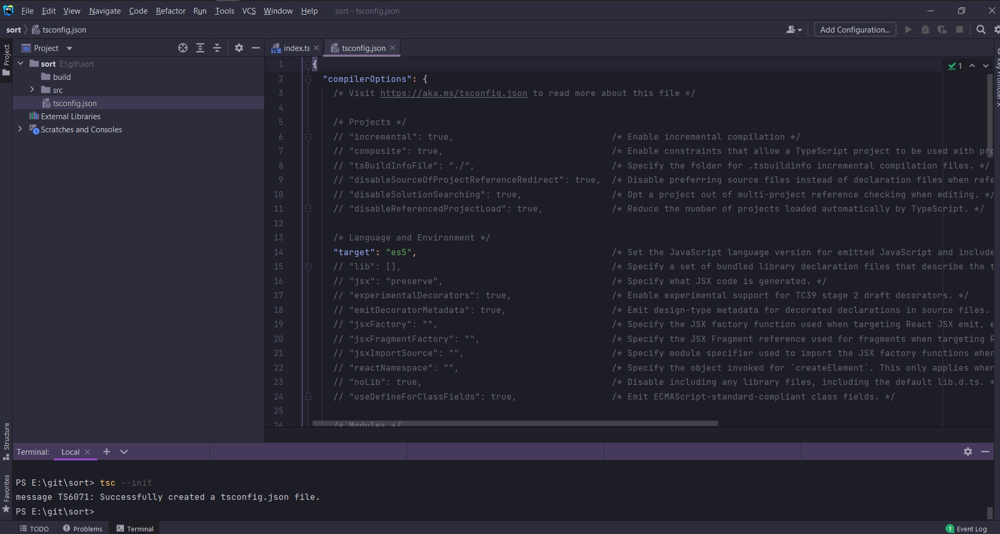
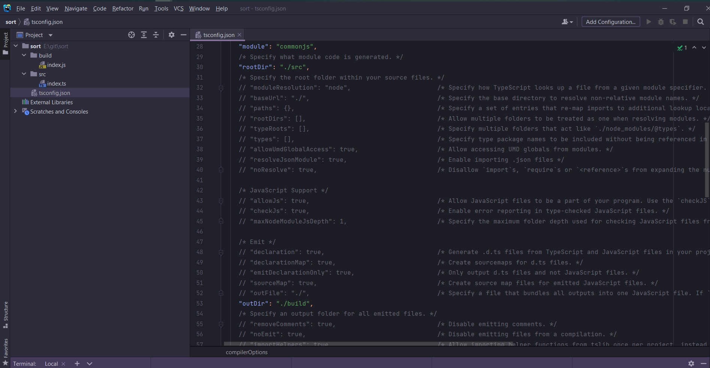
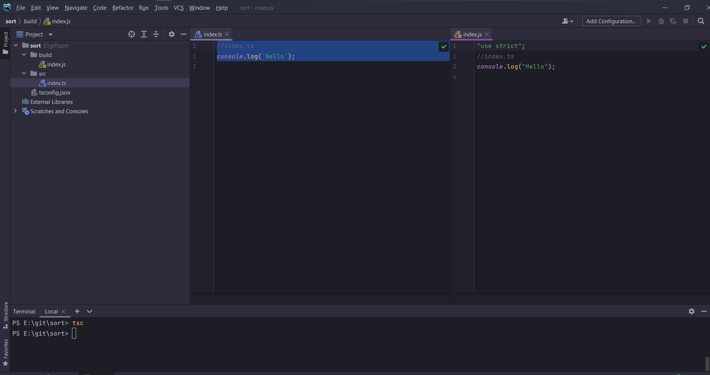

# 002_Конфигурация_TypeScript_компилятора

В прошлом проекте мы работали с parcel

```shell
npm i -g parcel-bundler

```

```shell
parcel index.html
```

В этом приложении мы будем поступать по другому. Вместо запуска в браузере мы будем запускать в Node.js.

Разберем более менее прямо как работать с TS компилятором.

Создаю новый проект sort. В корне директории index.ts.

```ts
//index.ts
console.log(`Hello`);

```

```shell
tsc index.ts
```

И после того как компиляция выполняется, генерируется js файл.

Если мы так будем продолжать то проект превратится в полную кашу.

В корне проекта создаю папку src, build. В папке src ts файлы будут, а в папке build будут скомпилированные файлы.

Теперь нужно объяснить TS как ему работать с двумя разными деррикториями.

tsconfig.json

Для этого в сконфигурирую его

```shell
tsc --init
```



И внутри мы можем найти очень большое количество опций. Они используются для того что бы настраивать компилятор.

И что бы объяснить компилятору что бы он брал весь TS код из директории src и далее помещал результаты компиляции в
директоию build нам нужно в tsconfig.json найти две настройки outDir и rootDir.

- rootDir - путь к папке которая содержит весь наш относительный код.
- outDir - скомпилированные файлы

Указываю путь



```shell
tsc
```



Для удобства мы можем использовать

```shell
tsc -w
```

-w - watch. каждый раз когда мы будем менять содержимое файлов ts будет автоматически перекомпилировать этот код и
создавать новые скомпилированные js файлы.


