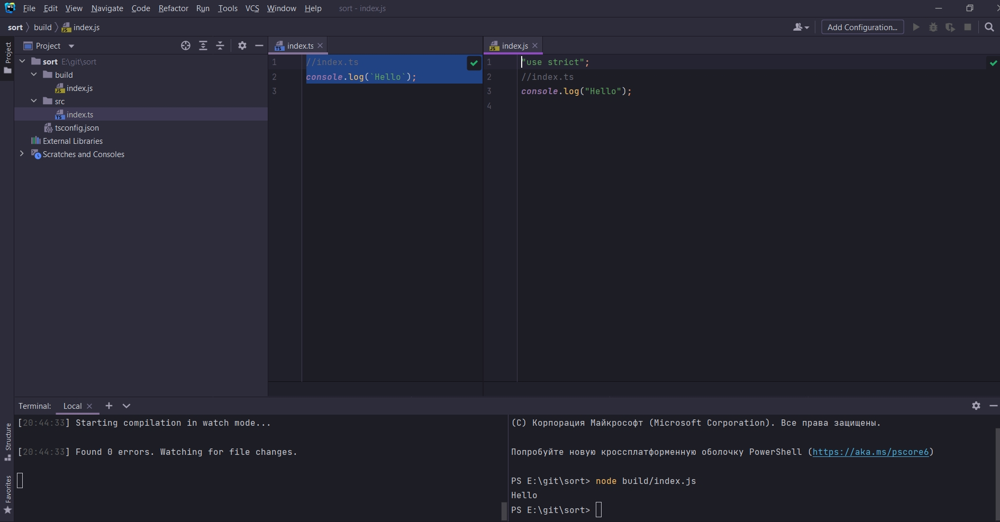
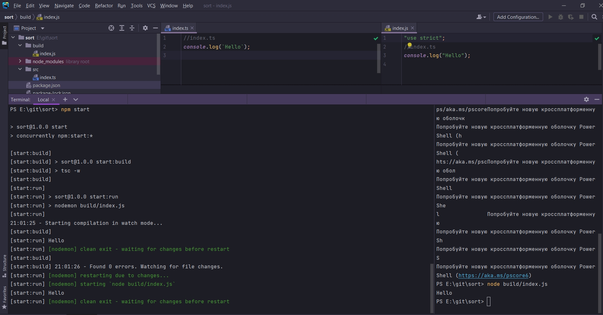

# 003_Одновременные_компиляция_и_запуск_кода

И так мы уже настроили автоматическую компиляцию кода.

Запуск прокта

```shell
tsc -w
```

Но мы не запускаем index.js. Теперь для того что бы запустить этот файл нам нужно перейти в терминал. Остановить процесс
Ctrl + C.

Либо открыть еще одно окно и внем уже запускать JS файл.



Перезапускать каждый раз? нет конечно.

Автоматизируем процесс запуска кода каждый раз когда мы меняем наш исходный код.

Для этого нам нужно установить несколько дополнительных иструментов.

```shell
npm init -y
```

```shell
npm i nodemon concurrently
```

```json
{
  "name": "sort",
  "version": "1.0.0",
  "description": "",
  "main": "index.js",
  "scripts": {
    "test": "echo \"Error: no test specified\" && exit 1"
  },
  "keywords": [],
  "author": "",
  "license": "ISC",
  "dependencies": {
    "concurrently": "^6.3.0",
    "nodemon": "^2.0.14"
  }
}

```

Прописываю скрипты запуска

```json
{
  "name": "sort",
  "version": "1.0.0",
  "description": "",
  "main": "index.js",
  "scripts": {
    "start:build": "tsc -w",
    "start:run": "nodemon build/index.js",
    "start": "concurrently npm:start:*"
  },
  "keywords": [],
  "author": "",
  "license": "ISC",
  "dependencies": {
    "concurrently": "^6.3.0",
    "nodemon": "^2.0.14"
  }
}

```

concurrently говорит посмотреть в scripts, найти все скрипты которые начинаются на start. concurrently запускае все эти
скрипты.




