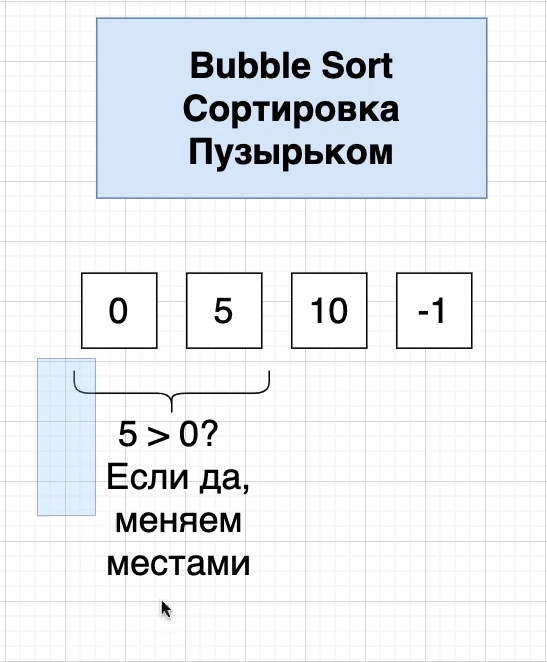
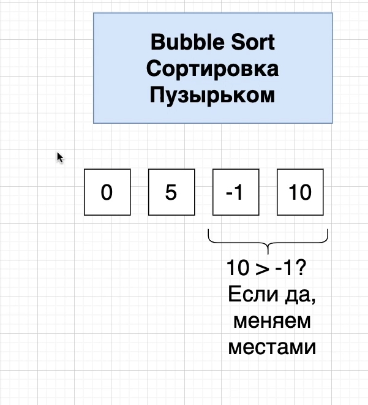

# 004_Простой_сортирующий_алгоритм

Хочу напомнить что мы с вами создадим мнгократно используемый код или повторно используемый код.

В этом разделе рассмотрим основной сортирующий алгоритм который мы будем использовать.

На самом деле имплементаци алгоритма в этом проекте для нас не так важна. Для нас большее значение представляет
понимание того как мы можем использовать этот код многократно.

Я не рекомендую постоянно пользоваться методом Сортировки Пузырьком Bubble sort.

Алгоритм сортировки пузырьком - это двойной цикл for который будет итерировать через весь массив т.е. через всю
коллекцию типов. И он это будет делать несколько раз. И на каждой итерации он будет рассматривать каждую пару элементов
в нашей коллекции элементов. Т.е. сначало он рассмотрит первых два элемента

И на каждой итерации он будет задавать очень простой вопрос. Является ли элемент находящийся слева большим чем элемент
находящийся справа. И если элемент слева больше чем элемент справа, то этот алгоритм пузырьковой сортировки меняет эти
два элемента местами.

5 > 0 - да больше. Поменял местами

5 > 10 - нет. Оставил так как есть

10 > -1 - да больше. Меняем местами

Сейчас была произведена одна итерация через весь массив. И на этом шаге, когда был проитерирован весь массив. Этот
алгоритм сортировки пузырьком гарантирует что элемент который находится крайним справа является самым большим в этой
последовательности чисел.

Если число слева было больше мы его перемещали в право. Т.е как пузырек всплывающий число переместилось в правую часть
этой последовательности. Последний элемент нам не нужно рассматривать в последующих итерациях.

0 > 5 нет. Не меняю местами 5 > -1 да больше. меняю местами

Мы закончили вторую итерацию по массиву.

0 > -1 да больше. Меняю местами

Сортировка окончена.

