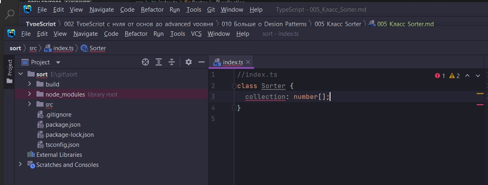

# 005_Класс_Sorter

Мы сейчас пока что не будем думать о многократном переиспользовании кода. Просто создадим имплементацию.

В index.ts создам класс Sorter. И этот класс будет принимать какую-то коллекцию состоящую из чисел и сортировать ее.

Создаю у этого класса свойство collection. Это будет числовой массив.

И нам сразу выдает ошибку.



Потому что нам нужно сразу инициализировать это свойсво либо инициализировать в constructor.

Я буду инициализировать в constructor. Т.е. когда будет вызываться объект класса sorter, будет вызываться constructor и
при помощи него мы будем инициализировать collection. И для того что бы инициализировать поле класса collection, мы
можем передавать в constructor какую-то коллекцию. В данном случае массив из значений числового типа. Т.е. при создании
объекта мы будем передавать массив и этот массив уже будет присваиваться свойству класса collection. На тот момент уже
свойства объекта sorter.

В аргументах можно указать такое же название collection и указать тот же тип number массив [].

```ts
//index.ts
class Sorter {
    collection: number[];

    constructor(collection: number[]) {
        this.collection = collection;
    }
}

const sorter = new Sorter([4, -3, 11, 29]);

```

Короткая запись

```ts
//index.ts
class Sorter {
    // короткая запись
    constructor(public collection: number[]) {
    }
}

const sorter = new Sorter([4, -3, 11, 29]);

```

Объявляю перед аргументом public модификатор. И с помощью него происходит и создание поля collection и его
инициализация.

Еще мне нужен метод который будет сортировать данную коллекцию.

```ts
//index.ts
class Sorter {
    // короткая запись
    constructor(public collection: number[]) {
    }

    // Задаю правило для метода sort
    sort(): void {
    }
}

const sorter = new Sorter([4, -3, 11, 29]);
sorter.sort();

```

Это каркас класса. Далее имплементирую метод sort.