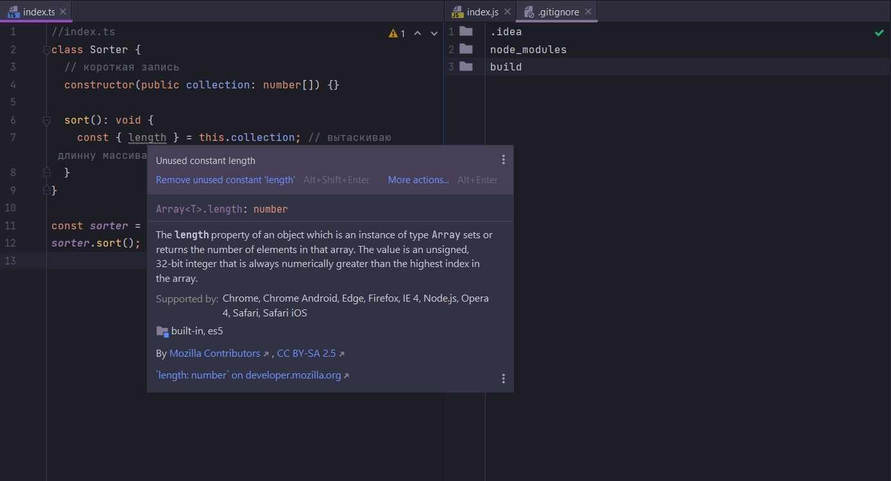
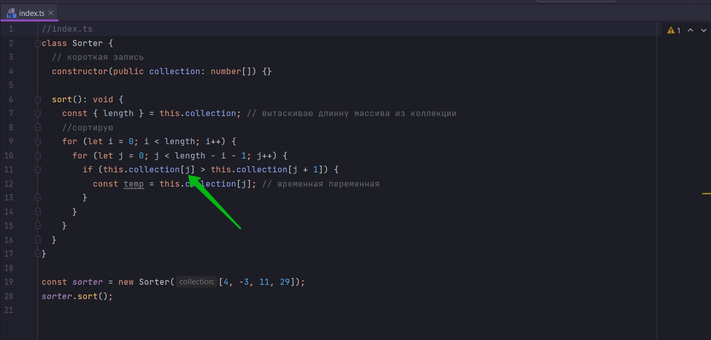
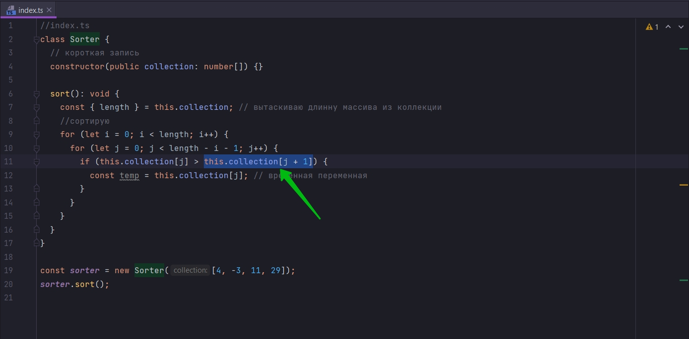
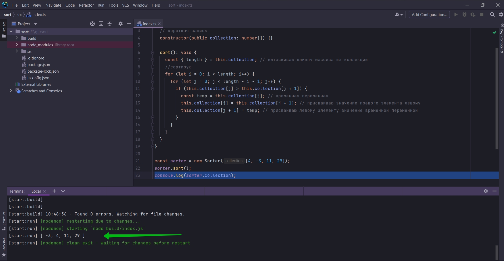

# 006_Имплементация_сортировки

У нас есть каркас класса Sorter

```ts
//index.ts
class Sorter {
    // короткая запись
    constructor(public collection: number[]) {
    }

    // Задаю правило для метода sort
    sort(): void {
    }
}

const sorter = new Sorter([4, -3, 11, 29]);
sorter.sort();
```

Внутри этого класса будем имплементировать Пузырьковую сортировку.

Прежде всего нам нужна длинна этой коллекции внутри метода sort. И мы потом будем итерировать всю это коллекцию. Будем
перебирать ее элементы один в другой вложенные цикл for.

```ts
//index.ts
class Sorter {
    // короткая запись
    constructor(public collection: number[]) {
    }

    sort(): void {
        const length = this.collection.length; // длинна коллекции
    }
}

const sorter = new Sorter([4, -3, 11, 29]);
sorter.sort();

```

Однако мы можем провести диструктуризацию тем самым немного сократить код.

```ts
//index.ts
class Sorter {
    // короткая запись
    constructor(public collection: number[]) {
    }

    sort(): void {
        const {length} = this.collection; // вытаскиваю длинну массива из коллекции
    }
}

const sorter = new Sorter([4, -3, 11, 29]);
sorter.sort();

```



как видим length типа number.

```ts
//index.ts
class Sorter {
    // короткая запись
    constructor(public collection: number[]) {
    }

    sort(): void {
        const {length} = this.collection; // вытаскиваю длинну массива из коллекции
        //сортирую
        for (let i = 0; i < length; i++) {
            for (let j = 0; j < length - i - 1; j++) {
            }
        }
    }
}

const sorter = new Sorter([4, -3, 11, 29]);
sorter.sort();

```

Благодаря этой логике последний, уже отсортированный элемен, самое большое число в коллекции, не учитывается length - i

- 1;

Далее логика сравнивания этих двух значений и обмена если нужно.

```ts
//index.ts
class Sorter {
    // короткая запись
    constructor(public collection: number[]) {
    }

    sort(): void {
        const {length} = this.collection; // вытаскиваю длинну массива из коллекции
        //сортирую
        for (let i = 0; i < length; i++) {
            for (let j = 0; j < length - i - 1; j++) {
                if (this.collection[j] > this.collection[j + 1]) {
                }
            }
        }
    }
}

const sorter = new Sorter([4, -3, 11, 29]);
sorter.sort();

```

if (this.collection[j] > this.collection[j + 1]) т.е. мы сравниваем левую часть пары this.collection[j]  с правой частью
пары this.collection[j + 1]. И если левая часть больше > , то мы должны этих два элемента поменять местами.

Для этого я использую промежуточную схему для обмена значениями. Мы должны какой-то временной перемено присвоить одно
значение. Проще показать.

```ts
//index.ts
class Sorter {
    // короткая запись
    constructor(public collection: number[]) {
    }

    sort(): void {
        const {length} = this.collection; // вытаскиваю длинну массива из коллекции
        //сортирую
        for (let i = 0; i < length; i++) {
            for (let j = 0; j < length - i - 1; j++) {
                if (this.collection[j] > this.collection[j + 1]) {
                    const temp = this.collection[j]; // временная переменная
                }
            }
        }
    }
}

const sorter = new Sorter([4, -3, 11, 29]);
sorter.sort();

```

И так как у нас сохранено значение которое находиться в элементе массива с индексом j.



Мы можем спокойно присваивать элементу, т.е. в index j присваиваю this.collection[j + 1].



Т.е. мы пишем this.collection[j] = this.collection[j + 1];

```ts
//index.ts
class Sorter {
    // короткая запись
    constructor(public collection: number[]) {
    }

    sort(): void {
        const {length} = this.collection; // вытаскиваю длинну массива из коллекции
        //сортирую
        for (let i = 0; i < length; i++) {
            for (let j = 0; j < length - i - 1; j++) {
                if (this.collection[j] > this.collection[j + 1]) {
                    const temp = this.collection[j]; // временная переменная
                    this.collection[j] = this.collection[j + 1];
                }
            }
        }
    }
}

const sorter = new Sorter([4, -3, 11, 29]);
sorter.sort();

```

Т.е. мы поместили в левый элемент правый элемент. Но теперь нам нужно поместить в правый элемент левый элемент. Но в
левом элементе у нас значение правого элемента.

Если бы мы не использовали бы временную переменную temp, у нас бы значение левого элемента было бы потеряно. Но так как
мы предусмотрительно сохранили const temp = this.collection[j]; // временная переменная

```ts
//index.ts
class Sorter {
    // короткая запись
    constructor(public collection: number[]) {
    }

    sort(): void {
        const {length} = this.collection; // вытаскиваю длинну массива из коллекции
        //сортирую
        for (let i = 0; i < length; i++) {
            for (let j = 0; j < length - i - 1; j++) {
                if (this.collection[j] > this.collection[j + 1]) {
                    const temp = this.collection[j]; // временная переменная
                    this.collection[j] = this.collection[j + 1]; // присваиваю значение правого элемента левому
                    this.collection[j + 1] = temp; // присваиваю левому элементу значение временной переменной
                }
            }
        }
    }
}

const sorter = new Sorter([4, -3, 11, 29]);
sorter.sort();
console.log(sorter.collection);

```



И это первый вариант кода.
