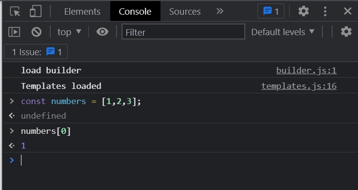
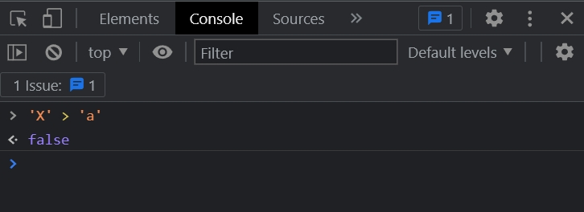

# 007_Две_проблемы

У нас есть начальная имплементация сортирующего алгоритма.

```ts
//index.ts
class Sorter {
    // короткая запись
    constructor(public collection: number[]) {
    }

    sort(): void {
        const {length} = this.collection; // вытаскиваю длинну массива из коллекции
        //сортирую
        for (let i = 0; i < length; i++) {
            for (let j = 0; j < length - i - 1; j++) {
                if (this.collection[j] > this.collection[j + 1]) {
                    const temp = this.collection[j]; // временная переменная
                    this.collection[j] = this.collection[j + 1]; // присваиваю значение правого элемента левому
                    this.collection[j + 1] = temp; // присваиваю левому элементу значение временной переменной
                }
            }
        }
    }
}

const sorter = new Sorter([4, -3, 11, 29]);
sorter.sort();
console.log(sorter.collection);

```

И сейчас это алгоритм работает только с массивом чисел. Мы хотим что бы он так же работал со строкой. И так же в
конечном итоге мы хотим что бы этот алгоритм работал с Linked List.

Поработаем со строками.

При работе с массивами мы можем получать доступ к элемента по индексу.



И точно также при помощи указания индекса в квадратных скобках мы може обновлять элементы массива.


Когда мы будем рассматривать строки то мы увидим что некоторые вещи работают точно так же как и с мссивами, а некоторые
нет.


Т.е. при помощи указания индекса я могу так же получать доступ к элементам строки так же как и массиве.

Но есть одно очень важное отличие. Строки в JS immutable т.е. не изменяемы. Это значит что мы не можем изменять символы
в этой строке так как мы делем в массиве изменяя какой-то элемент.

Мы можем присвоить новое значение переменной color, но сама строка immutable, не изменяемая.


Это имеет значение для нашего кода так как мы не можем вот здесь делать обмен символами.


Это будет работать для boolean значения но не для строки. И так же нам нужно будет менять if statement т.е. условие в
случае сос трокой if (
this.collection[j] > this.collection[j + 1]).


В случае со строкой сортировка будет выполняться в алфавитном порядке и по этому X сместиться в самый правый край
строки.

Давайте подумаем как мы это можем сделать при помощи Пузырьковой сортировки. Нам нужно сравнивать попарно элементы. Если
левый элемент больше правого, то мы их меняем местами. И так как буква Х стоит дольше по алфавиту чем а по этому X > a.

Но такой метод не будет работать в JS.



Т.е. имея такую логику как у нас в приложении мы не переместим X в рпавую часть.

Все потому что в JS каждый символ имеет код.


Именно по этому вот этот вот код в if statement, if (this.collection[j] > this.collection[j + 1]) { , который прекрастно
работает для числового массива

```ts
//index.ts
class Sorter {
    // короткая запись
    constructor(public collection: number[]) {
    }

    sort(): void {
        const {length} = this.collection; // вытаскиваю длинну массива из коллекции
        //сортирую
        for (let i = 0; i < length; i++) {
            for (let j = 0; j < length - i - 1; j++) {
                if (this.collection[j] > this.collection[j + 1]) {

                    const temp = this.collection[j]; // временная переменная
                    this.collection[j] = this.collection[j + 1]; // присваиваю значение правого элемента левому
                    this.collection[j + 1] = temp; // присваиваю левому элементу значение временной переменной

                }
            }
        }
    }
}

const sorter = new Sorter([4, -3, 11, 29]);
sorter.sort();
console.log(sorter.collection);

```

Не будет работать для строк.

Когда у нас различные виды коллекций нам нужно для них использовать разный код. Другую имплементацию сравнения. И так же
другую имплементацию сравнения.

