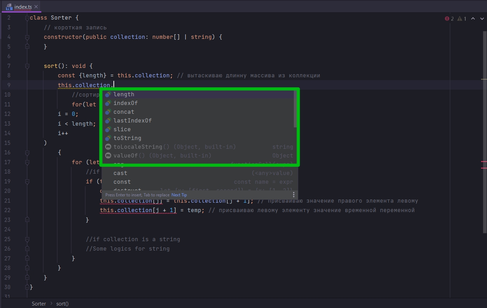
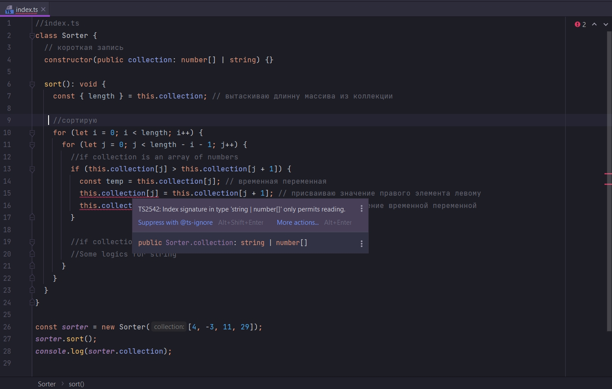

# 008_TypeScript_действительно_умён

В прошлом видио мы понли что нам нужно имплементировать алгоритм для сортировки как числовых типов в массиве, так и
просто символов в строке. В дальнейшем мы этот алгоритм должны будем подстроить и для Linked List.

И одна из проблем где мы сравниваем два элемента в массиве.

В случае со строкой когда мы сравниваем символы в верхнем и нижнем регистре у нас могут быть результаты не совсем те
которые мы ожидаем. Происходит это из-за сравнения кодов символов.

И вторая проблема


Со строками мы не можем присваивать новое значение символу в строке т.е. JS строки являются не изменяемыми immutable.

Нам нужно определить какой-то способ что-бы алгоритм работал как с числовыми типами в массиве, так и с символами в
строке.

Сначало мы применим не совсем хороший подход. Этот не хороший подход это самый легкий способ решить эьу проблему.

Мы можем проверять коллекцию, которая передается в качестве аргумента в конструктор, является ли она массивом из чисел.

```ts
//index.ts
class Sorter {
    // короткая запись
    constructor(public collection: number[]) {
    }

    sort(): void {
        const {length} = this.collection; // вытаскиваю длинну массива из коллекции
        //сортирую
        for (let i = 0; i < length; i++) {
            for (let j = 0; j < length - i - 1; j++) {
                //if collection is an array of numbers
                if (this.collection[j] > this.collection[j + 1]) {
                    const temp = this.collection[j]; // временная переменная
                    this.collection[j] = this.collection[j + 1]; // присваиваю значение правого элемента левому
                    this.collection[j + 1] = temp; // присваиваю левому элементу значение временной переменной
                }

                //if collection is a string
                //Some logics for string
            }
        }
    }
}

const sorter = new Sorter([4, -3, 11, 29]);
sorter.sort();
console.log(sorter.collection);

```

Т.е. в зависимости от условия будет выполняться тот или иной блок кода.

Нам нужно определить какого типа наша коллекция и от этого запускать тот или иной код.

Прежде всего мне нужно обновить аннотацию типов в парамерах конструктора.

```ts
//index.ts
class Sorter {
    // короткая запись
    constructor(public collection: number[] | string) {
    }

    sort(): void {
        const {length} = this.collection; // вытаскиваю длинну массива из коллекции
        //сортирую
        for (let i = 0; i < length; i++) {
            for (let j = 0; j < length - i - 1; j++) {
                //if collection is an array of numbers
                if (this.collection[j] > this.collection[j + 1]) {
                    const temp = this.collection[j]; // временная переменная
                    this.collection[j] = this.collection[j + 1]; // присваиваю значение правого элемента левому
                    this.collection[j + 1] = temp; // присваиваю левому элементу значение временной переменной
                }

                //if collection is a string
                //Some logics for string
            }
        }
    }
}

const sorter = new Sorter([4, -3, 11, 29]);
sorter.sort();
console.log(sorter.collection);

```


По этой диаграмме мы пробовали передавать метод addMarker аргумент в котором указывали тип company или user.

Когда мы используем оператор или то TS как бы ограничивает доступ к свойствам этого объедененного типа. Т.е. TS смотрит
на эти два объедененных типа и говорит нам что мы можем обращаться только к тем свойствам которые есть и у одного типа и
у второго. На скрине это свойство location. Все другие свойства он откинет и они будут не доступны. Т.е. ограничивается
доступ к тем полям которые имеются в обном классе и которых нет в другом.

Точно такая же ситуация происходит и здесь. Теперь к параметру collection у нас добавлены ограничения


мы можем обращаться только к тем свойствам этого параметра collection, которые есть у обоих типов. У типа number[]
яислового массива и у string



И как видите нам разрешено ссылаться лишь наограниченное количество методов которые есть и у числовых массивов и у
string.

Но в данном случае здесь происходят еще кое-какие сравнения, а не только доступ к каким-то общим методам проверяется.

Если вы помните мы разбирали что когда мы работаем с массивами мы можем через index напрямую обратиться к элементу
массива и обновить этот элемент внутри массива. И так же мы разобрали что это не позволено делать в строках. И именно по
этому мы получаем красное подчеркивание



Обращение через индекс в типе string или number[] разрешает только чтение. Мы не можем присваивать новое значение через
index.

Эта ошибка возникает именно из-за объедененного типа который мы теперь применяем к нашему параметру collection.


Этот объедененный тип объеденяет типы string и number array.

И как мы уже выяснили TS будет итерировать сквозь каждый тип из этих двух объдененных типов и смотреть есть ли это
свойство, которое он проверяет, у другого типа. Он не будет ссылаться на типы которые не поддерживаются двумя типами
сразу.

T.е. toUpperCase у string есть, а у number нет. Не ссылаюсь. toLowerCase у string есть, а у number нет. Не ссылаюсь.

И тоже самое с методами number.

Остается только общее свойство


И тут TS начинает проверять еще глубже. Начинает проверять различные фиттчи. Синтаксис который разрешен для обоих этих
типов. И TS полностью понимает что из массивов строк мы можем при помощи индексации мы можем заменять элементы в
number[], присваивать им новые значения. Т.е. мы можем найти массив collection, потом обратиться к элементу
collection[j] по индексу и далее присвоить этому элементу новое значение collection[j + 1].

TS понимает что присваивание по индексу на 100% позволено в массивах. А в строках, хотя мы и можем обращаться по index к
элементу строки, но мы не можем менять значение по index т.е. присваивать новое значение. По-этому это свойство мы тоже
отбрасываем.


По этому в ошибке написано что если мы хотим в этих типах string | number[] обращаться по index, то нам разрешено только
чтение.


Присваивания новых значений по index запрещены.

И все таки когда мы добавим проверку типов мы избавимся от этой ошибки.

