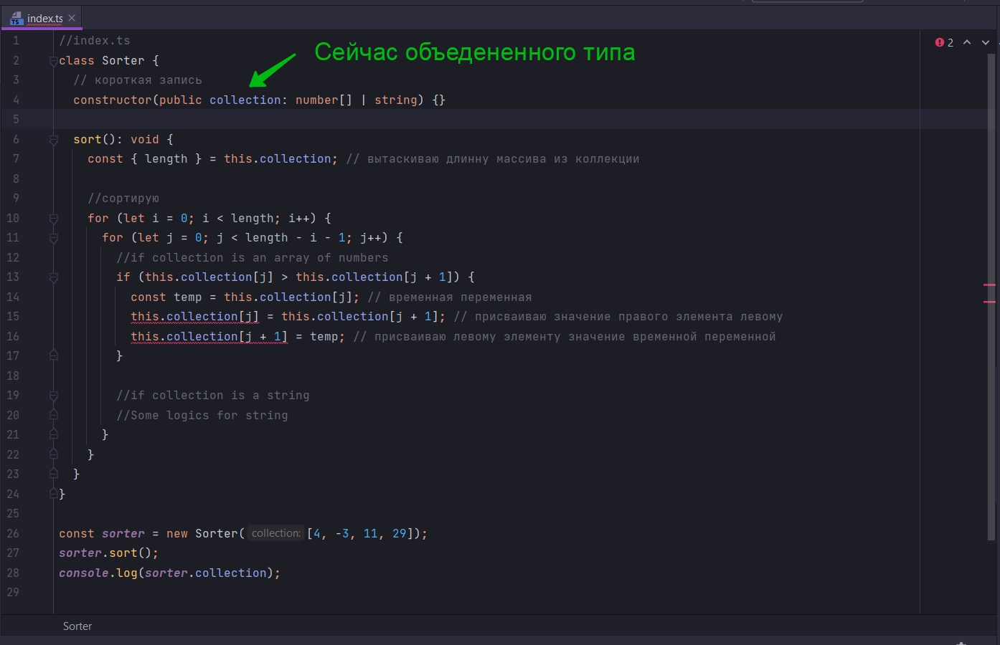
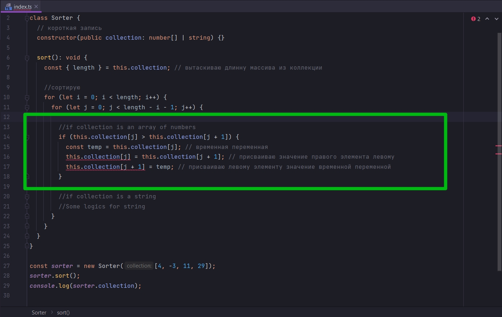
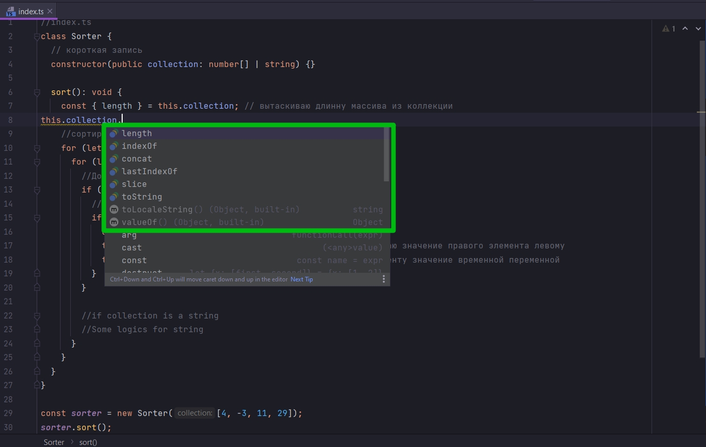
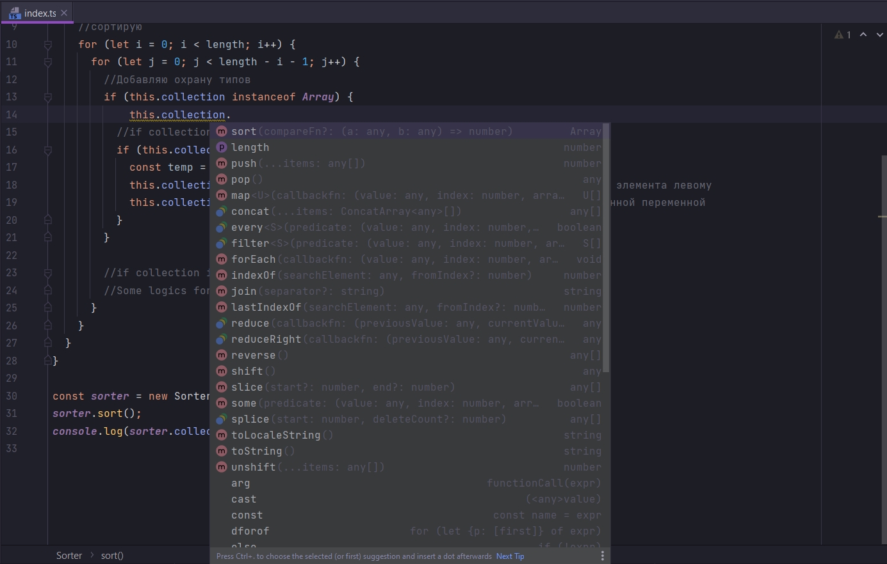
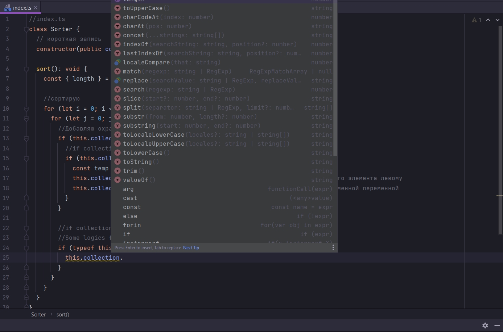
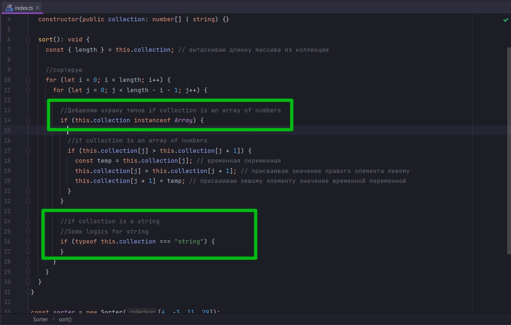
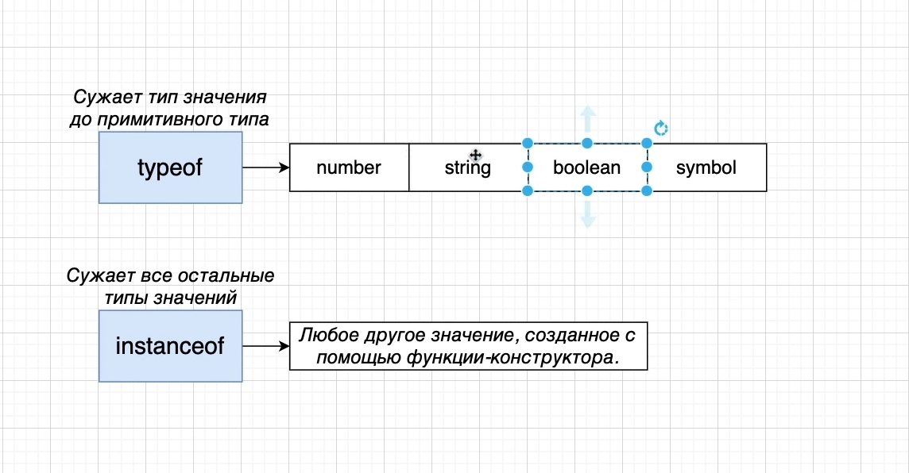
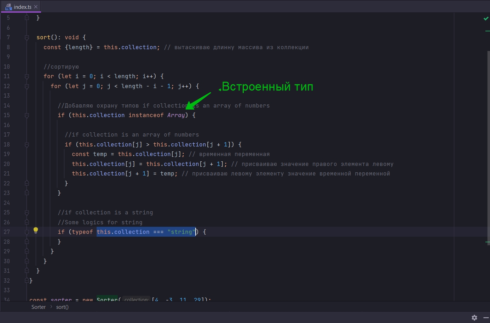
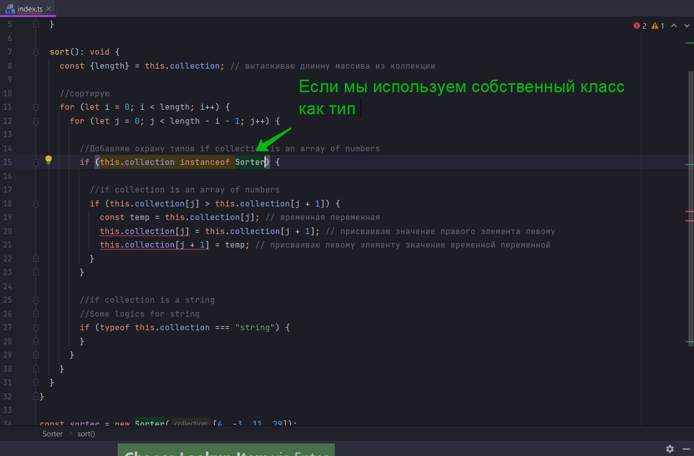
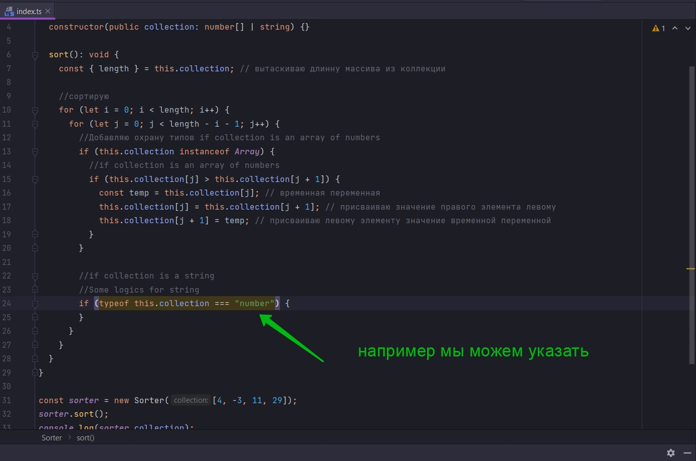

# 009_Охрана_типов

```ts
//index.ts
class Sorter {
    // короткая запись
    constructor(public collection: number[] | string) {
    }

    sort(): void {
        const {length} = this.collection; // вытаскиваю длинну массива из коллекции

        //сортирую
        for (let i = 0; i < length; i++) {
            for (let j = 0; j < length - i - 1; j++) {
                //if collection is an array of numbers
                if (this.collection[j] > this.collection[j + 1]) {
                    const temp = this.collection[j]; // временная переменная
                    this.collection[j] = this.collection[j + 1]; // присваиваю значение правого элемента левому
                    this.collection[j + 1] = temp; // присваиваю левому элементу значение временной переменной
                }

                //if collection is a string
                //Some logics for string
            }
        }
    }
}

const sorter = new Sorter([4, -3, 11, 29]);
sorter.sort();
console.log(sorter.collection);

```

Теперь Поясню почему этот результат объединения типов очень значимый.

Этот блок кода

```ts
//if collection is an array of numbers
if (this.collection[j] > this.collection[j + 1]) {
    const temp = this.collection[j]; // временная переменная
    this.collection[j] = this.collection[j + 1]; // присваиваю значение правого элемента левому
    this.collection[j + 1] = temp; // присваиваю левому элементу значение временной переменной
}
```

Будет работать только тогда когда мы будем обращаться с параметром collection как с числовым массивом.

Строки будут работать только тогда когды мы будем обращаться с параметром collection как к string.

Но сейчас collection объедененного типа



Нам нужен какой-то трюк который позволит сказать Typescript когда у нас вот такой код позволь работать с collection как
с типом числового массива number[].



Мы будем использовать Охрану типов. Она будет проверять тип this.collection. И когда мы будем запускать охрану типов, мы
как бы будем прояснять с каким типом значения мы работаем.

Пишу еще одно условие. И в тело true помещаю предыдущее условие.

В параметрах условия пишу this.collection instanceof Array.

```ts
//index.ts
class Sorter {
    // короткая запись
    constructor(public collection: number[] | string) {
    }

    sort(): void {
        const {length} = this.collection; // вытаскиваю длинну массива из коллекции

        //сортирую
        for (let i = 0; i < length; i++) {
            for (let j = 0; j < length - i - 1; j++) {
                //Добавляю охрану типов
                if (this.collection instanceof Array) {
                    //if collection is an array of numbers
                    if (this.collection[j] > this.collection[j + 1]) {
                        const temp = this.collection[j]; // временная переменная
                        this.collection[j] = this.collection[j + 1]; // присваиваю значение правого элемента левому
                        this.collection[j + 1] = temp; // присваиваю левому элементу значение временной переменной
                    }
                }

                //if collection is a string
                //Some logics for string
            }
        }
    }
}

const sorter = new Sorter([4, -3, 11, 29]);
sorter.sort();
console.log(sorter.collection);

```

Теперь я могу использовать код которому позволено работать только с одним из эти типов а именно number[].

Но все равно у меня остался доступ только к объедененным методам. Другие методы не доступны.



Но если я вызову collection внутри условия, то я увижу все необходимые методы числового массива.



Т.е. тут у нас collection воспринимается как Array. И охранатипов показывает нам действительно кое-что интересное.

теперь тоже самое проделаем для строк. Для строк синтаксис Охраны типов будет немного другой.

```ts
//index.ts
class Sorter {
    // короткая запись
    constructor(public collection: number[] | string) {
    }

    sort(): void {
        const {length} = this.collection; // вытаскиваю длинну массива из коллекции

        //сортирую
        for (let i = 0; i < length; i++) {
            for (let j = 0; j < length - i - 1; j++) {
                //Добавляю охрану типов if collection is an array of numbers
                if (this.collection instanceof Array) {
                    //if collection is an array of numbers
                    if (this.collection[j] > this.collection[j + 1]) {
                        const temp = this.collection[j]; // временная переменная
                        this.collection[j] = this.collection[j + 1]; // присваиваю значение правого элемента левому
                        this.collection[j + 1] = temp; // присваиваю левому элементу значение временной переменной
                    }
                }

                //if collection is a string
                //Some logics for string
                if (typeof this.collection === "string") {

                }
            }
        }
    }
}

const sorter = new Sorter([4, -3, 11, 29]);
sorter.sort();
console.log(sorter.collection);

```



Теперь мы имеем доступ ко всем свойствам строки.

Далее мы будем реализовывать сравнивание двух элементов находящихся рядом. Во-вторых нам нужно их как-то менять местами
при сортировке пузырьком.

Но прежде рассмотрим более подробно эти два вида охраны типов





Когда мы работаем с примитивными типами. Они съужаются из объедененного значения к какому-то определенному значению
примитивного типа при помощи typeof. т.е. мы используем такую проверку. Указываю typeof и далее проверяю this.collection
=== "string". После знака эквивалентности указываю приметивный тип по которому проходит проверка "string".

В любом другом значении созданном при помощи функции-constructor использую instanceof. Т.е. в этом случае мы как бы
работаем со всеми объектными типами. Это может быть какой-то встроенный тип



Или это может быть какой-то наш класс который мы используем как тип. К примеру тот же наш класс Sorter



Либо другой встроенный тип в JS Date. Всегда использую instanceof.

С примитивными типами typeof. Только для 4-x случаев number, string, boolean,symbol.




