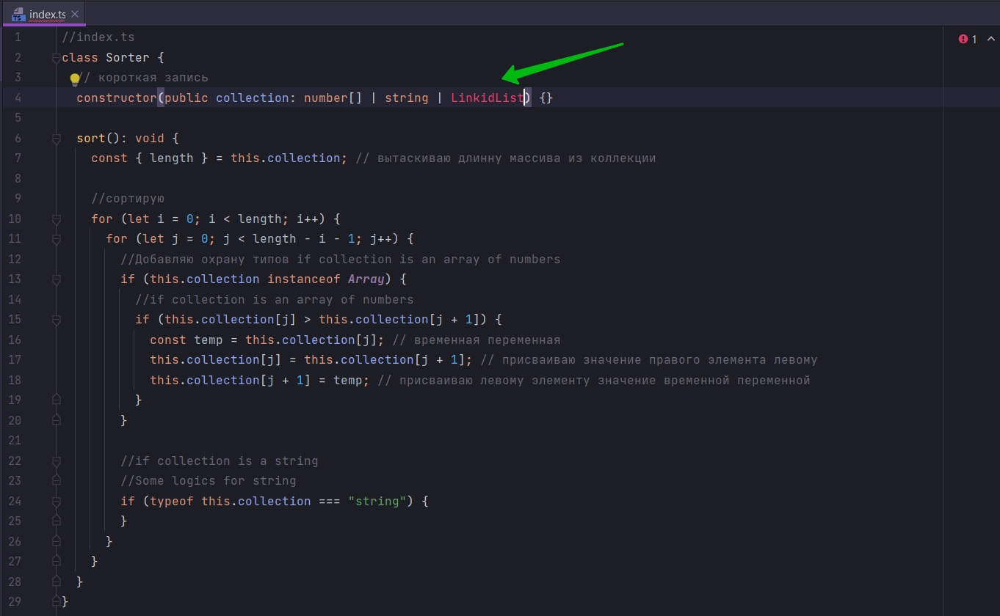

# 010_Почему_это_плохо

```ts
//index.ts
class Sorter {
    // короткая запись
    constructor(public collection: number[] | string) {
    }

    sort(): void {
        const {length} = this.collection; // вытаскиваю длинну массива из коллекции

        //сортирую
        for (let i = 0; i < length; i++) {
            for (let j = 0; j < length - i - 1; j++) {
                //Добавляю охрану типов if collection is an array of numbers
                if (this.collection instanceof Array) {
                    //if collection is an array of numbers
                    if (this.collection[j] > this.collection[j + 1]) {
                        const temp = this.collection[j]; // временная переменная
                        this.collection[j] = this.collection[j + 1]; // присваиваю значение правого элемента левому
                        this.collection[j + 1] = temp; // присваиваю левому элементу значение временной переменной
                    }
                }

                //if collection is a string
                //Some logics for string
                if (typeof this.collection === "string") {
                }
            }
        }
    }
}

const sorter = new Sorter([4, -3, 11, 29]);
sorter.sort();
console.log(sorter.collection);

```

На самом деле мы написали плохой код.

Причина такая же как и в предыдущем проекте. Если мы захотим использовать дополнительные типы сортировки. Нам нужно
будет переходить в наш класс Sorter и менять здесь логику. Т.е. как минимум мне нужно указать еще LinkedList



Далее мне нужно былобы здесь писать Охрану типов для LinkedList.

```ts
//index.ts
class Sorter {
    // короткая запись
    constructor(public collection: number[] | string | LinkedList) {
    }

    sort(): void {
        const {length} = this.collection; // вытаскиваю длинну массива из коллекции

        //сортирую
        for (let i = 0; i < length; i++) {
            for (let j = 0; j < length - i - 1; j++) {

                //Охрана типов для LinkedList
                if (this.collection instanceof LinkedList) {
                }


                if (this.collection instanceof Array) {
                    //Добавляю охрану типов if collection is an array of numbers
                    //if collection is an array of numbers
                    if (this.collection[j] > this.collection[j + 1]) {
                        const temp = this.collection[j]; // временная переменная
                        this.collection[j] = this.collection[j + 1]; // присваиваю значение правого элемента левому
                        this.collection[j + 1] = temp; // присваиваю левому элементу значение временной переменной
                    }
                }

                //if collection is a string
                //Some logics for string
                if (typeof this.collection === "string") {
                }
            }
        }
    }
}

const sorter = new Sorter([4, -3, 11, 29]);
sorter.sort();
console.log(sorter.collection);

```

Каждый раз когда мы будем хотеть работать с каким-то типом collection. Мы должны будем в конструкторе добавлять этот
тип, через объединение типов.

Во-вторыз нам нужно будет менять функцию sort нашего класса добавляя постоянно какую-то новую логику.