# 011_Извлечение_ключевой_логики

В прошлом видео мы решили что подход при помощи указания объедененных типов в параметрах не очень хорош т.к. мы при
добавлении большого количества различных коллекций будем очень сильно менять наш класс Sorter постоянно добавляя
какую-то новую функциональность для каждого из этих типов.

Мы будем использовать interface.

Но прежде я хочу остановиться на промежуточном рефакторинге. Оно поможет нам понять как решить эту проблему и далее мы
уже введем interface в наш код.

Прежде всего я хочу напомнить две проблемы нашего кола.

Первая проблема это в условии при сравнивании

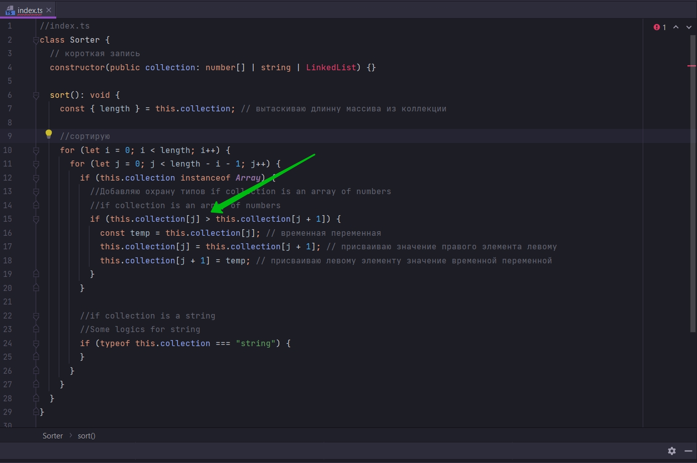

мы должны кастомизировать т.е. настраивать, изменять как-то этот код, для различных типов коллекций. И вторая проблема
это сам процесс обмена местами.

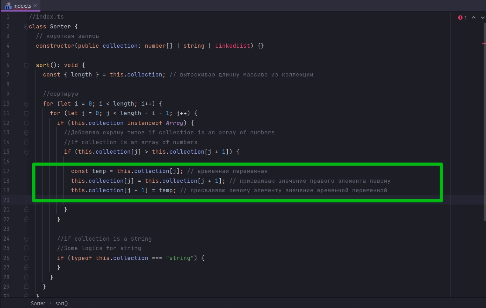

Который тоже должен быть кастомизирован под каждый тип коллекции.

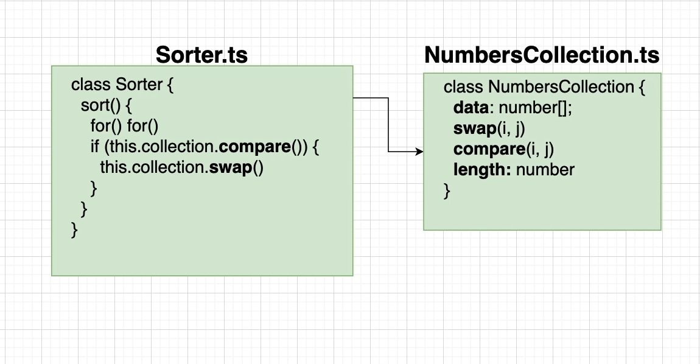

И так главные две проблемы выделены жирным шрифтом.

Это сравнивание элементов compare. И так же обмен элементов swap. Этот код должен быть кастомизирован под каждый вид
коллекций.

И именно по этому мы сначало пытаемся извлеч логику сравнивания и поместить ее в отдельную функцию в отдельный класс.

И так же мы поместим в другой класс логику обмена.

И наш класс Sorter не будет иметь прямую ссылку на массив из чисел.

Вместо этого Sorter класс будет иметь новую сущность NumbersCollection.ts Именно этот класс будет иметь числовой массив
data:number[] к которому мы сможем обращаться. Это будет свойство data. И этот массив в этом свойстве мы и будем
сортировать. Внутри этого класса так же будет пара функций swap(менять) и compare(compare). Которые будут
имплементировать эту логику

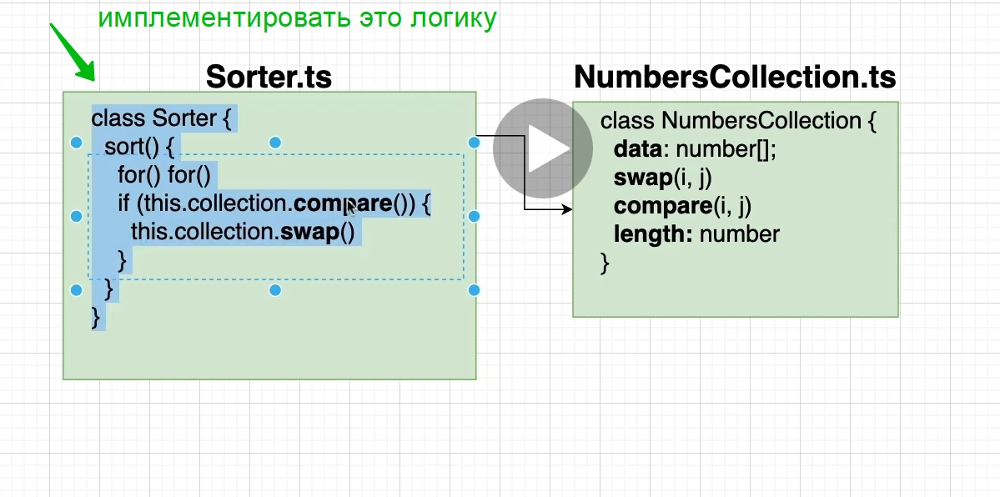

конкретно для числового массива. Т.е. мы как бы спрячем вот эту логику

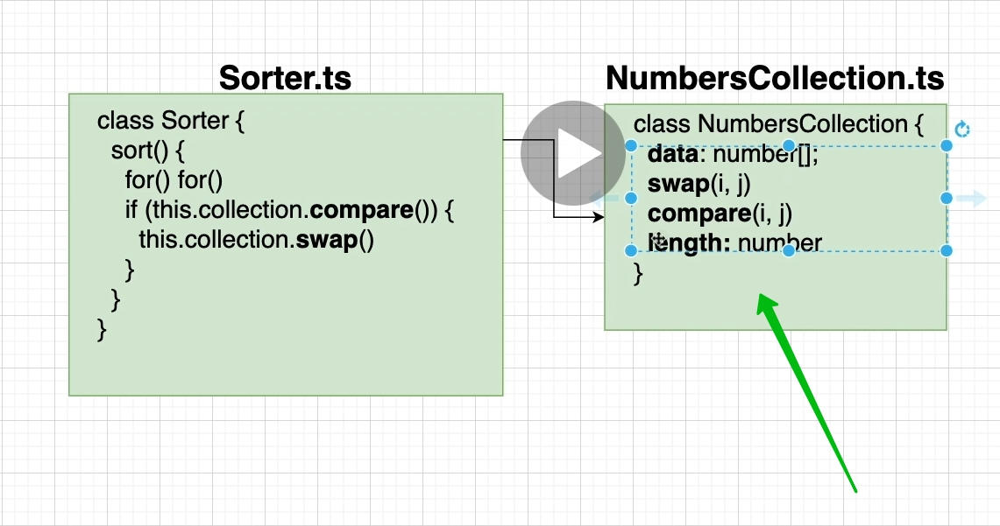

которая должна кастомизироваться под конкретный тип. Мы ее уберем в отдельный класс. Т.е. мы как бы говорим. Хотите
отсортировать массив числовой. Вот class NumbersCollection. И этот класс имеет кастомную функцию т.е. присущую только
ему

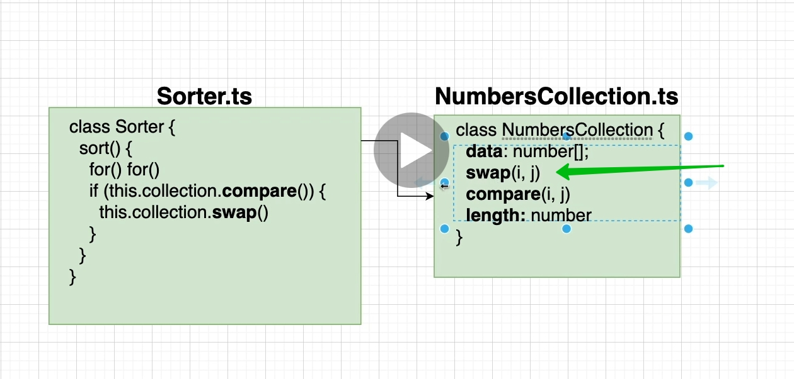

которая присуща только ему. Она меняет местами элементы в числовом массиве.

Так же этот class NumbersCollection функцию compare, которая сравнивает два элемента в числовом массиве.

Эта кастомизированная логика т.е. присущая какому-то отдельному типу данных. Логика будет помещена в отдельный класс.
Это первый шаг к тому что бы сделать наш класс Sorter переиспользуемым для совершенно разных коллекций типов. Т.е. мы
должны сделать логику внутри Sorter максимально общей которую можно применить к общим типам.

И у нас в нашем классе Sorter кое какая логика которая действительно общая для самых различных типов коллекций.

Для пузырьковой сортировки циклы for, они будут одинаковыми для любых типов коллекций.

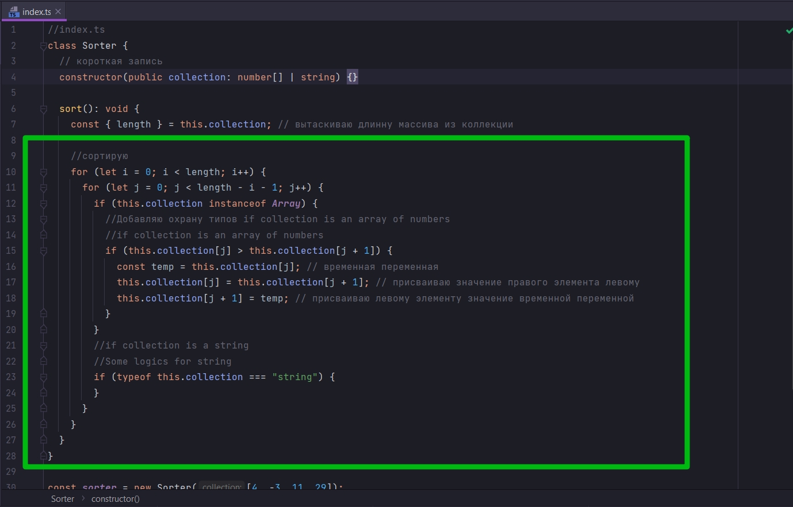

То что будет меняться в зависимости от типа коллекции это сравнивание compare и swap обмен местами.

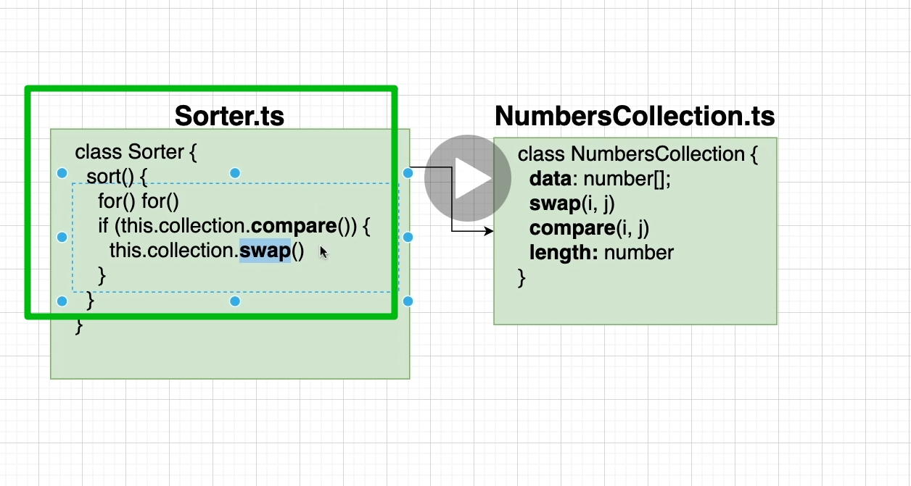

Поэтому как бы эта логика будет завернута, скрыта внутри отдельного класса

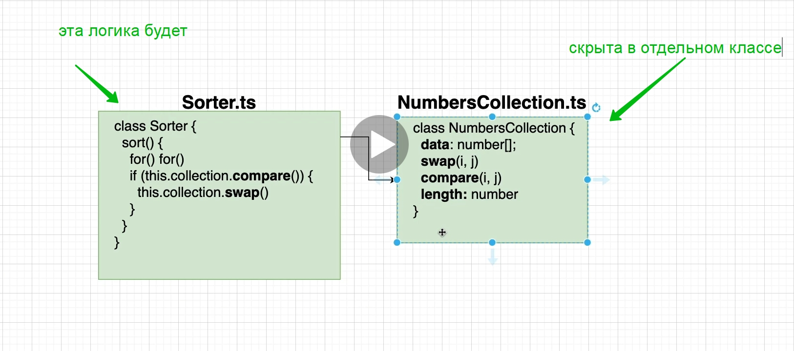

И теперь Sorter класс не будет иметь прямую ссылку на числовой массив. Вместо этого класс Sorter будет иметь ссылку на
class NumbersCollections. И уже в свою очередь NumbersCollections будет иметь числовой массив

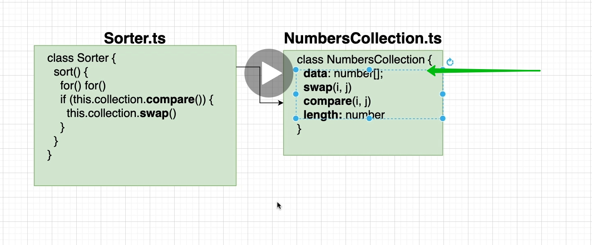

Создаю Sorter.ts

Вырезаю из index.ts class Sorter и так же избавляюсь от охраны типов

```ts
//src Sorter.ts
export class Sorter {
    // короткая запись
    constructor(public collection:) {
    }

    sort(): void {
        const {length} = this.collection; // вытаскиваю длинну массива из коллекции

        //сортирую
        for (let i = 0; i < length; i++) {
            for (let j = 0; j < length - i - 1; j++) {
                if (this.collection[j] > this.collection[j + 1]) {
                    const temp = this.collection[j]; // временная переменная
                    this.collection[j] = this.collection[j + 1]; // присваиваю значение правого элемента левому
                    this.collection[j + 1] = temp; // присваиваю левому элементу значение временной переменной
                }
            }
        }
    }
}

```

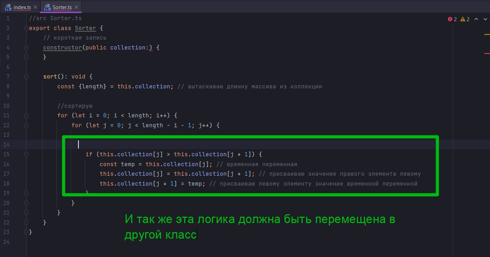

Но прежде всего нам нужно создать этот класс.

