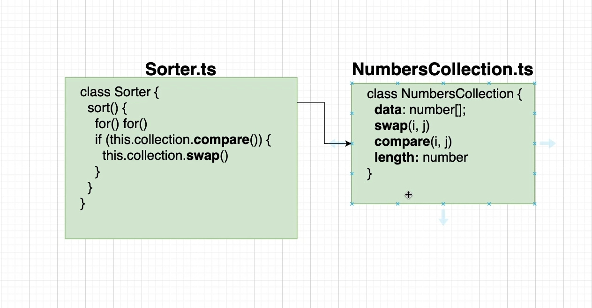
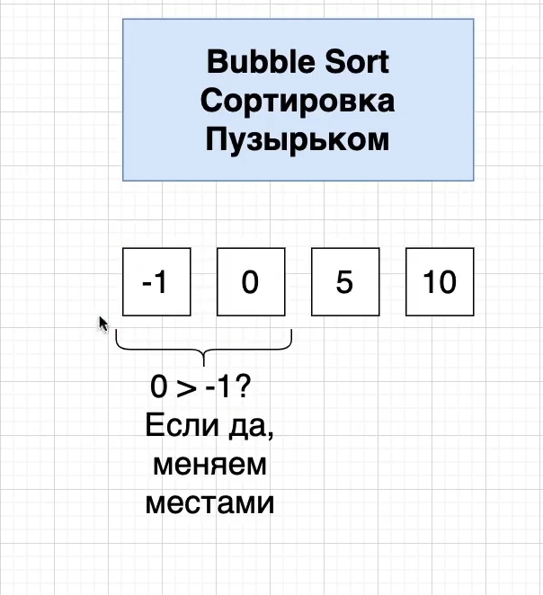
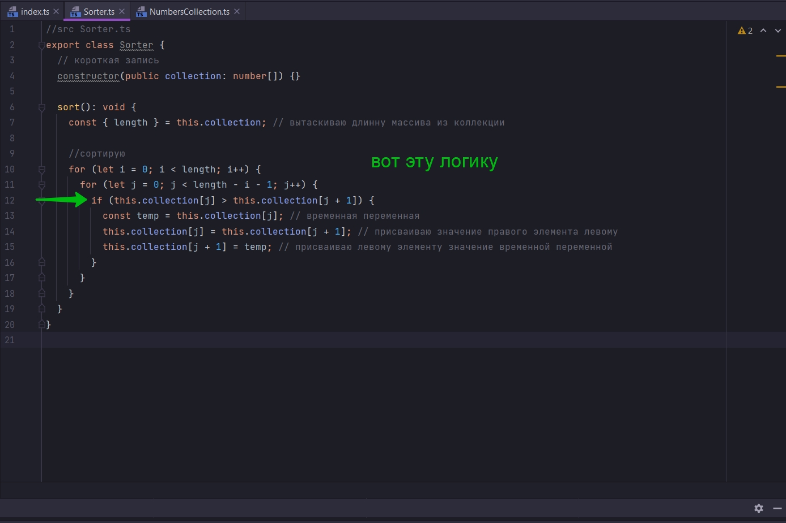
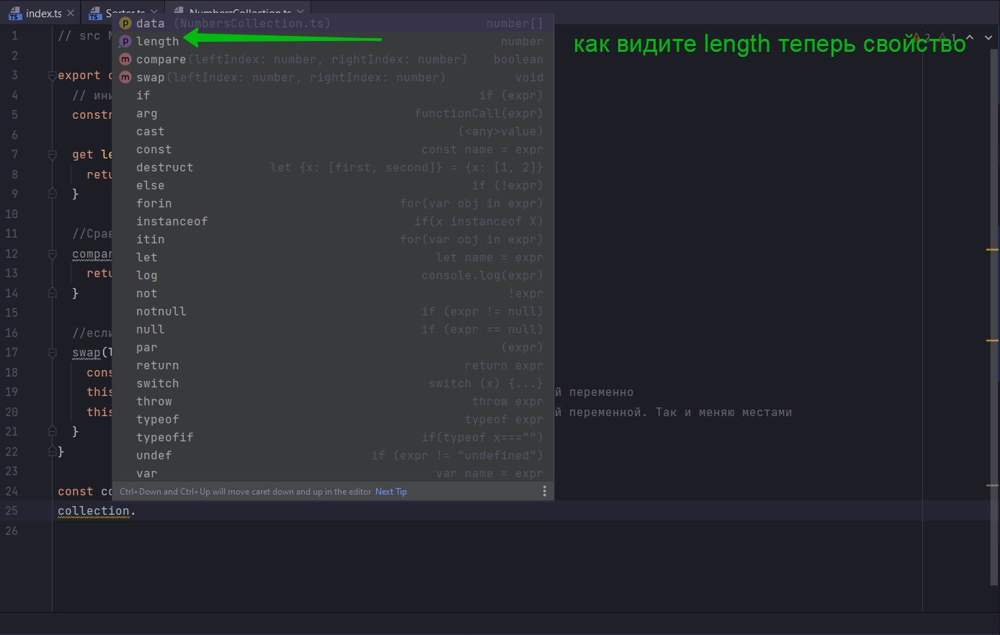
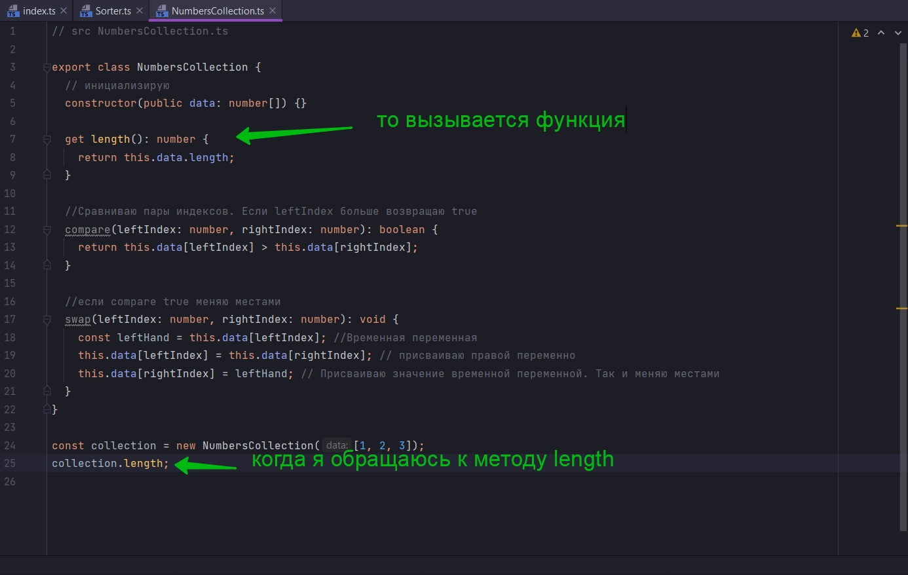
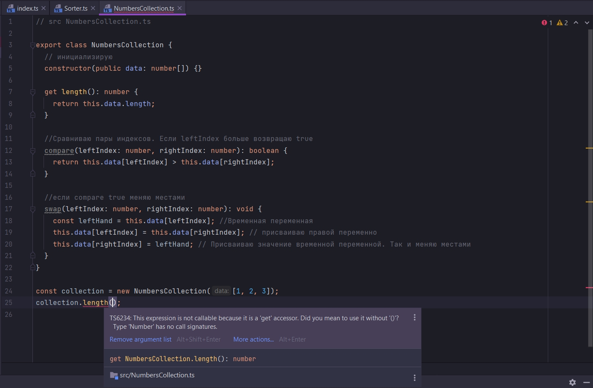
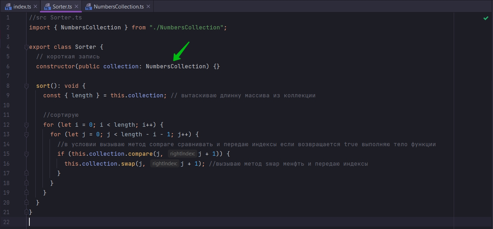
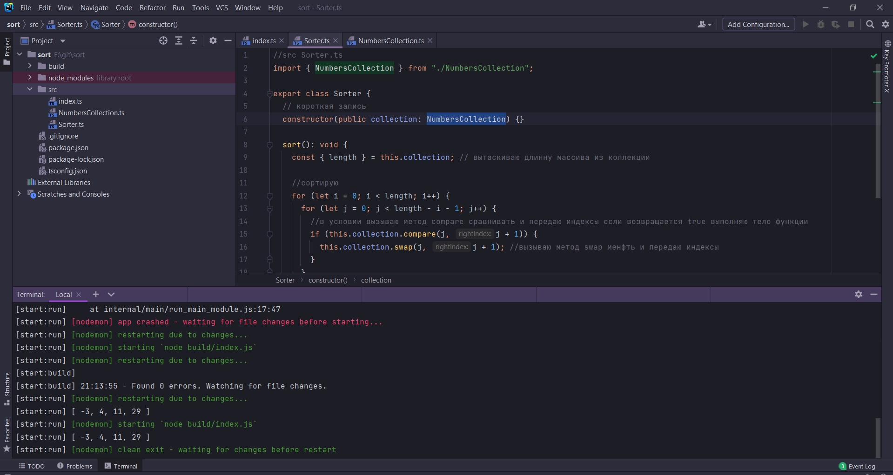
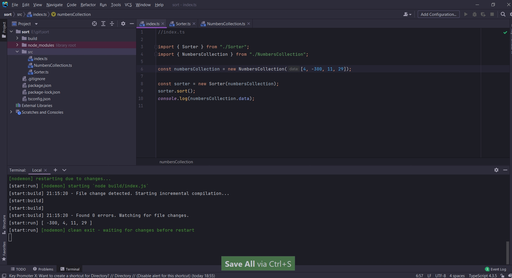

# 012_Разделение_сравнения_и_обмена



Начнем создавать и имплементировать класс NumbersCollection. Очень специфичный класс который будет работать на данный
момент с числовым массивом и который будет иметь очень специфичные методы swap,для обмена местами, и compare,для
сравнивания элементов в числовом массивею.

Создаю NumbersCollection.ts

```ts
// src NumbersCollection.ts

export class NumbersCollection {
}

```

Как я уже говорил в этом классе должна быть ссылка на коллекцию числового массива, который мы будем сортировать.

```ts
// src NumbersCollection.ts

export class NumbersCollection {
    data: number[];

    // инициализирую
    constructor(data: number[]) {
        this.data = data; // присваиваю параметр который буду передавать в constructor
    }
}

```

как обычно я пишу полный синтаксис. Но у нас есть сжатый.

```ts
// src NumbersCollection.ts

export class NumbersCollection {
    // инициализирую
    constructor(public data: number[]) {
    }
}

```

Мы создаем public свойство data. И в конструкторе будем передавать в него значение числового массива и инициализировать
этим значением.

Т.е. теперь этот класс NumbersCollection будет иметь ссылку на data на числовой массив который мы будем сортировать.

И теперь в этом классе у нас будет очень специфичная логика которая будет сравнивать два элемента числового массива и
менять местами.

Сначало нам надо сравнить элементы. Напишем сначало метод compare.

```ts
// src NumbersCollection.ts

export class NumbersCollection {
    // инициализирую
    constructor(public data: number[]) {
    }

    compare(): boolean {
    }
}

```

И так первый параметр будет левый элемент в паре.

```ts
// src NumbersCollection.ts

export class NumbersCollection {
    // инициализирую
    constructor(public data: number[]) {
    }

    compare(leftIndex: number, rightIndex: number): boolean {
    }
}

```



В сортировке Пузырьком мы сравниваем, мы переходим от пары к паре в каждом шаге цикла и сравниваем два элемента. Если
левый элемент больше правого мы их меняем местами.

После сравнения перехожу к следующей паре индексов и сравниваю значения. В даннои случае index 0 со значением -1, и
index 1 со значением 0. Так как 0 > -1 перестановки не будет. Далее проверяется index 1 со значение 0 и index 2 со
значение 5 и т.д.

И мы можем сделать это очень просто. Мы будем возвращать boolean значение сравнивания двух значений из массива data.

```ts
// src NumbersCollection.ts

export class NumbersCollection {
    // инициализирую
    constructor(public data: number[]) {
    }

    compare(leftIndex: number, rightIndex: number): boolean {
        return this.data[leftIndex] > this.data[rightIndex];
    }
}

```

И если этот метод compare будет возвращать true, т.е. если левый элемент больше правого, то нам нужно будет менять их
местами.

Если же он возвращает false, т.е. левый элемент не больше правого. В этом случае нам не нужно менять местами эти
элементы.

И так мы с вами извлекли логику из класса Sort



в отдельный класc NumbersCollection.

Теперь сделаю тоже самое для логики обмена. В NumbersCollection прописываю функцию swap которая так же параметрами будет
принимать leftIndex: number, rightIndex: number. Что бы понимать какие элементы с какими индексами менять местами.

```ts
// src NumbersCollection.ts

export class NumbersCollection {
    // инициализирую
    constructor(public data: number[]) {
    }

    //Сравниваю пары индексов. Если leftIndex больше возвращаю true
    compare(leftIndex: number, rightIndex: number): boolean {
        return this.data[leftIndex] > this.data[rightIndex];
    }

    //если compare true меняю местами
    swap(leftIndex: number, rightIndex: number): void {
    }
}

```

В теле функции swap реализуем метод обмена местами именно для числового массива.

```ts
// src NumbersCollection.ts

export class NumbersCollection {
    // инициализирую
    constructor(public data: number[]) {
    }

    //Сравниваю пары индексов. Если leftIndex больше возвращаю true
    compare(leftIndex: number, rightIndex: number): boolean {
        return this.data[leftIndex] > this.data[rightIndex];
    }

    //если compare true меняю местами
    swap(leftIndex: number, rightIndex: number): void {
        const leftHand = this.data[leftIndex]; //Временная переменная
        this.data[leftIndex] = this.data[rightIndex]; // присваиваю правой переменно
        this.data[rightIndex] = leftHand; // Присваиваю значение временной переменной. Так и меняю местами
    }
}

```

И еще из класса Sort мы должны имплементировать в NumbersCollection длинну массива.

В NumbersCollection добавляю новый метод length.

```ts
// src NumbersCollection.ts

export class NumbersCollection {
    // инициализирую
    constructor(public data: number[]) {
    }

    length(): number {
        return this.data.length;
    }

    //Сравниваю пары индексов. Если leftIndex больше возвращаю true
    compare(leftIndex: number, rightIndex: number): boolean {
        return this.data[leftIndex] > this.data[rightIndex];
    }

    //если compare true меняю местами
    swap(leftIndex: number, rightIndex: number): void {
        const leftHand = this.data[leftIndex]; //Временная переменная
        this.data[leftIndex] = this.data[rightIndex]; // присваиваю правой переменно
        this.data[rightIndex] = leftHand; // Присваиваю значение временной переменной. Так и меняю местами
    }
}

```

В данном случае мы должны получать length при помощи метода. Но обычно когда мы получаем длинну массива, то это не метод
а свойство. И лучше бы было бы укзать не метод length, а свойство.

И мы можем это сделать при помощи так называемого getter. Иногда такие методы называются аксессорами. Т.е. от слова
доступ. Т.е. дают доступ к чему-то.

И для этого я помещу перед названием метода length ключевое слово get.

```ts
// src NumbersCollection.ts

export class NumbersCollection {
    // инициализирую
    constructor(public data: number[]) {
    }

    get length(): number {
        return this.data.length;
    }

    //Сравниваю пары индексов. Если leftIndex больше возвращаю true
    compare(leftIndex: number, rightIndex: number): boolean {
        return this.data[leftIndex] > this.data[rightIndex];
    }

    //если compare true меняю местами
    swap(leftIndex: number, rightIndex: number): void {
        const leftHand = this.data[leftIndex]; //Временная переменная
        this.data[leftIndex] = this.data[rightIndex]; // присваиваю правой переменно
        this.data[rightIndex] = leftHand; // Присваиваю значение временной переменной. Так и меняю местами
    }
}

```

И вроде бы ничего не изменилось, но теперь я могу обращаться к длинне как к свойству.





Так как я поместил здесь ключевое слово get, то я не должен обращаться к этому getter length как к функции или методу.

Если же я к ней обращусь как к функции или методу, то я получу ошибку.



В ней говориться что это выражение не возможно вызвать потому что это get accessor.

[https://learn.javascript.ru/property-accessors](https://learn.javascript.ru/property-accessors)

[https://developer.mozilla.org/ru/docs/Web/JavaScript/Reference/Operators/Property_Accessors](https://developer.mozilla.org/ru/docs/Web/JavaScript/Reference/Operators/Property_Accessors)

Можно было бы употребить и без ключевого слова get.

Но get использовать лучше т.к. всегда в числовых массивах number[], length выражается как свойство а не метод

Оставляю код в форме метода accessor.

```ts
// src NumbersCollection.ts

export class NumbersCollection {
    // инициализирую
    constructor(public data: number[]) {
    }

    get length(): number {
        return this.data.length;
    }

    //Сравниваю пары индексов. Если leftIndex больше возвращаю true
    compare(leftIndex: number, rightIndex: number): boolean {
        return this.data[leftIndex] > this.data[rightIndex];
    }

    //если compare true меняю местами
    swap(leftIndex: number, rightIndex: number): void {
        const leftHand = this.data[leftIndex]; //Временная переменная
        this.data[leftIndex] = this.data[rightIndex]; // присваиваю правой переменно
        this.data[rightIndex] = leftHand; // Присваиваю значение временной переменной. Так и меняю местами
    }
}

```

Теперь переходим в класс Sorter и свяжем его с классом NumbersCollection.

```ts
//src Sorter.ts
import {NumbersCollection} from "./NumbersCollection";

export class Sorter {
    // короткая запись
    constructor(public collection: NumbersCollection) {
    }

    sort(): void {
        const {length} = this.collection; // вытаскиваю длинну массива из коллекции

        //сортирую
        for (let i = 0; i < length; i++) {
            for (let j = 0; j < length - i - 1; j++) {
                //в условии вызываю метод compare сравнивать и передаю индексы если возвращается true выполняю тело функции
                if (this.collection.compare(j, j + 1)) {
                    this.collection.swap(j, j + 1); //вызываю метод swap менфть и передаю индексы
                }
            }
        }
    }
}

```

Цель которую мы добивались это извлечь всю логику присущую числовым массивам и поместить ее в отдельный класс
NumbersCollection.

И теперь нам нужно протестировать все ли работает.

И для этого переписываю index.ts

Было

```ts
//index.ts

const sorter = new Sorter([4, -3, 11, 29]);
sorter.sort();
console.log(sorter.collection);
```

И вот правильный код. Думаю разберешься.

```ts
//index.ts

import {Sorter} from "./Sorter";
import {NumbersCollection} from "./NumbersCollection";

const numbersCollection = new NumbersCollection([4, -3, 11, 29]);

const sorter = new Sorter(numbersCollection);
sorter.sort();
console.log(numbersCollection.data);

```

Создаю объект класса const numbersCollection = new NumbersCollection(); Теперь я могу в него передавать числовой массив
const numbersCollection = new NumbersCollection([4, -3, 11, 29]);

После чего в Sorter ожидается один аргумент. Сюда я должен предоставить коллекцию который я должен предоставить в
конструктор Sorter класса.



NumbersCollection - это банан

Теперь при создании объекта класса sorter в класс передаю numbersCollection.






