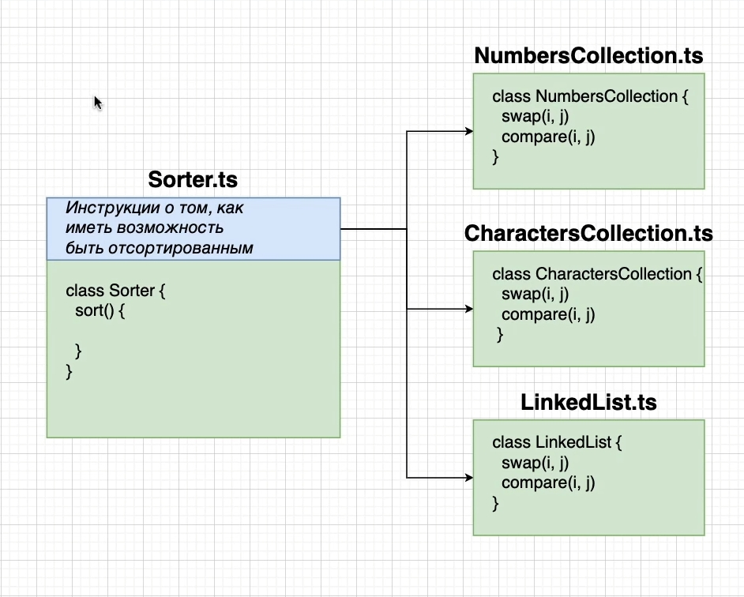

# 013_Формулировка_интерфейса

На данный момент у нас в классе Sorter в конструкторе может принимать параметр только тип NumbersCollection

```ts
//src Sorter.ts
import {NumbersCollection} from "./NumbersCollection";

export class Sorter {
    // короткая запись
    constructor(public collection: NumbersCollection) {
    }

    sort(): void {
        const {length} = this.collection; // вытаскиваю длинну массива из коллекции

        //сортирую
        for (let i = 0; i < length; i++) {
            for (let j = 0; j < length - i - 1; j++) {
                //в условии вызываю метод compare сравнивать и передаю индексы если возвращается true выполняю тело функции
                if (this.collection.compare(j, j + 1)) {
                    this.collection.swap(j, j + 1); //вызываю метод swap менфть и передаю индексы
                }
            }
        }
    }
}

```

И нам нужно селать так что бы наш класс в конструкторе принимал любую другую коллекцию. Например коллекцию символов или
LinkedList или любую другую коллекцию.



Самая сложная часть в создании interface это понять как мы можем их инструктировать о том что бы этот класс имел
возможность сортировки.


collection это то что мы пытаемся отсортировать. И в collection нам нужно обязательно три вещи.

- Нам нужна длинна ютой коллекции length
- У нас есть метод compare что бы сравнивать элементы
- и swap что бы менять их местами.

Это именно и будет нашими инструкциями для классов.


Класс CharactersCollection будет как бы оборачивать строку. И в нем должна быть такая же функциональность

- Нам нужна длинна ютой коллекции length
- У нас есть метод compare что бы сравнивать элементы
- и swap что бы менять их местами.

Много лишнего не вижу смысла писать. На диаграмме все показано. Если в любом из классов есть все свойства указанные выше
или как на диаграмме, мы далем доступ к класу Sorter. Если класс имеет все эти три свойства мы можем использовать наш
сортирующий алгоритм в классе Sorter.

Именно так и имплементируется повторное или многократное использование с помощью интерфейсов. И все благодаря
инструкциям прописанным в классе Sorter.