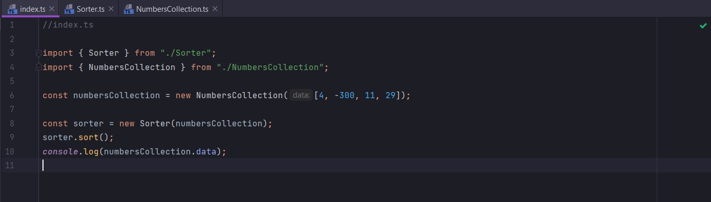

# 014_Определение_интерфейса

Создаю interface Sortable в классе Sort.

```ts
//src Sorter.ts
import {NumbersCollection} from "./NumbersCollection";

//Инструкции о том как иметь возможность быть отсортированными
interface Sortable {
    length: number;

    compare(leftIndex: number, rightIndex: number): boolean; // если true меняю местами
    swap(leftIndex: number, rightIndex: number): void;
}

export class Sorter {
    // короткая запись
    constructor(public collection: NumbersCollection) {
    }

    sort(): void {
        const {length} = this.collection; // вытаскиваю длинну массива из коллекции

        //сортирую
        for (let i = 0; i < length; i++) {
            for (let j = 0; j < length - i - 1; j++) {
                //в условии вызываю метод compare сравнивать и передаю индексы если возвращается true выполняю тело функции
                if (this.collection.compare(j, j + 1)) {
                    this.collection.swap(j, j + 1); //вызываю метод swap менфть и передаю индексы
                }
            }
        }
    }
}

```

И теперь когда мы будем создавать объект класса Sorter нам не нужно передавать в качестве параметра NumbersCollection.

Сейчас я смогу передавать в него любой объект, любую вещь имеющую, которая имеет три свойства length, compare, swap.

И для этого нам нужно обновить аннотацию типов на интерфейс Sortable.

```ts
//src Sorter.ts

//Инструкции о том как иметь возможность быть отсортированными
interface Sortable {
    length: number;

    compare(leftIndex: number, rightIndex: number): boolean; // если true меняю местами
    swap(leftIndex: number, rightIndex: number): void;
}

export class Sorter {
    // короткая запись
    constructor(public collection: Sortable) {
    }

    sort(): void {
        const {length} = this.collection; // вытаскиваю длинну массива из коллекции

        //сортирую
        for (let i = 0; i < length; i++) {
            for (let j = 0; j < length - i - 1; j++) {
                //в условии вызываю метод compare сравнивать и передаю индексы если возвращается true выполняю тело функции
                if (this.collection.compare(j, j + 1)) {
                    this.collection.swap(j, j + 1); //вызываю метод swap менфть и передаю индексы
                }
            }
        }
    }
}

```

Это хороший стиль написания кода. У нас вверху в интерфейсе инструкции о том как быть аргументам в конструкторе
аргументам класса Sortable. Т.е. иметь возможность быть отсортированным при помощи нашего класса.

Если мы перейдем в index.ts



```ts
//index.ts

import {Sorter} from "./Sorter";
import {NumbersCollection} from "./NumbersCollection";

const numbersCollection = new NumbersCollection([4, -300, 11, 29]);

const sorter = new Sorter(numbersCollection);
sorter.sort();
console.log(numbersCollection.data);

```

То как видите мы здесь не получаем ошибок. Мы передаем NumbersCollection а не Sortable. И тем не менее мы не получаем ни
каких ошибок.

Это происходит потому что наш класс NumbersCollection польностью соответствует требованиям, удовлетворяет инструкциям
интерфейса.


```ts
//src Sorter.ts

//Инструкции о том как иметь возможность быть отсортированными
interface Sortable {
    length: number;

    compare(leftIndex: number, rightIndex: number): boolean; // если true меняю местами
    swap(leftIndex: number, rightIndex: number): void;
}

export class Sorter {
    // короткая запись
    constructor(public collection: Sortable) {
    }

    sort(): void {
        const {length} = this.collection; // вытаскиваю длинну массива из коллекции

        //сортирую
        for (let i = 0; i < length; i++) {
            for (let j = 0; j < length - i - 1; j++) {
                //в условии вызываю метод compare сравнивать и передаю индексы если возвращается true выполняю тело функции
                if (this.collection.compare(j, j + 1)) {
                    this.collection.swap(j, j + 1); //вызываю метод swap менфть и передаю индексы
                }
            }
        }
    }
}

```

```ts
// src NumbersCollection.ts

export class NumbersCollection {
    // инициализирую
    constructor(public data: number[]) {
    }

    get length(): number {
        return this.data.length;
    }

    //Сравниваю пары индексов. Если leftIndex больше возвращаю true
    compare(leftIndex: number, rightIndex: number): boolean {
        return this.data[leftIndex] > this.data[rightIndex];
    }

    //если compare true меняю местами
    swap(leftIndex: number, rightIndex: number): void {
        const leftHand = this.data[leftIndex]; //Временная переменная
        this.data[leftIndex] = this.data[rightIndex]; // присваиваю правой переменно
        this.data[rightIndex] = leftHand; // Присваиваю значение временной переменной. Так и меняю местами
    }
}

```

Имено благодаря тому что мы имплементировали length свойство при помощи accessor или getter, называют по разному такой
метод, именно по этому мы можем к нему обращаться как к свойству.

Именно по этому в interface я к length обращаюсь как к методу а не как к функции. К примеру не вызываю как функцию через
круглые скобки.

Видимо он сам не понимает что такое методы и свойства.


И еще один момент. Кокда мы с вами добавили interface Sortable. В методах compare и swap я передаю в параметрах
leftIndex и rightIndex. И в классе NumbersCollection названия параметров в этих методах эдентичны.

И на самом деле это не обязательно. Название параметров в реализации методов


И в определении методов в interface


Не должны совпадать. Это распостраняется только на параметры. Названия самих методов length, compare, swap должны
совпадать обязательно.

В interface названия параметров не так важны. Но обычно называют одноименно что бы не путаться.


теперь мы можем создавать другие типы коллекций для работы с нашим классом Sortable.


