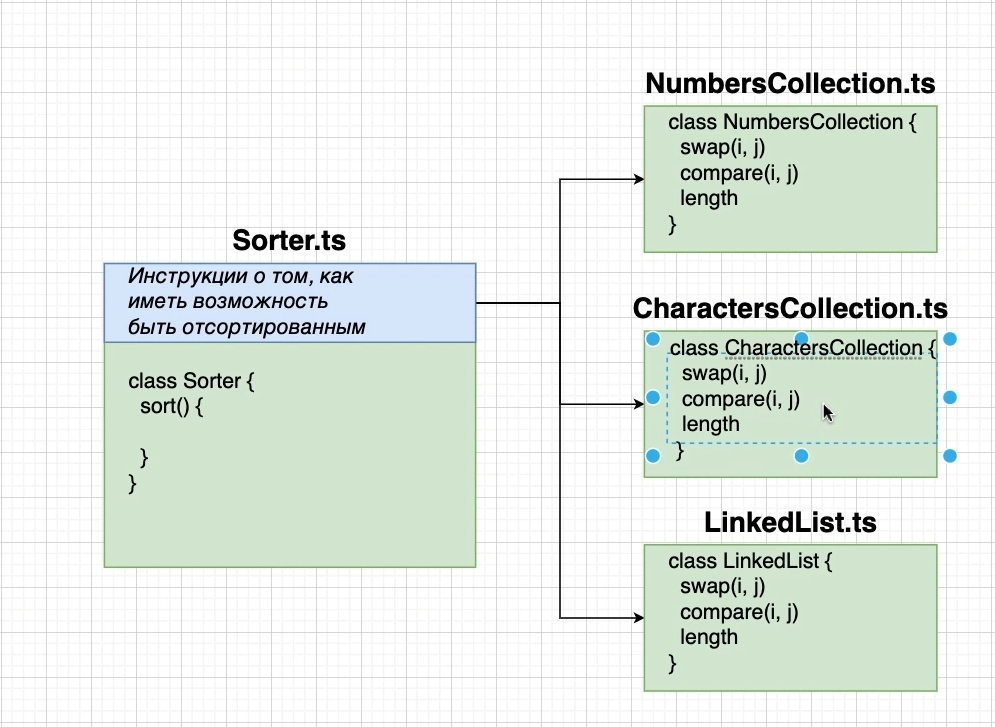
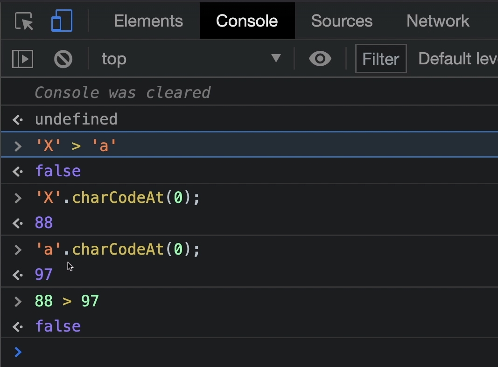
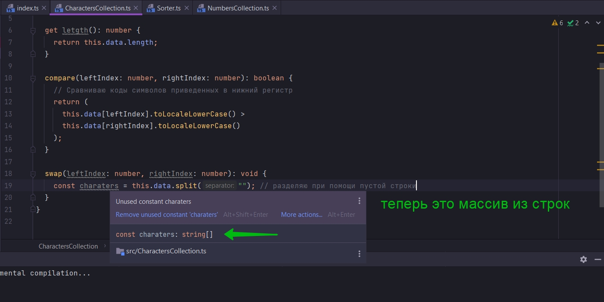
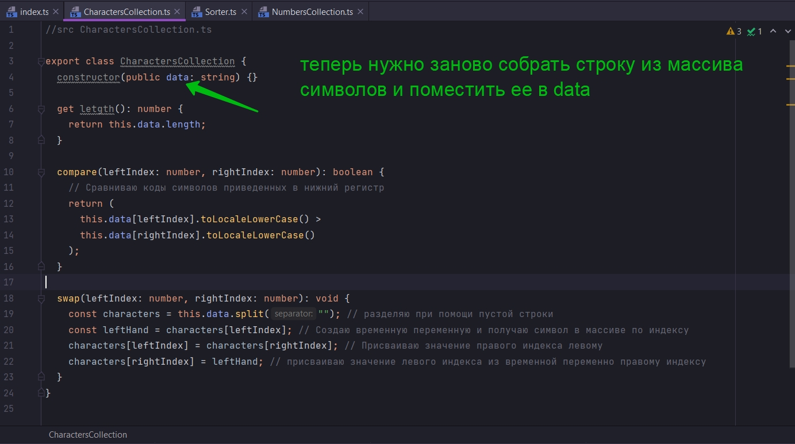
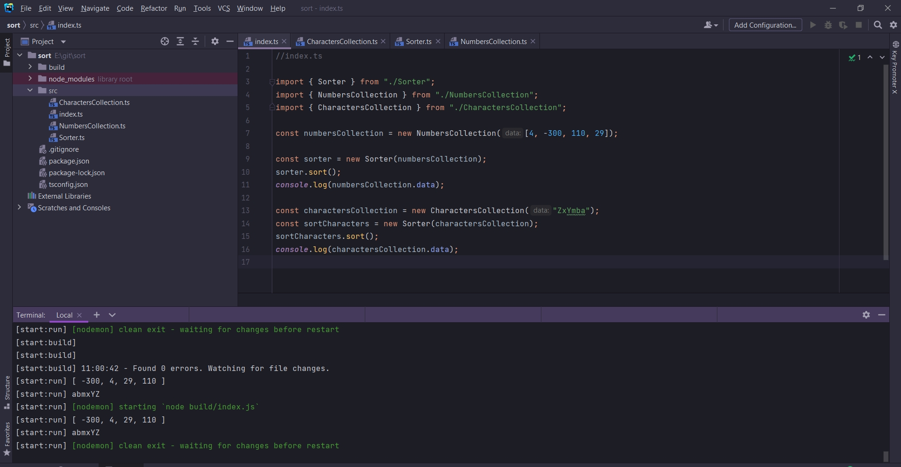

# 015_Сортировка_строк



Создаю CharactersCollection.ts

```ts
//src CharactersCollection.ts

export class CharactersCollection {
    constructor(public data: string) {
    }

    get length(): number {
        return this.data.length;
    }

    compare(leftIndex: number, rightIndex: number): boolean {

    }


}

```

Во время сравнения символов строки происходит савнение кодов символов.



Но это не то что мы хотели. Мы хотели что бы они были отсортированы по алфавиту.

Мы сделаес следующее:

- Приведем все символы в нижний регистр
- после будем сравнивать элементы.

```ts
//src CharactersCollection.ts

export class CharactersCollection {
    constructor(public data: string) {
    }

    get length(): number {
        return this.data.length;
    }

    compare(leftIndex: number, rightIndex: number): boolean {
        // Сравниваю коды символов приведенных в нижний регистр
        return (
            this.data[leftIndex].toLocaleLowerCase() >
            this.data[rightIndex].toLocaleLowerCase()
        );
    }
}

```

Реализую метод swap

```ts
//src CharactersCollection.ts

export class CharactersCollection {
    constructor(public data: string) {
    }

    get length(): number {
        return this.data.length;
    }

    compare(leftIndex: number, rightIndex: number): boolean {
        // Сравниваю коды символов приведенных в нижний регистр
        return (
            this.data[leftIndex].toLocaleLowerCase() >
            this.data[rightIndex].toLocaleLowerCase()
        );
    }

    swap(leftIndex: number, rightIndex: number): void {
    }

}

```

И если вы помните мы не можем на прямую менять менять элементы в строке т.к. строки в JS immutable т.е. не изменяемы.

Один из самых простых способов, взять строку, разбить на символы и поместить каждый символ в массив. Т.е это уже будет
массив из символов. И потом мы можем применять ту же логику которую мы применяли в numbers.

```ts
//src CharactersCollection.ts

export class CharactersCollection {
    constructor(public data: string) {
    }

    get length(): number {
        return this.data.length;
    }

    compare(leftIndex: number, rightIndex: number): boolean {
        // Сравниваю коды символов приведенных в нижний регистр
        return (
            this.data[leftIndex].toLocaleLowerCase() >
            this.data[rightIndex].toLocaleLowerCase()
        );
    }

    swap(leftIndex: number, rightIndex: number): void {
        const charaters = this.data.split(""); // разделяю при помощи пустой строки
    }
}

```



 ```ts
//src CharactersCollection.ts

export class CharactersCollection {
    constructor(public data: string) {
    }

    get length(): number {
        return this.data.length;
    }

    compare(leftIndex: number, rightIndex: number): boolean {
        // Сравниваю коды символов приведенных в нижний регистр
        return (
            this.data[leftIndex].toLocaleLowerCase() >
            this.data[rightIndex].toLocaleLowerCase()
        );
    }

    swap(leftIndex: number, rightIndex: number): void {
        const characters = this.data.split(""); // разделяю при помощи пустой строки
        const leftHand = characters[leftIndex]; // Создаю временную переменную и получаю символ в массиве по индексу
        characters[leftIndex] = characters[rightIndex]; // Присваиваю значение правого индекса левому
        characters[rightIndex] = leftHand; // присваиваю значение левого индекса из временной переменно правому индексу
    }
}

```

И теперь мне нужно заново из этого массива собрать строку и поместить ее в data



```ts
//src CharactersCollection.ts

export class CharactersCollection {
    constructor(public data: string) {
    }

    get length(): number {
        return this.data.length;
    }

    compare(leftIndex: number, rightIndex: number): boolean {
        // Сравниваю коды символов приведенных в нижний регистр
        return (
            this.data[leftIndex].toLocaleLowerCase() >
            this.data[rightIndex].toLocaleLowerCase()
        );
    }

    swap(leftIndex: number, rightIndex: number): void {
        const characters = this.data.split(""); // разделяю, разбиваю символы, при помощи пустой строки
        const leftHand = characters[leftIndex]; // Создаю временную переменную и получаю символ в массиве по индексу
        characters[leftIndex] = characters[rightIndex]; // Присваиваю значение правого индекса левому
        characters[rightIndex] = leftHand; // присваиваю значение левого индекса из временной переменно правому индексу
        this.data = characters.join(""); //Собираю строку из массива. Соеденяю символы по пустой строке
    }
}

```

Проверяю работоспособность

```ts
//index.ts

import {Sorter} from "./Sorter";
import {NumbersCollection} from "./NumbersCollection";
import {CharactersCollection} from "./CharactersCollection";

const numbersCollection = new NumbersCollection([4, -300, 110, 29]);

const sorter = new Sorter(numbersCollection);
sorter.sort();
console.log(numbersCollection.data);

const charactersCollection = new CharactersCollection("ZxYmba");
const sortCharacters = new Sorter(charactersCollection);
sortCharacters.sort();
console.log(charactersCollection.data);

```



