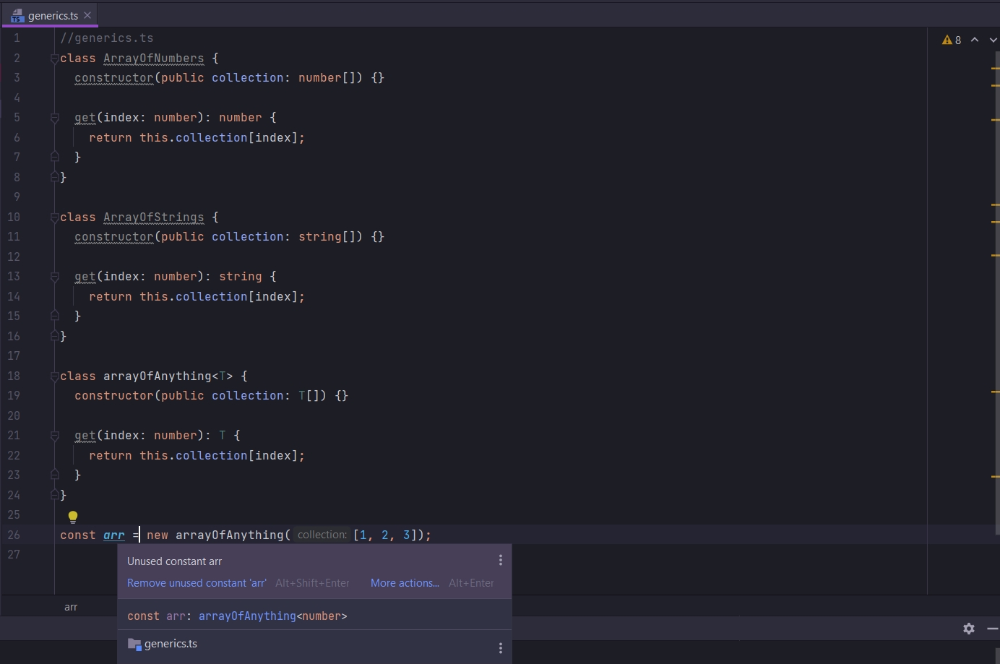

# 002_Type_Inference_и_Generics

Рассмотрим пару важных моментов о Generic. И именно эти моменты касаются классов. И так внизу мы создали объект класса
arrayOfAnything

```ts
//generics.ts
class ArrayOfNumbers {
    constructor(public collection: number[]) {
    }

    get(index: number): number {
        return this.collection[index];
    }
}

class ArrayOfStrings {
    constructor(public collection: string[]) {
    }

    get(index: number): string {
        return this.collection[index];
    }
}

class arrayOfAnything<T> {
    constructor(public collection: T[]) {
    }

    get(index: number): T {
        return this.collection[index];
    }
}

new arrayOfAnything<number>([1, 2, 3]);

```

Когда мы в классе arrayOfAnything указали в качестве generic типа <number>. Мы как бы представляем что мы переходим в
определение класса.


И везде где есть Generic T, заменяем его на тип number внутри класса. Это как бы происходит за кулисами.

Я могу сделать вот так.



и теперь хотя и и убрал угловые скобки в которых определя тип generic, в переменной я все равно наблюдаю его тип.

Когда мы создаем новый объект arrayOfAnything мы передаем в него аргумент массива из чисел и TS знает что это именно
массив из чисел. И TS смотрит что мы в конструктор класса arrayOfAnything


Передаем массив из чисел T[]. Раз мы передаем в этот конструктор массив из чисел. Следовательно этот generic тип T[]
будет числовым. Т.е. это Type inference или вывод типа.

Мы использовали Generic сами того не подозрева. Например когда использовали axios. Понимание вывода типа с Generic может
быть немного сложным.