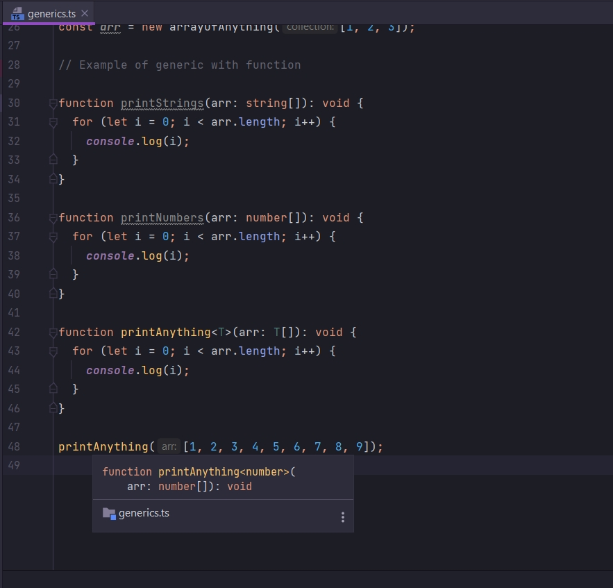

# 003_Функции_и_Generics

Рассмотрим использование Generic в функциях. Мы рассмотрим пару примеров и так же увидим использование type inference
или вывод типов для Generic.

```ts
// Example of generic with function

function printStrings() {
}

function printNumbers() {
}
```

Каждая из этих функций будет получать в качестве параметра либо массив из строк либо массив из чисел. Каждая из этих
функций будет итерировать сквозь этот массив и выводить в консоль каждый элемент этого массива.

```ts
// Example of generic with function

function printStrings(arr: string[]): void {
    for (let i = 0; i < arr.length; i++) {
        console.log(i);
    }
}

function printNumbers(arr: number[]): void {
    for (let i = 0; i < arr.length; i++) {
        console.log(i);
    }
}
```

И тут видно 100% дублирование кода. Очень простой способ это исправить при помощи Generic.

Мы можем создать функцию которая будет принимать в качестве параметра любой тип массива.

```ts
// Example of generic with function

function printStrings(arr: string[]): void {
    for (let i = 0; i < arr.length; i++) {
        console.log(i);
    }
}

function printNumbers(arr: number[]): void {
    for (let i = 0; i < arr.length; i++) {
        console.log(i);
    }
}

function printAnything<T>(arr: T[]): void {
    for (let i = 0; i < arr.length; i++) {
        console.log(i);
    }
}
```

Как и в случае с классами generic T т.е. type, мы можем представлять его как еще один дополнительный параметр в функции.
Каждый раз когда мы будем делать вызов функции printAnything нам нужно будет указать конкретный аргумент для параметра T
т.е. какой-то конкретный тип. И в этом случае вызов этой функции будет производится с передачей массива и этого
специфического типауказанного вами.

Название Generic может быть каким угодно. Это банан.

Вызываю функцию.

```ts
// Example of generic with function

function printStrings(arr: string[]): void {
    for (let i = 0; i < arr.length; i++) {
        console.log(i);
    }
}

function printNumbers(arr: number[]): void {
    for (let i = 0; i < arr.length; i++) {
        console.log(i);
    }
}

function printAnything<T>(arr: T[]): void {
    for (let i = 0; i < arr.length; i++) {
        console.log(i);
    }
}

printAnything<number>([1, 2, 3, 4, 5, 6, 7, 8, 9]);
```

Тут есть один момент с которым можно запутаться. Что мы должны сюда передавать


или плюс квадратные скобки.


Это значить что мы в параметр функции передадим двумерный массив.


Передача двумерного числового массива будет неверно в нашем случае.

Так же как и при работе с классами происходит вывод типов. Мы можем убрать <number> и все будет работать.



Но и как при аннотации типа возвращаемого значения функции


Поэтому я так же рекомендую при вызове функции указывать тип значения передаваемый в Generic. это все таки помогает для
отлавливания ошибок.

