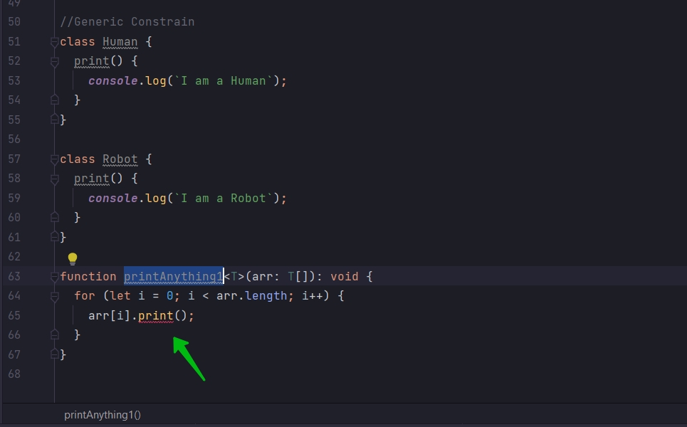
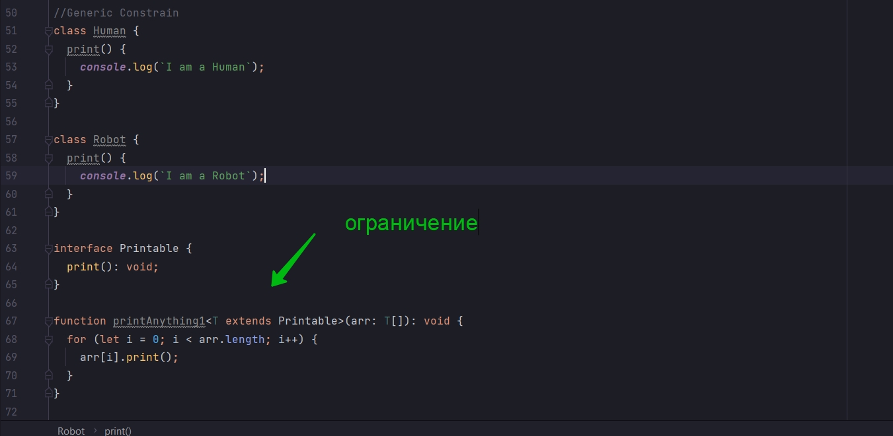

# 004_Generic_Constraints Ограничения Generic

В прошлом видео мы создали функцию printAnything которая может вывести в консоль все элементы поочередно.

```ts

// Example of generic with function

function printStrings(arr: string[]): void {
    for (let i = 0; i < arr.length; i++) {
        console.log(i);
    }
}

function printNumbers(arr: number[]): void {
    for (let i = 0; i < arr.length; i++) {
        console.log(i);
    }
}

function printAnything<T>(arr: T[]): void {
    for (let i = 0; i < arr.length; i++) {
        console.log(i);
    }
}

printAnything<number>([1, 2, 3, 4, 5, 6, 7, 8, 9]);
```

Я хочу создать еще одну функцию printAnything которая вместо того что бы выводить в консоль при помощи consol.log, она
будет использовать предопределенный метод print который можно вызвать для итерируемого элемента массива.

Метод print будет предопределен в классе т.е. у нас будут объекты какого-то класса. И у этих объектов будет
предопределен метод print и это объекты соответственно смогут вызывать этот метод print

```ts
//Generic Constrain
class Human {
    print() {
        console.log(`I am a Human`);
    }
}

class Robot {
    print() {
        console.log(`I am a Robot`);
    }
}
```

Теперь я хочу создать новую функцию которая будет принимать в качестве аргумента массив классов. И итерируя будет
вызывать каждую из этих функций.

Реализую функцию printAnything1 в которой будет цикл for на каждой итерации которого буду вызывать функции содержащинся
в массиве.



```ts
//Generic Constrain
class Human {
    print() {
        console.log(`I am a Human`);
    }
}

class Robot {
    print() {
        console.log(`I am a Robot`);
    }
}

function printAnything1<T>(arr: T[]): void {
    for (let i = 0; i < arr.length; i++) {
        arr[i].print();
    }
}
```

Свойства print не существует в типе T. TS как бы говорит нам. Вы хотите использовать динамически тим T т.е. arr[arr]
будет типа T. На самом деле нет ни каких гарантий того что элемент будет иметь метод print.

Для этого мы должны добавить ограничение. Constrain как бы говорит TS что мы обещаем что мотод print будет в этих типах.

Для этого нам нужно до определения функции определить interface. D lfyyj v штеукафсу я указываю print(): void;

И последний шаг который я сделаю это при указании Generic типа. Я должен унаследоваться от interface.

```ts
//Generic Constrain
class Human {
    print() {
        console.log(`I am a Human`);
    }
}

class Robot {
    print() {
        console.log(`I am a Robot`);
    }
}

interface Printable {
    print(): void;
}

function printAnything1<T extends Printable>(arr: T[]): void {
    for (let i = 0; i < arr.length; i++) {
        arr[i].print();
    }
}
```

Ограничение указано здесь



Вызываю функцию и в нее помещаю массив их новых классов.

```ts
//Generic Constrain
class Human {
    print() {
        console.log(`I am a Human`);
    }
}

class Robot {
    print() {
        console.log(`I am a Robot`);
    }
}

interface Printable {
    print(): void;
}

function printAnything1<T extends Printable>(arr: T[]): void {
    for (let i = 0; i < arr.length; i++) {
        arr[i].print();
    }
}

printAnything1([new Human(), new Robot()]);
```

А лучше всего указывать конкретный тип.

```ts

//Generic Constrain
class Human {
    print() {
        console.log(`I am a Human`);
    }
}

class Robot {
    print() {
        console.log(`I am a Robot`);
    }
}

interface Printable {
    print(): void;
}

function printAnything1<T extends Printable>(arr: T[]): void {
    for (let i = 0; i < arr.length; i++) {
        arr[i].print();
    }
}

printAnything1<Human>([new Human()]);
printAnything1<Robot>([new Robot()]);
```

Ограничение Generic на самом деле полезно. Потому что каждый раз когда мы вызываем для какого-то объекта метод generic
типа мы должны быть уверены что в этом типе в котором мы будем передавать, конкретный тип вместо generic типа, что в
этом типе существует соответствующий метод.
