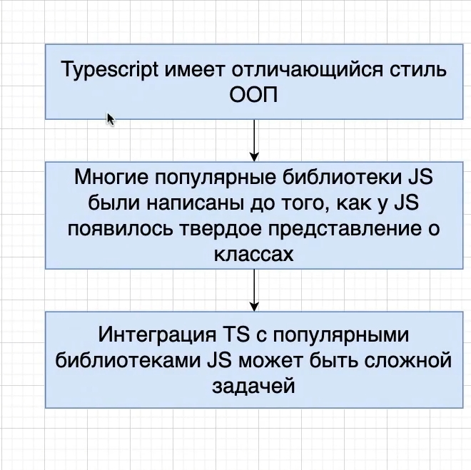
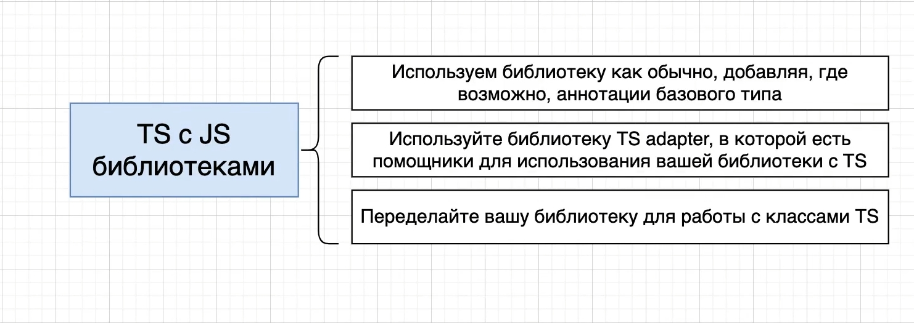
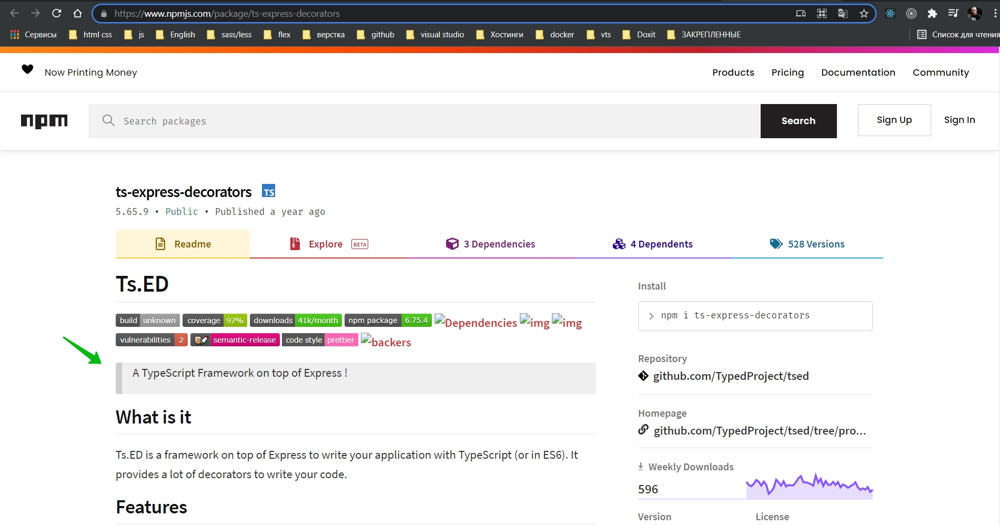

# 001_TypeScript_&_JS_библиотеки

На протяжении всего курса мы использовали классы. И взаимодействие между классами происходило при помощи интерфейсов.

- TS имеет отличающийся стиль ООП. Мы использовали классы на протяжении всего курса. Использовали наследование,
  interfaces, композицию. Проблема в том что многие популярные библиотеки JS были написаны до того как JS появилось
  твердое представление о классах и о ООП. По - сути классы появились в ES6.

Именно по этому интеграция TS с популярными библиотеками может быть довольно сложной задачей.

Существует три решения

- Используем библиотеку как обычно, добавляя где возможно аннотации базового типа. Т.е. мы не должны заботится о
  создании классов, использовании интерфейсов и обовсем этом ООП.

- Другой подход это использовать библиотеку TS adapter. Яркий
  пример [ts-express-decorators](https://www.npmjs.com/package/ts-express-decorators)

Это TS framework по верх express. Если мы посмотрим на код примера, то увидим совсем не похожий на express код.

- Третий подход самый жесткий. Переделать библиотеку для работы с классами.

Мы будем в основном работать с третьим подходом.

