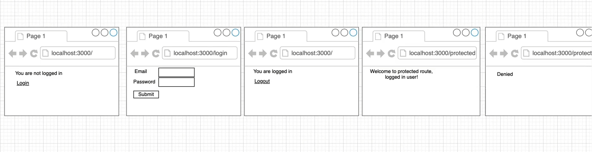
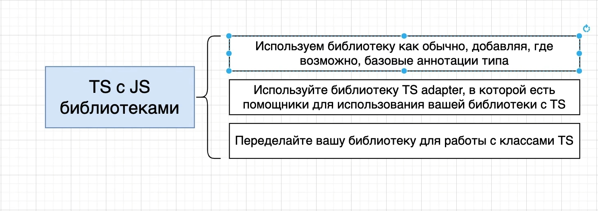

# 002_Обзор_приложения

В первом приложении мы сфокусируемся на Express.js. Мы научимся использовать TS для работы с Express.js.

Вы с вами создадим приложение в стиле аутентификации. Т.е. используя express мы с вами попробуем создать Web-сайт. Мы
будем по разным роутам наблюдать разный контент на экране.

На корневом роуте root будет отображаться залогинен ли пользователь. Каждый раз когда пользователь будет кликать на
Login мы его будем перенаправлять на соответствующий роут. Это будет простой html. Мы не будем с вами разбирать view
классы, модели. У нас не будет back-end

Много текста. Кароче это будет очень простое приложение. Задача понять как подружить TS с Express.

В данном разделе я буду использовать первый способ. Просто в этом подходе мы начнем немного переделывать библиотеку для
работы с классами TS.