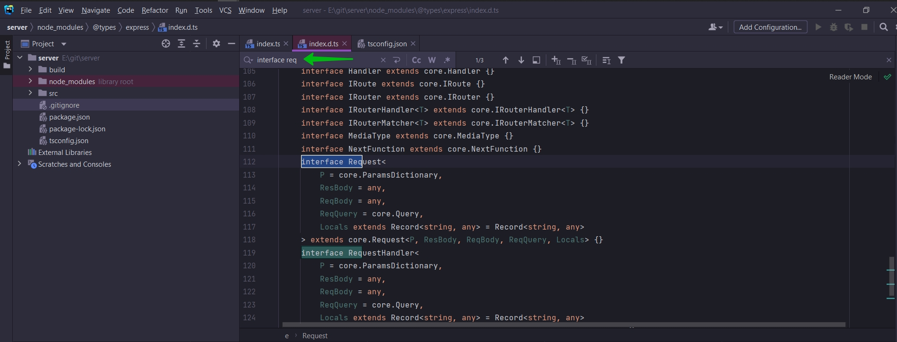

# 004_Создаём_в_Express_Root_Route

```shell
npm i express
```

Так же мне нужет middleware для того что бы парсить текст внутри формы.

Так же мы будем использовать middleware для того что бы отслеживать залогинен ли пользователь.

Для этого я буду использовать middleware [cookie-session](https://www.npmjs.com/package/cookie-session)

```shell
npm i cookie-session
```

И для того что бы парсить текст я установлю [body-parser](https://www.npmjs.com/package/body-parser)

```shell
npm i body-parser
```

```json
{
  "name": "server",
  "version": "1.0.0",
  "description": "",
  "main": "index.js",
  "scripts": {
    "start:build": "tsc -w",
    "start:run": "nodemon build/index.js",
    "start": "concurrently npm:start:*"
  },
  "keywords": [],
  "author": "",
  "license": "ISC",
  "dependencies": {
    "body-parser": "^1.19.0",
    "concurrently": "^6.3.0",
    "cookie-session": "^1.4.0",
    "express": "^4.17.1",
    "nodemon": "^2.0.14"
  }
}


```

Разработка


И как всегда прежде чем начать с какой-то сторонней библиотекой мне нужно загрузить файлы определени типов.

```shell
npm i @types/express @types/body-parser @types/cookie-session
```

```ts
//src index.ts
import express from "express";

const app = express();

app.get("/", (req, res) => {
});

```

И вот здесь в игру вступает TS.

Мы в принципе можем добавить опционально оннотацию типа в эту функцию. Это не обязательно. Это заисит на сколько глубоко
вы хотите зайти с TS при использовании Express. Мы рассмотрим подход в котором мы будем добавлять как можно больше TS в
приложение.

Я хочу добавить аннотацию для req и res. И для этого я должен импортировать type из express т.е. тип. Он показывает что
из себя представляет объект req и объект res.

Перехожу в файл определения типа express.



Этот interface описывает все свойства которые должен иметь объект req. И тоже самое я могу проделать для response.

Мы можем импортировать оба эти interface


И после чего я их могу использовать как аннотацию типов в объектах req,res.

```ts
//src index.ts
import express, {Request, Response} from "express";

const app = express();

app.get("/", (req: Request, res: Response) => {
});

```

Добавляю запуск сервера

```ts
//src index.ts
import express, {Request, Response} from "express";

const PORT = 5000;

const app = express();

app.get("/", (req: Request, res: Response) => {
    res.send(`
  <div>
  <h1>Hello</h1>
  </div>
  `);
});

app.listen(PORT, () => {
    console.log(`Сервер запущен на порту: ${PORT}`);
});

```


