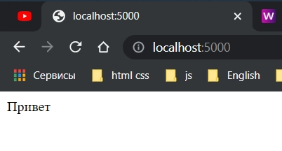

# 005_Использование_Express_Router

Теперь мы можем имплементировать различные роуты в express приложение.

Мы должны иметь несколько route handlers.

В src создаю папку routes. В ней loginRoutes.ts.

Использую для названия loginRoutes.ts маленькую букву l. Это происходит потому что в TS когда мы указываем первый символ
в верхнем регистре это значит что из этого файла мы будем экспортировать какой-то класс.

Но в данном случае мы не будем использовать ни каких классов в этом файле. Мы здесь создадим так называемый
expressRouter.

```ts
//src routes loginRoutes.ts

import {Router} from "express";

const router = Router();

```

Здесь хочу обратить внимание нет ни какого ключевого слова new, просто Router.

```ts
//src routes loginRoutes.ts

import {Router} from "express";

const router = Router();

router.get("/", (req, res) => {
    res.send(`Привет`);
});

export {router};

```

Обратите внимание на export { router };

И далее регистрирую роутер

```ts
//src index.ts
import express, {Request, Response} from "express";
import {router} from "./routes/loginRoutes";

const PORT = 5000;

const app = express();

app.use(router);

app.listen(PORT, () => {
    console.log(`Сервер запущен на порту: ${PORT}`);
});

```



