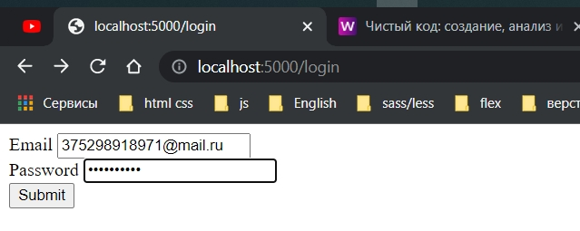

# 006_Парсинг_тела_формы

прежде всего я хочу добавить страницу с формой.

меняю роут на /login

```ts
//src routes loginRoutes.ts

import {Router} from "express";

const router = Router();

router.get("/login", (req, res) => {
    res.send(`Привет`);
});

export {router};

```

Добавляю аннотацию типов

```ts
//src routes loginRoutes.ts

import {Router, Request, Response} from "express";

const router = Router();

router.get("/login", (req: Request, res: Response) => {
    res.send(`Привет`);
});

export {router};

```

Добавляю форму

```ts
//src routes loginRoutes.ts

import {Router, Request, Response} from "express";

const router = Router();

router.get("/login", (req: Request, res: Response) => {
    res.send(`
  <form method="POST">
   <div>
   <label>Email</label>
   <input name="email"/>
</div>
 <div>
   <label>Password</label>
   <input name="password" type="password"/>
</div>
<button>Submit</button>
   </form>
  `);
});

export {router};

```


Тперь добавляю обработчик формы.

```ts
//src routes loginRoutes.ts

import {Router, Request, Response} from "express";

const router = Router();

router.get("/login", (req: Request, res: Response) => {
    res.send(`
  <form method="POST">
   <div>
   <label>Email</label>
   <input name="email"/>
</div>
 <div>
   <label>Password</label>
   <input name="password" type="password"/>
</div>
<button>Submit</button>
   </form>
  `);
});

router.post("/login", (req: Request, res: Response) => {
});

export {router};

```

Когда мы используем Request express не парсит за нас форму. И для этого я буду использовать, уже
установленный,body-parser.

```ts
//src index.ts
import express, {Request, Response} from "express";
import {router} from "./routes/loginRoutes";
import bodyParser from "body-parser";

const PORT = 5000;

const app = express();

app.use(bodyParser.urlencoded({extended: true})); // обязательно прописываю выше регистрации роутов и опциональный параметр extended: ставлю в true
app.use(router);

app.listen(PORT, () => {
    console.log(`Сервер запущен на порту: ${PORT}`);
});

```

Теперь внутри обработчика формы я имею доступ к новому свойству объекта req. а точнее появляется свойство body.

```ts
//src routes loginRoutes.ts

import {Router, Request, Response} from "express";

const router = Router();

router.get("/login", (req: Request, res: Response) => {
    res.send(`
  <form method="POST">
   <div>
   <label>Email</label>
   <input name="email"/>
</div>
 <div>
   <label>Password</label>
   <input name="password" type="password"/>
</div>
<button>Submit</button>
   </form>
  `);
});

router.post("/login", (req: Request, res: Response) => {
    const {email, password} = req.body; // деструктурирую из тела запроса email, password
    res.send(`Email: ${email}, Password: ${password}`);
});
export {router};

```




