# 007_Почему_Express_работает_не_так_просто_с_TS

В этом виде мы с вами не напишем ни какой дополнительный код. Вместо этого я хочу рассмотреть обработчик события post

```ts
//src routes loginRoutes.ts

import {Router, Request, Response} from "express";

const router = Router();

router.get("/login", (req: Request, res: Response) => {
    res.send(`
  <form method="POST">
   <div>
   <label>Email</label>
   <input name="email"/>
</div>
 <div>
   <label>Password</label>
   <input name="password" type="password"/>
</div>
<button>Submit</button>
   </form>
  `);
});

router.post("/login", (req: Request, res: Response) => {
    const {email, password} = req.body; // деструктурирую из тела запроса email, password
    res.send(`Email: ${email}, Password: ${password}`);
});
export {router};

```

Вот эта строка const {email, password} = req.body; поможет вам понять на сколько тяжело интегрировать TS в Express и
другие популярные библиотеки JS.

Прежде всего я хочу рассмотреть откуда приходит тело запроса req.body.

В index.ts мы свами используем bodyParser

```ts
//src index.ts
import express, {Request, Response} from "express";
import {router} from "./routes/loginRoutes";
import bodyParser from "body-parser";

const PORT = 5000;

const app = express();

app.use(bodyParser.urlencoded({extended: true})); // обязательно прописываю выше регистрации роутов и опциональный параметр extended: ставлю в true
app.use(router);

app.listen(PORT, () => {
    console.log(`Сервер запущен на порту: ${PORT}`);
});

```

На данный момент уже эта библиотека включена в express. По этому вместо bodyParser мы можем использовать express.

```ts
//src index.ts
import express, {Request, Response} from "express";
import {router} from "./routes/loginRoutes";
import bodyParser from "body-parser";

const PORT = 5000;

const app = express();

app.use(express.urlencoded({extended: true})); // обязательно прописываю выше регистрации роутов и опциональный параметр extended: ставлю в true
app.use(router);

app.listen(PORT, () => {
    console.log(`Сервер запущен на порту: ${PORT}`);
});

```

Существуют и другие библиотеки cookie-session. она не включена в express на данный момент и так же любые другие
сторонние middleware т.е. промежуточное программное обеспечение.

Давайте рассмотрим что мы все таки используем body-parser.

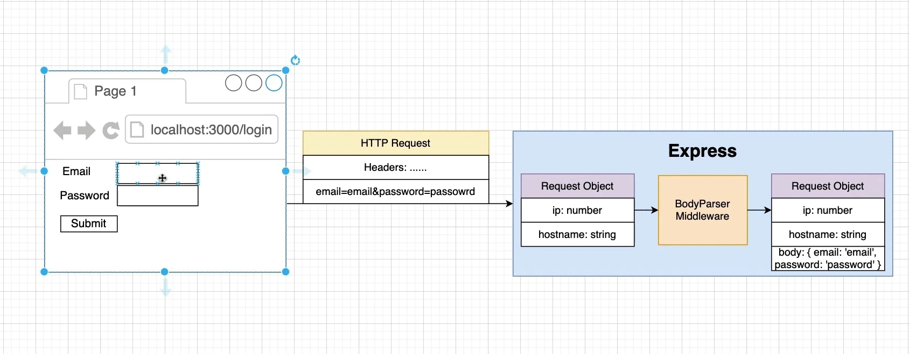

Рассмотрим не локальный запрос, а запрос на сервер.

HTTP Request содержит различные headers и т.д. И так же этот запрос имеет информацию которая прикреплена к так
называемому body, телу запроса которое отправляется из браузера на сервер.

Email и пароль в теле запроса закодирована.

Как только запрос дошел до сервера т.е. express, он сразу же генерирует так называемый Request Object.

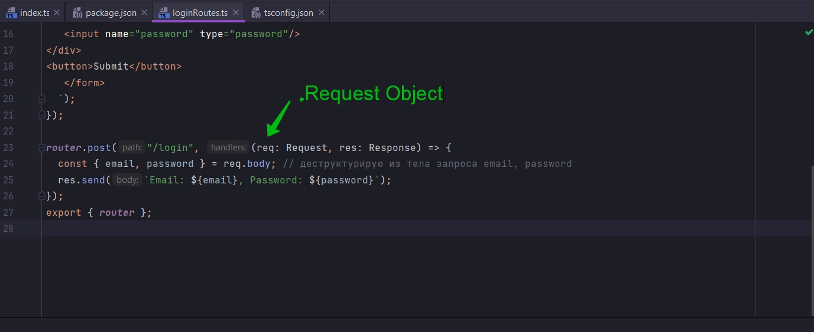

Express генерируем Request Object и связывает с ним какую-то информацию. Такую как ip адресс, hostname и очень большое
количество другой информации.

Очень важно что этот объект Request Object не имеет свойства body. Вместо этого Request Object передается в BodyParser
Middleware. А это является промежуточным ПО. Хоть он и включен теперь в express, но тем не менее мы рассматриваем такую
ситуацию.

Этот BodyParser Middleware начинаем исследовать HTTP Request и видит что в этом запросе есть какая-то информация. И
BodyParser Middleware начинает парсить эту информацию. После того как пропарсит прикрепляет к Request Object эту инфу.
Т.е. BodyParser Middleware добавляет в Request Object свойство body в которм содержится вся необходимая переданная инфа.

Обратите внимание. Свойство body добавлено BodyParser Middleware.

Если я закоментирую строку и сделаю запрос

```ts
//src index.ts
import express, {Request, Response} from "express";
import {router} from "./routes/loginRoutes";
import bodyParser from "body-parser";

const PORT = 5000;

const app = express();

// app.use(bodyParser.urlencoded({ extended: true })); // обязательно прописываю выше регистрации роутов и опциональный параметр extended: ставлю в true
app.use(router);

app.listen(PORT, () => {
    console.log(`Сервер запущен на порту: ${PORT}`);
});

```

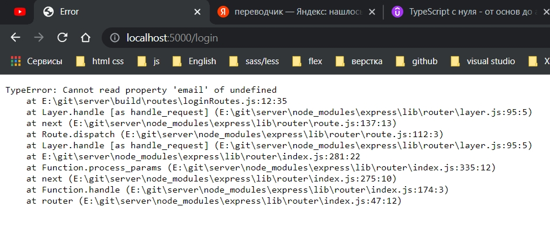

Теперь body = undefined

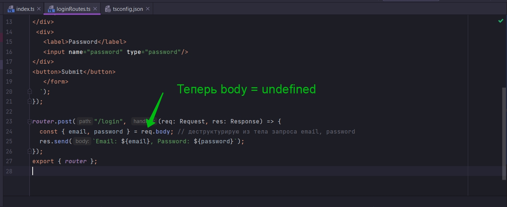

Это касается и другого промежуточного ПО

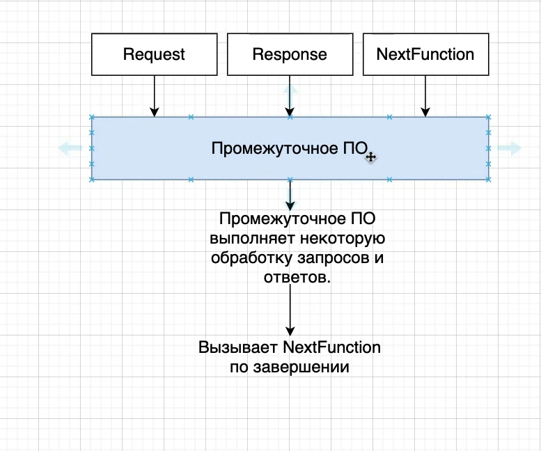

Цель промежуточного ПО исследовать Запрос, а так же Ответ. Как-то их обработать. И как показано на диаграмме обработать
и послать дейтвие следующему в цепочке middleware.

И теперь главный вопрос. Какова цель TS? Одна из самых главных функций которую берет на себя TS это понимание свойств
которые имеет объект. Именно так работает TS. Он смотрит на разные свойства и типы которые имеет объект и использует эту
информацию для того что бы решить что-то не так с вашим кодом или все впорядке.

О работе промежуточного ПО. Его работа это взять Request и Response и добавить,удалить или изменить свойство. Это на
100% контрпродуктивно тому что делает TS. Потому что Сети Middleware имплементированы в простом JS. Что значит что TS не
знает ни какого понятия о том какие свойства были добавлены или удалены.

Даже файлы определения типов не говорят TS что происходит. Хотя и да и нет.

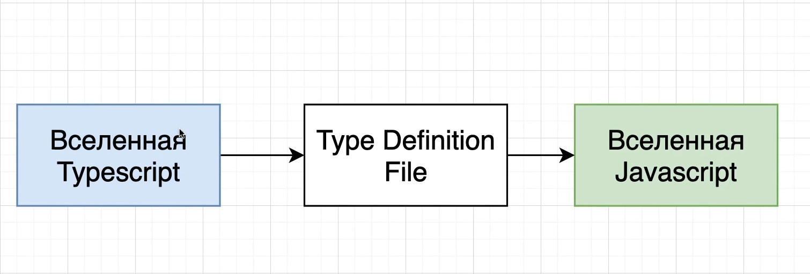

Что на самом деле делает Type Definition File?

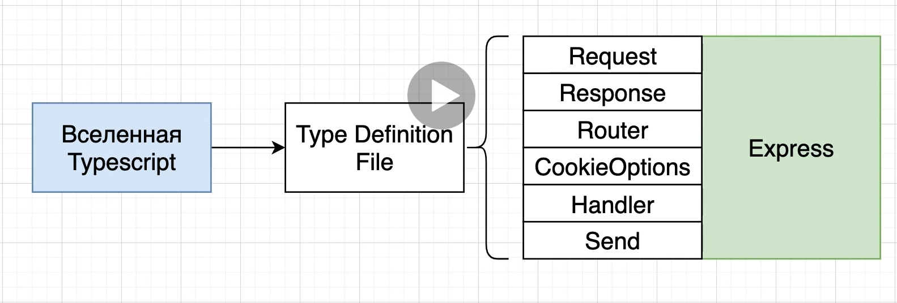

Он рассказывает нам о разных свойствах которые JS библиотека открывает для нас.

Но он не рассказывает TS какие различные свойства, или вообще ни какой информации не содержит, которая содержится внутри
этих функций.

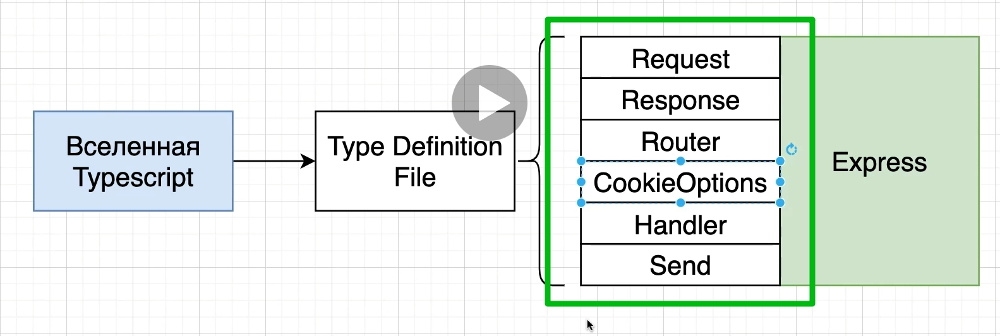

TS сложно использовать промежуточное ПО написанное на JS.

Но тем не менее здесь есть кое что интересное. Если я опять закоментирую строку.

```ts
//src index.ts
import express, {Request, Response} from "express";
import {router} from "./routes/loginRoutes";
import bodyParser from "body-parser";

const PORT = 5000;

const app = express();

// app.use(bodyParser.urlencoded({ extended: true })); // обязательно прописываю выше регистрации роутов и опциональный параметр extended: ставлю в true
app.use(router);

app.listen(PORT, () => {
    console.log(`Сервер запущен на порту: ${PORT}`);
});

```

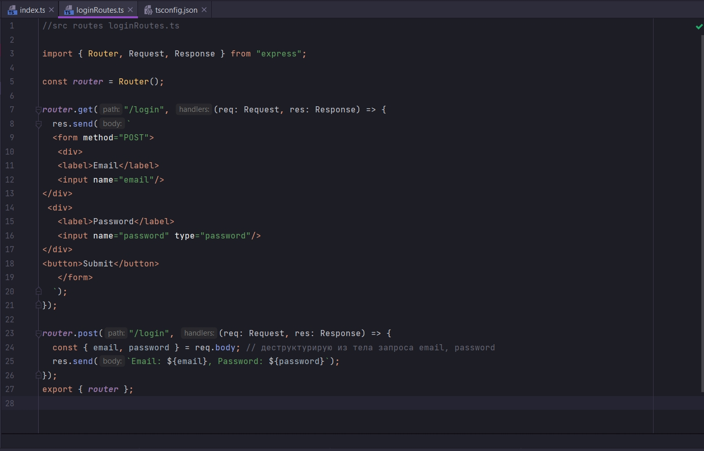

Как видите мы не получаем ни каких ошибок.

Почему же TS зная что в объекте res = undefined. Почему же TS не подсказывает об ошибке? И это проблема №2. TS не знает
что происходит в промежуточном ПО.

Как вы помните мы используем Type Definition File.

Во-первых они нам не рассказывают всей истории о типах. Во-вторых они нам иногда говорят не правильную информацию.

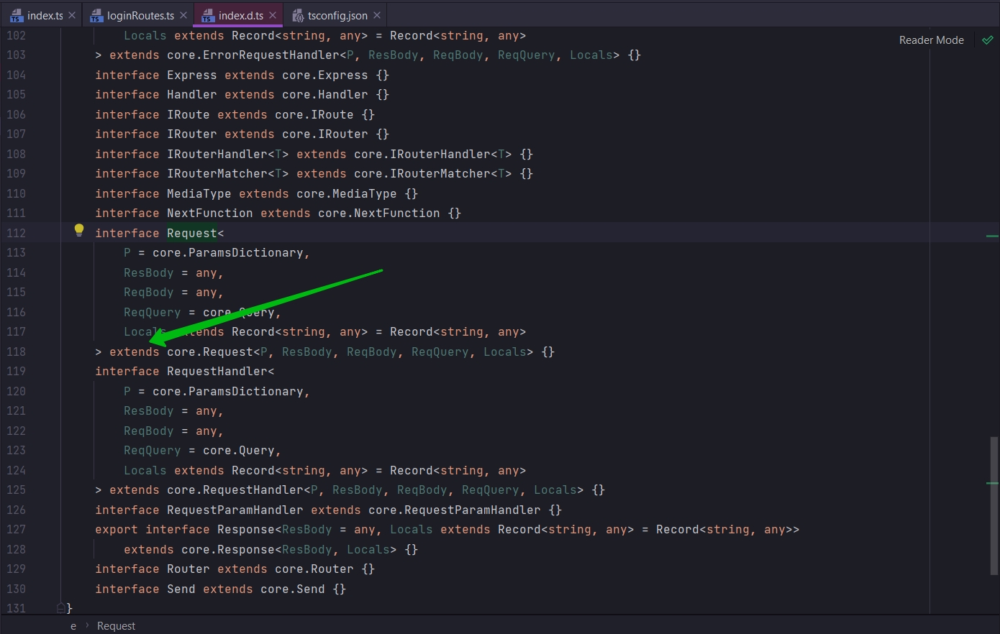

Это значит что что этот interface наследуется от core.Request т.е. из другой библиотеки, библиотеки core. И если мы
перейдем

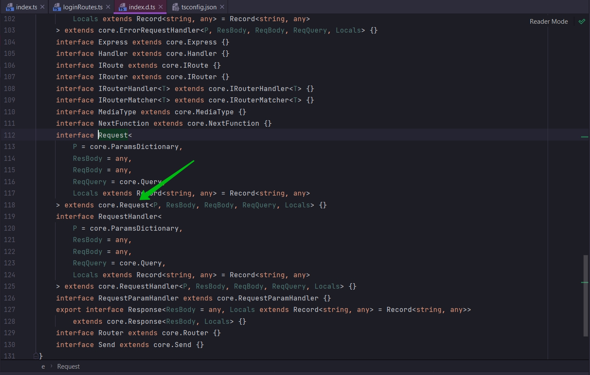

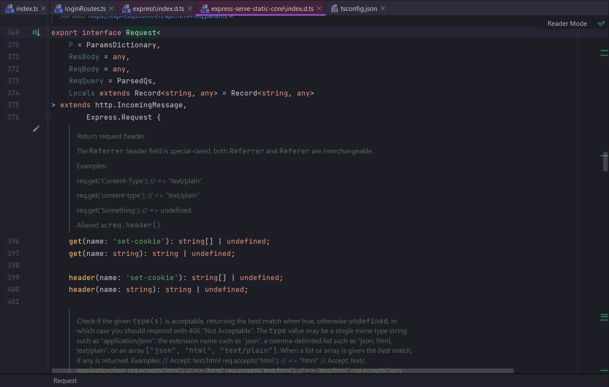

Здесь уже увидим какие-то свойства этого interface которые мы можем использовать.

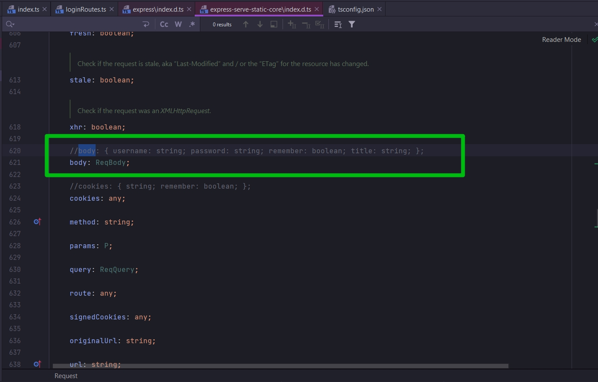

У него нет этого свойства. Мы в этом убеждались так как получали undefined.

Тот кто писал этот файл делает очень натянутое представление что у нас это свойство есть. Это не правильный файл. И по
этому в req.body TS не видит ошибку.


