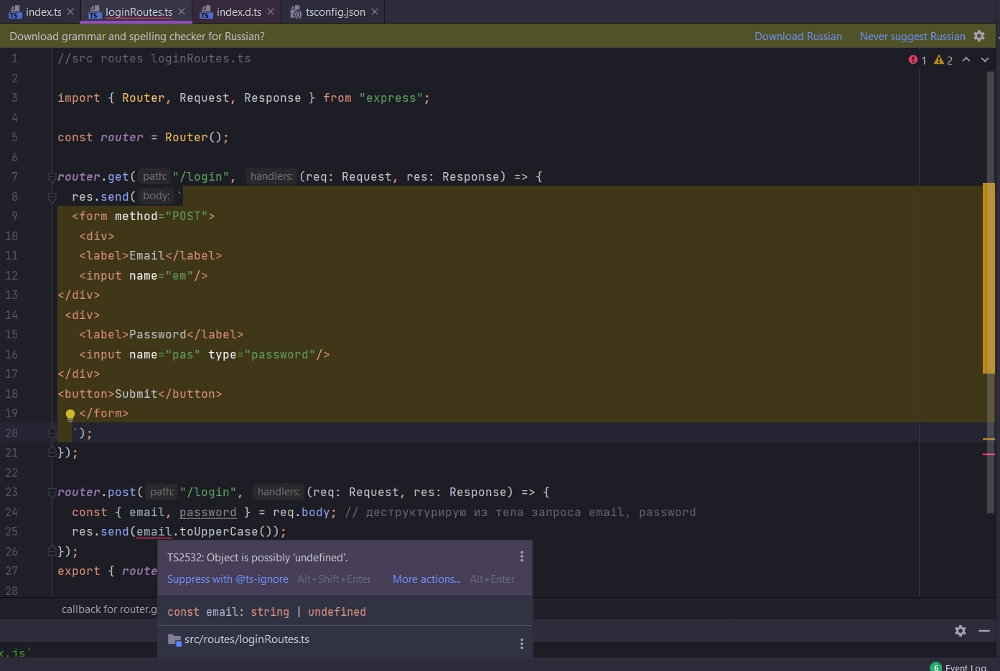

# 008_Проблемы_с_файлами_определения_типов


расскоментирую

```ts
//src index.ts
import express from "express";
import {router} from "./routes/loginRoutes";
import bodyParser from "body-parser";

const PORT = 5000;

const app = express();

app.use(bodyParser.urlencoded({extended: true})); // обязательно прописываю выше регистрации роутов и опциональный параметр extended: ставлю в true
app.use(router);

app.listen(PORT, () => {
    console.log(`Сервер запущен на порту: ${PORT}`);
});

```

Файлы определения типов не могут точно выразить то что происходит внутри функций JS. Они только декларируют эти файлы.
То что эти JS функции могут существовать.

Декларация - это когда вы объявляете переменную с именем, а переменная может быть объявлена только один раз. Т.е. при
установки дополнительного Middleware т.е. библиотеки происходит добавление тех или иных функций и методов middleware. По

- этому становятся доступными новые фунции и методы примущи той или иной библиотеке. Пример: int x;, String myName;,
  Boolean myCondition
- Инициализация: Инициализация - это когда мы помещаем значение в переменную, это происходит, когда мы объявляем
  переменную Пример: int x = 7;, String myName = "Emi";, Boolean myCondition = false
- Назначение: Назначение - это когда мы уже объявили или инициализировали переменную, и мы меняем значение. Вы можете
  изменить значение переменной столько раз, сколько хотите, или вам нужно.

Вторая проблема это то что предоставляемые нам файлы определения типов Defenition File, они не всегда точны.

Третья проблема в том что каждый раз когда у нас есть какой-то внешний источник информации, который предоставляет
информацию на наш сервер. Мы не знаем наверняка что эта информация корректна сформирована.

Например когда мы получаем отправку формы мы можем предполагать что она имеет какой-то набор свойств, но в реальности
они могут быть не предоставлены.

Любая программа которая принимает информацию снаружи не может надеятся на то что внешняя информация имеет все ожидаемые
свойства. Эта проблема становится еще худшей из-за файлов определения типов.

Кароче опять много говорит. Итог такой делаем не привильную форму. Свойсва name в инпутах не совпадает со свойствами
деструктурезированными из тела запроса. А так же предполагается что email это строка которая приводится к верхнему
регистру. Свойства деструктурируемые из тела запроса не совпадают со свойствами передаваемыми из инпутов по этому то что
мы деструктурируем из тела запроса равняется undefined.

```ts
//src routes loginRoutes.ts

import {Router, Request, Response} from "express";

const router = Router();

router.get("/login", (req: Request, res: Response) => {
    res.send(`
  <form method="POST">
   <div>
   <label>Email</label>
   <input name="em"/>
</div>
 <div>
   <label>Password</label>
   <input name="pas" type="password"/>
</div>
<button>Submit</button>
   </form>
  `);
});

router.post("/login", (req: Request, res: Response) => {
    const {email, password} = req.body; // деструктурирую из тела запроса email, password
    res.send(email.toUpperCase());
});
export {router};

```


И как мы видим TS нам абсолютно не подсказывает по поводу ошибок.


Мы хотим что бы на этапе компиляции TS нам подсказывал что что-то идет не так. На самом деле хотелось бы что бы req.body
может иметь или может не иметь каких - то свойств которые я ожидаю от него.

Рассмотрим какое маленькое исправление мы можем сделать в файле представления типов и это маленькое исправление может
решить полностью эту проблему.

Перехожу по body.


Мы видим что ResBody = any т.е. это любой тип. Что конечно же меня не устраивает.

Перехожу назад


И я исправлю тим ResBody на кое что удобное для нас.

Обычно мы никогда не делаем исправления в файле определения типов потому что это dependencies зависимость.

Просто я хочу показать что более лучше написанный Defenition File может решить нашу проблему.

Я укажу что свойство body должно быть объектом который имеет какие-то ключи, каких-то не известных значений. Т.е. я не
знаю какие разные ключи могут быть внутриэтого объекта потому что мы можем получить впринципе любые ключи


Что бы это отобразить в объекте указываю массив. И в нем пишу что какие-то ключи могут являться строками. Мы не знаем
какие ключи н они будут существовать. Возвращаемые значения тоже будут string или undefined


Мы говорим TS что когда мы будем получать доступ к свойству этого объекта его значение может быть или string или
undefined.

Напоминаю обычно мы этого не делаем. Но лучше написанный файл определения типов может решить проблему.




Теперь он предупреждает что объект может быть или string или undefined. И по этому лучше это как-то обработать. А не на
прямую без всяких условий вызывать toUpperCase() для этого email объекта.

Для того что бы этого избежать мы можем установить охрану типов

```ts
//src routes loginRoutes.ts

import {Router, Request, Response} from "express";

const router = Router();

router.get("/login", (req: Request, res: Response) => {
    res.send(`
  <form method="POST">
   <div>
   <label>Email</label>
   <input name="em"/>
</div>
 <div>
   <label>Password</label>
   <input name="pas" type="password"/>
</div>
<button>Submit</button>
   </form>
  `);
});

router.post("/login", (req: Request, res: Response) => {
    const {email, password} = req.body; // деструктурирую из тела запроса email, password

    if (email) {
        res.send(email.toUpperCase());
    }
});
export {router};

```


Сейчас мы будем вызывать для email toUpperCase только в том случае если email является строкой. Если эе он undefined то
мы этого делать не будем.

```ts
//src routes loginRoutes.ts

import {Router, Request, Response} from "express";

const router = Router();

router.get("/login", (req: Request, res: Response) => {
    res.send(`
  <form method="POST">
   <div>
   <label>Email</label>
   <input name="em"/>
</div>
 <div>
   <label>Password</label>
   <input name="pas" type="password"/>
</div>
<button>Submit</button>
   </form>
  `);
});

router.post("/login", (req: Request, res: Response) => {
    const {email, password} = req.body; // деструктурирую из тела запроса email, password

    if (email) {
        res.send(email.toUpperCase());
    } else {
        res.send(`You mast provide an email property`);
    }
});
export {router};

```


Проблема типо решена. Но я все же возвращаю все назад в Defenition File.


