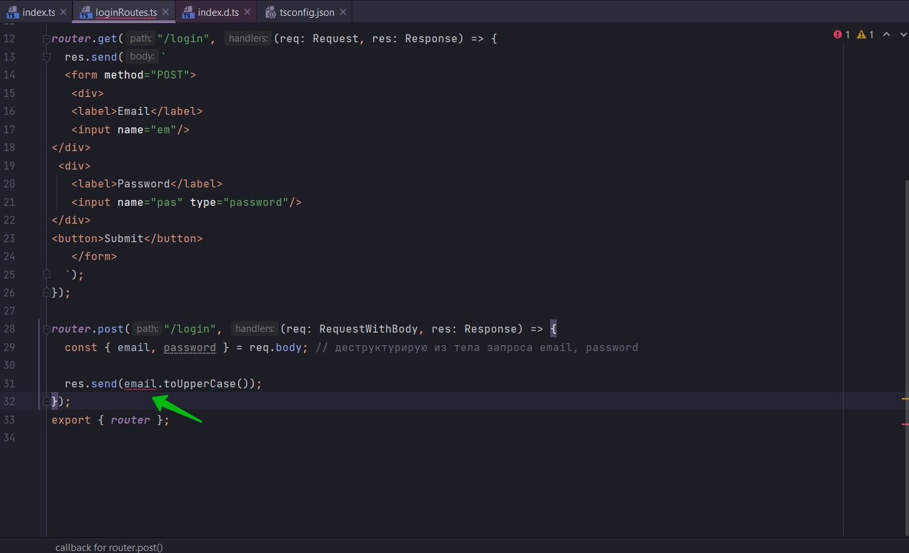
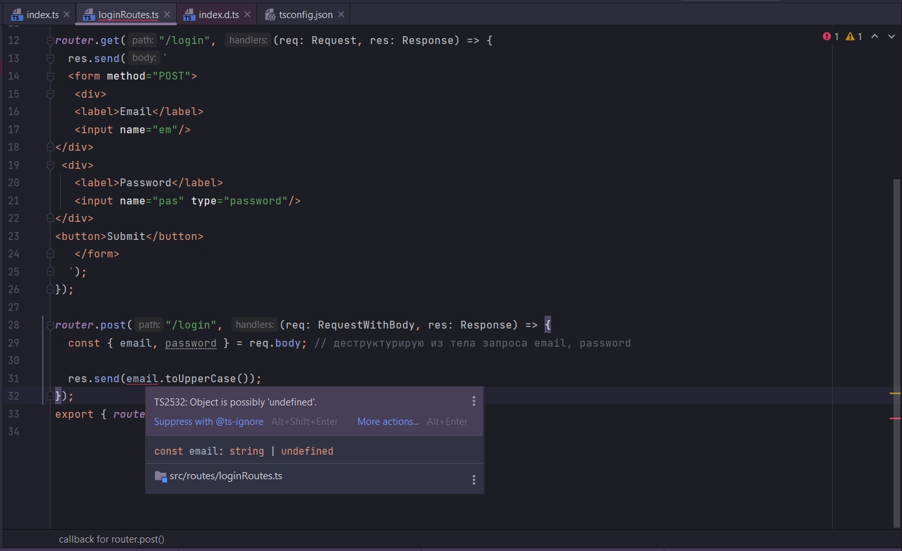
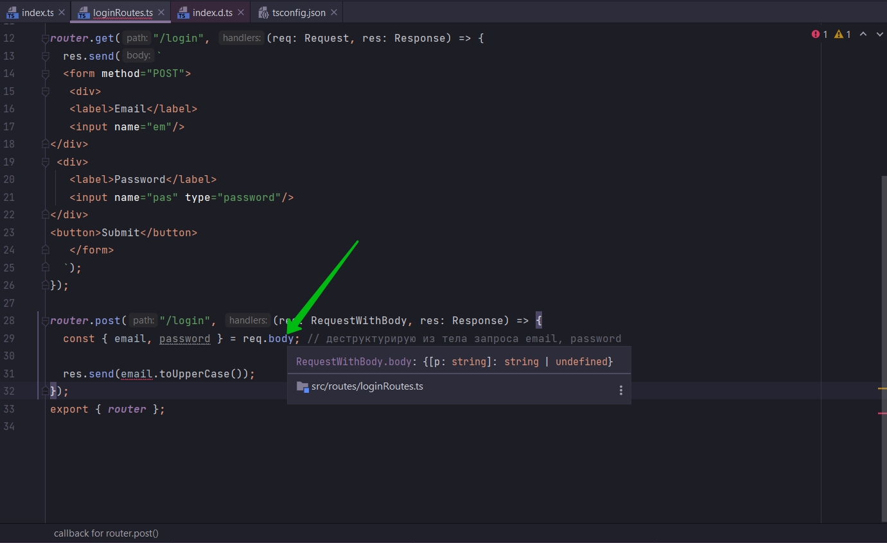
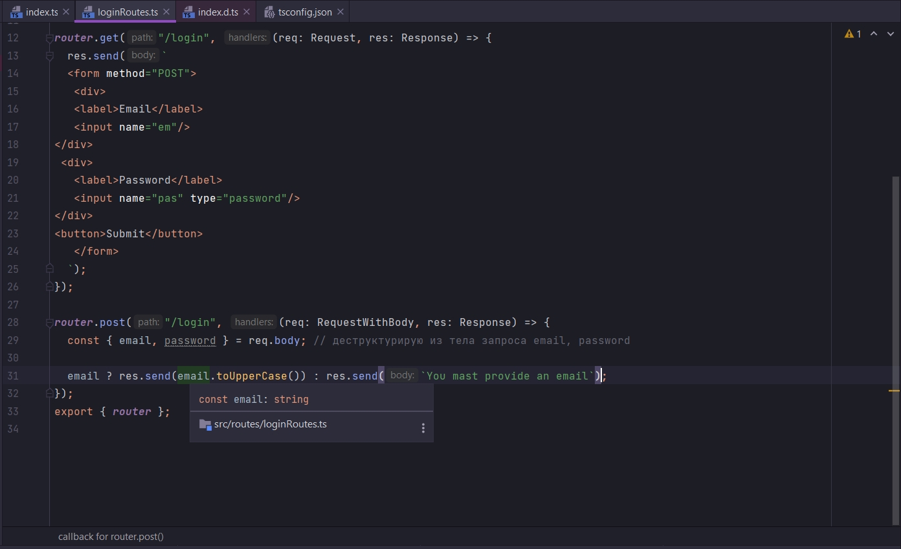
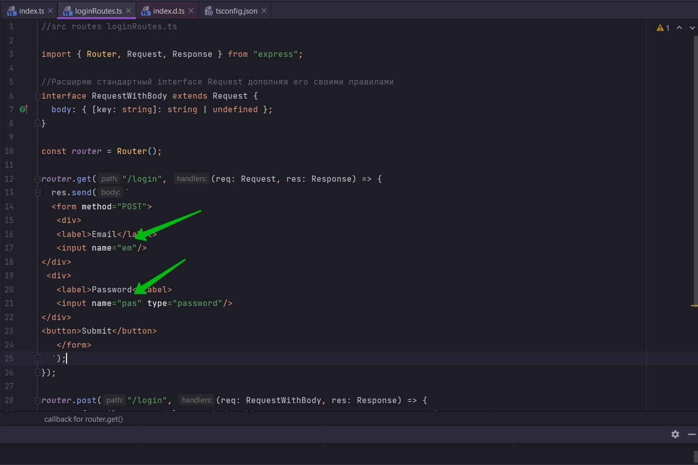
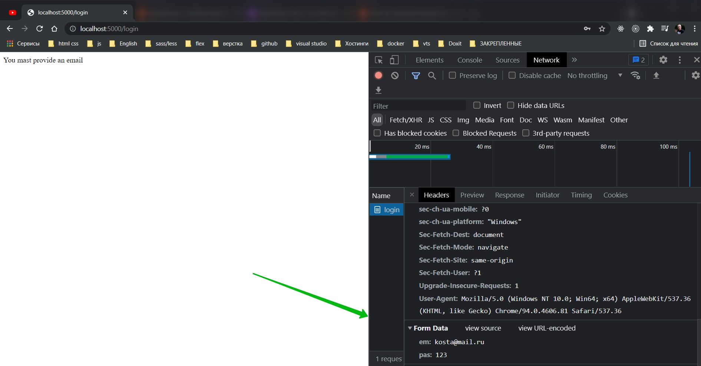
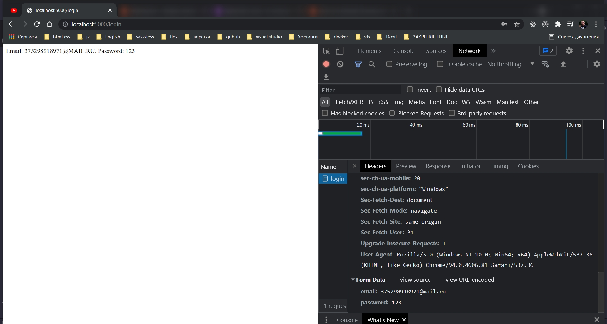

# 009_Решение_проблемы_с_файлами_определения_типов

В прошлом видео мы делали изменения в файле определения типов. Есть следующай проблема. Допустим мы скачали проект на
другом компьютере, установили зависимости. Естественно зависимости установятся те которые создали разработчики. Тоже
самое происходит и с файлами определения типов. И все те настройки которые мы прописывали попросту нужно прописывать
заново.

Вместо этого мы создадим новый interface который будет наследоваться от interface Request. Т.е. мы возьмем все Type
Definition которые уже определены внутри этого interface. Но мы переопределим или перепишем одно свойство body. И
создадим для него новый тип более подходящий для нашего приложения. В нем прописываю единственно правило для body. В
этом правиле так как я не знаю что это будут заключи объекта я прописываю key, далее указываю что он будет принимать тип
строку. После чего указываю тип возвращаемого значения string или undefined.

```ts
//src routes loginRoutes.ts

import {Router, Request, Response} from "express";

//Расширяю стандартный interface Request дополняя его своими правилами
interface RequestWithBody extends Request {
    body: { [key: string]: string | undefined };
}

const router = Router();

router.get("/login", (req: Request, res: Response) => {
    res.send(`
  <form method="POST">
   <div>
   <label>Email</label>
   <input name="em"/>
</div>
 <div>
   <label>Password</label>
   <input name="pas" type="password"/>
</div>
<button>Submit</button>
   </form>
  `);
});

router.post("/login", (req: Request, res: Response) => {
    const {email, password} = req.body; // деструктурирую из тела запроса email, password

    if (email) {
        res.send(email.toUpperCase());
    } else res.send("You mast provide an email property");
});
export {router};

```

Теперь я могу использовать этот interface в разных request handlers обработчиках запросов. Везде где мы ожидаем работать
со свойством body.

Это будет нас заставлять в дальнейшем через TS убедиться что это все таки строка а не undefined.

Теперь в методе post указываю в объекте req указываю аннотацию типа RequestWithBody







body может быть объектом с ключами, значения которых может быть либо строкой либо undefined.



Теперь если я навожу на email я конкретно вижу что это строка.

```ts
//src routes loginRoutes.ts

import {Router, Request, Response} from "express";

//Расширяю стандартный interface Request дополняя его своими правилами
interface RequestWithBody extends Request {
    body: { [key: string]: string | undefined };
}

const router = Router();

router.get("/login", (req: Request, res: Response) => {
    res.send(`
  <form method="POST">
   <div>
   <label>Email</label>
   <input name="em"/>
</div>
 <div>
   <label>Password</label>
   <input name="pas" type="password"/>
</div>
<button>Submit</button>
   </form>
  `);
});

router.post("/login", (req: RequestWithBody, res: Response) => {
    const {email, password} = req.body; // деструктурирую из тела запроса email, password

    email ? res.send(email.toUpperCase()) : res.send(`You mast provide an email`);
});
export {router};

```

Сейчас в форме у нас не правильные названия в атрибутах name.



Соответственно они попадают в тело запроса.

А я с помощью диструктуризации пытаюсь вытащить email, password коих нет в request body в теле запроса.



Исправляю

```ts
//src routes loginRoutes.ts

import {Router, Request, Response} from "express";

//Расширяю стандартный interface Request дополняя его своими правилами
interface RequestWithBody extends Request {
    body: { [key: string]: string | undefined };
}

const router = Router();

router.get("/login", (req: Request, res: Response) => {
    res.send(`
  <form method="POST">
   <div>
   <label>Email</label>
   <input name="email"/>
</div>
 <div>
   <label>Password</label>
   <input name="password" type="password"/>
</div>
<button>Submit</button>
   </form>
  `);
});

router.post("/login", (req: RequestWithBody, res: Response) => {
    const {email, password} = req.body; // деструктурирую из тела запроса email, password

    email
        ? res.send(
            `Email: ${email.toUpperCase()}, Password: ${password}`
        )
        : res.send(`You mast provide an email`);
});
export {router};


```



И если бы мы тут использовали второй handler. Другую функцию что бы управлять нашими роутами в нашем приложении. Если бы
мы запрос создали в другом файле, то тогда interface можно было бы переместить interface в отдельный файл и использовать
его уже из этого файла в файлах управления роутами.

Это конечно решение но оно не идеально. Сейчас когда мы пишем какой-то request handler мы должны понимать и помнить что
параметр req именно тип RequestWithBody. И это не очень хорошо так как это мы можем забыть.

