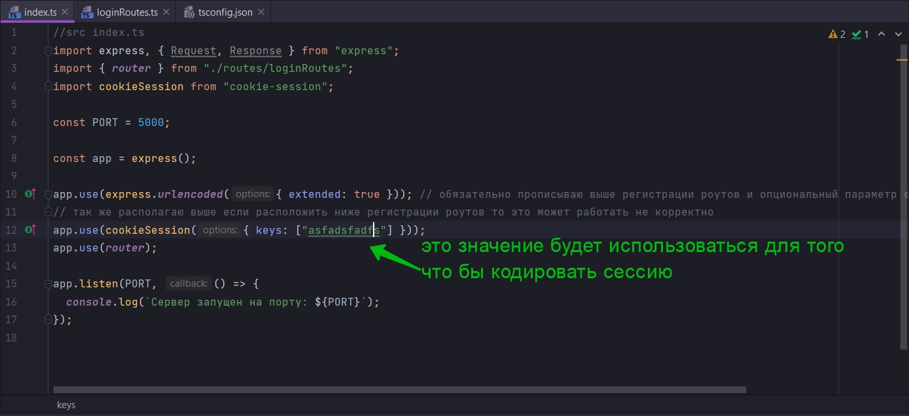
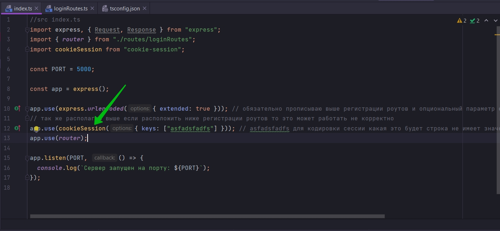
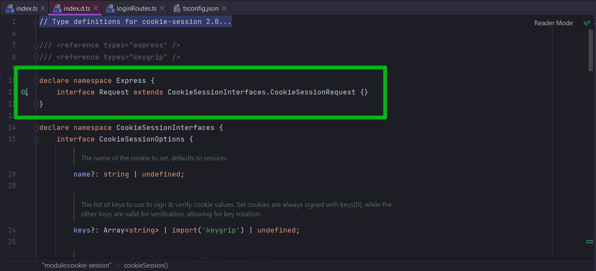
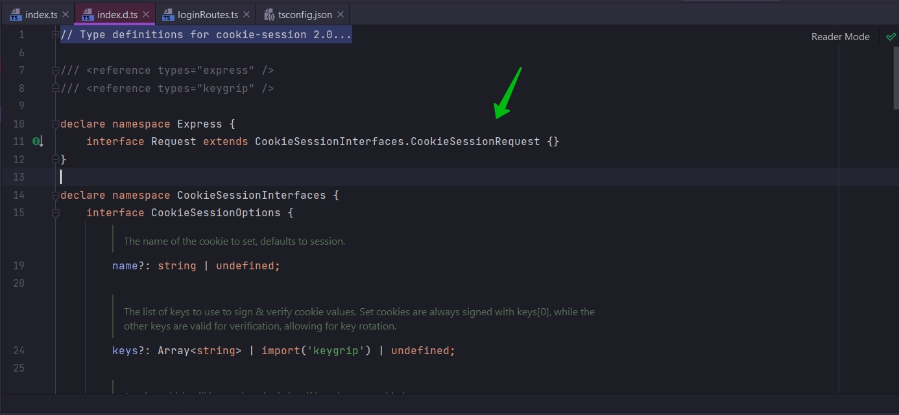
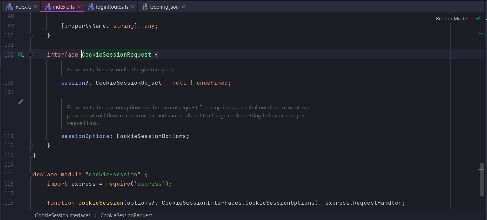
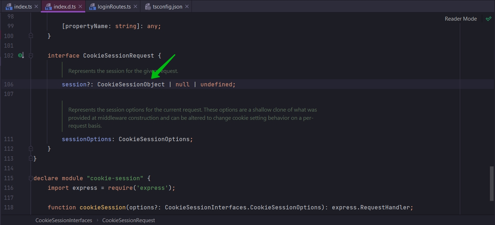
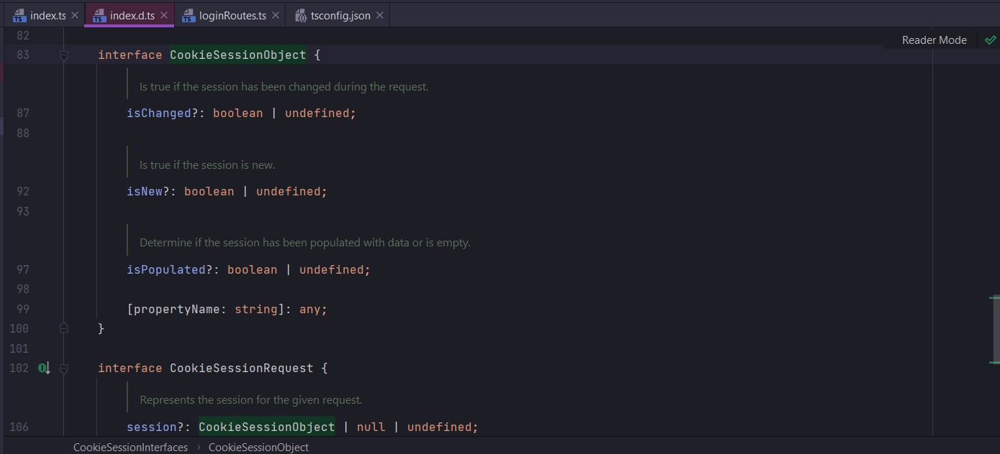
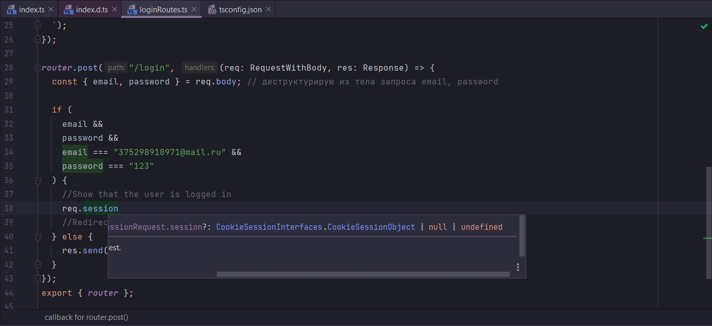

# 010_Создание_session

И так мы хотим если пользователь успешно залогинелся, перенаправлять его из формы на корневой роутер.

Мы установим флаг при помощи которого будем указывать что пользователь залогинен.

Пишу условие в котором проверяю email password являютсяли они undefined. Второе это то что они равны какой-то хард кодед
паре.

```ts
//src routes loginRoutes.ts

import {Router, Request, Response} from "express";

//Расширяю стандартный interface Request дополняя его своими правилами
interface RequestWithBody extends Request {
    body: { [key: string]: string | undefined };
}

const router = Router();

router.get("/login", (req: Request, res: Response) => {
    res.send(`
  <form method="POST">
   <div>
   <label>Email</label>
   <input name="email"/>
</div>
 <div>
   <label>Password</label>
   <input name="password" type="password"/>
</div>
<button>Submit</button>
   </form>
  `);
});

router.post("/login", (req: RequestWithBody, res: Response) => {
    const {email, password} = req.body; // деструктурирую из тела запроса email, password

    if (
        email &&
        password &&
        email === "375298918971@mail.ru" &&
        password === "123"
    ) {
        //Show that the user is logged in
        //Redirect to the root route
    } else {
        res.send("Invalid email or password");
    }
});
export {router};

```

И теперь нам надо отобразить что этот пользователь залогинен. Для этого мы установим сессии для свойства пользователя.
По сути мы можем использовать session для того что бы связать какой-то кусочек данных, кусочек информации с
пользователем либо с кем-то кто отправляет запрос на наш сервер. Когда мы устанавливаем properties для session эта
информация, данный будут сохранены в cookies пользователя т.е. user. Это управляется автоматически при помощи браузера
человека. Т.е. каждый request который делает пользователь будет иметь эту информацию которую мы свяжем с session. Мы
используем это для того что бы показать что пользователь залогинен.

Для того что бы использовать сессии нам нужно внутри express установить sessions. Если мы перейдем в package.json то
увидим что мы уже установили cookie-session. Это middleware который мы должны использовать внутри нашего index.ts.



 ```ts
//src index.ts
import express, {Request, Response} from "express";
import {router} from "./routes/loginRoutes";
import cookieSession from "cookie-session";

const PORT = 5000;

const app = express();

app.use(express.urlencoded({extended: true})); // обязательно прописываю выше регистрации роутов и опциональный параметр extended: ставлю в true
// так же располагаю выше если расположить ниже регистрации роутов то это может работать не корректно
app.use(cookieSession({keys: ["asfadsfadfs"]})); // asfadsfadfs для кодировки сессии какая это будет строка не имеет значения просто это должно быть строкой
app.use(router);

app.listen(PORT, () => {
    console.log(`Сервер запущен на порту: ${PORT}`);
});

```

Эта строка app.use(cookieSession({ keys: ["asfadsfadfs"] })); добавляет sessions для нашего requst объекта.

И я хочу вам напомнить app.use(express.urlencoded({ extended: true })); когда мы здесь используем bodyParser в этой
строке, который уже встроен в express, мы добавляем свойство body в наш объект request. Это была долгая дисскуссия. О
том что Definition File не очень хорошо взаимодействуют с приложением.

Но cookie-session это нечто совсем другое. cookie-session Definition File на самом деле лучше описывает свойства которые
которые добавляют в request объект.

Если я сейчас обращусь к req.session то я получу undefined т.к. по умолчанию объект req не имеет такого свойства. Точно
так же как объект req не имеет body.

И только тот факт что я в index.ts добавляю app.use(cookieSession({ keys: ["asfadsfadfs"] })); Именно при помощи этой
строки объект req получает свойство session.

Перехожу в Type Definition File cookieSession.





Здесь говориться что они находят Express. Внутри Express находят interface Request и они говорят что он наследуется от
CookieSessionInterfaces.CookieSessionRequest. Они в interface Request добавляют дополнительное свойство.

Перехожу далее





Тут мы можем найти какие различные свойства будут добавлены в этот Request объект. Как видите здесь добавлено не
обязательное опциональное свойство session и это совойство будет CookieSessionObject.

Если я кликну





То я могу здесь найти самые различные свойства которые есть в этом interface: isChanged, isNew, isPopulated. И самое
важное что мы здесь можем видить это propertyName свойство которе может быть any. Это то что мы свами добавляли вручную
для body-parser. Т.е. они предусмотрели и написали правильный код.



```ts
//src routes loginRoutes.ts

import {Router, Request, Response} from "express";

//Расширяю стандартный interface Request дополняя его своими правилами
interface RequestWithBody extends Request {
    body: { [key: string]: string | undefined };
}

const router = Router();

router.get("/login", (req: Request, res: Response) => {
    res.send(`
  <form method="POST">
   <div>
   <label>Email</label>
   <input name="email"/>
</div>
 <div>
   <label>Password</label>
   <input name="password" type="password"/>
</div>
<button>Submit</button>
   </form>
  `);
});

router.post("/login", (req: RequestWithBody, res: Response) => {
    const {email, password} = req.body; // деструктурирую из тела запроса email, password

    if (
        email &&
        password &&
        email === "375298918971@mail.ru" &&
        password === "123"
    ) {
        //Show that the user is logged in
        req.session = {loggedIn: true}; // это обозначит что пользователь залогинен
        //Redirect to the root route
        res.redirect("/");
    } else {
        res.send("Invalid email or password");
    }
});
export {router};

```

На самом деле если мы сейчас запустим код то получим ошибку так как у нас пока нет root router.