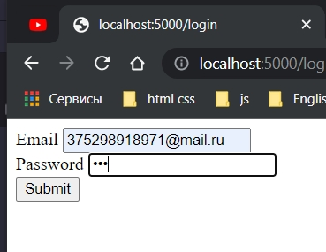
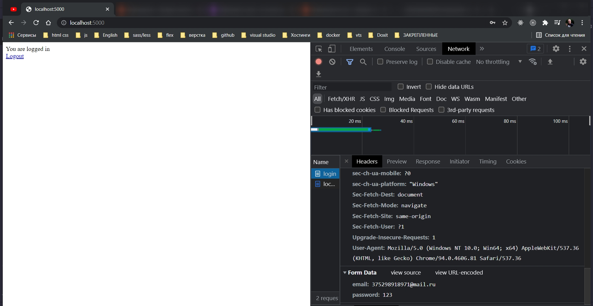

# 011_login_&_logout

Напишу обработчик прям тут

```ts
//src routes loginRoutes.ts

import {Router, Request, Response} from "express";

//Расширяю стандартный interface Request дополняя его своими правилами
interface RequestWithBody extends Request {
    body: { [key: string]: string | undefined };
}

const router = Router();

router.get("/login", (req: Request, res: Response) => {
    res.send(`
  <form method="POST">
   <div>
   <label>Email</label>
   <input name="email"/>
</div>
 <div>
   <label>Password</label>
   <input name="password" type="password"/>
</div>
<button>Submit</button>
   </form>
  `);
});

router.post("/login", (req: RequestWithBody, res: Response) => {
    const {email, password} = req.body; // деструктурирую из тела запроса email, password

    if (
        email &&
        password &&
        email === "375298918971@mail.ru" &&
        password === "123"
    ) {
        //Show that the user is logged in
        req.session = {loggedIn: true}; // это обозначит что пользователь залогинен
        //Redirect to the root route
        res.redirect("/");
    } else {
        res.send("Invalid email or password");
    }
});

router.get("/", (req: Request, res: Response) => {
    //req.session
    if (req.session && req.session.loggedIn) {
    }
});
export {router};

```

Если пользователь есть то у него вот это свойство есть req.session и в нем есть loggedIn тогда в теле условия можно
написать какой-то код. Иначе ошибка.

```ts
//src routes loginRoutes.ts

import {Router, Request, Response} from "express";

//Расширяю стандартный interface Request дополняя его своими правилами
interface RequestWithBody extends Request {
    body: { [key: string]: string | undefined };
}

const router = Router();

router.get("/login", (req: Request, res: Response) => {
    res.send(`
  <form method="POST">
   <div>
   <label>Email</label>
   <input name="email"/>
</div>
 <div>
   <label>Password</label>
   <input name="password" type="password"/>
</div>
<button>Submit</button>
   </form>
  `);
});

router.post("/login", (req: RequestWithBody, res: Response) => {
    const {email, password} = req.body; // деструктурирую из тела запроса email, password

    if (
        email &&
        password &&
        email === "375298918971@mail.ru" &&
        password === "123"
    ) {
        //Show that the user is logged in
        req.session = {loggedIn: true}; // это обозначит что пользователь залогинен
        //Redirect to the root route
        res.redirect("/");
    } else {
        res.send("Invalid email or password");
    }
});

router.get("/", (req: Request, res: Response) => {
    //req.session
    if (req.session && req.session.loggedIn) {
        res.send(`
    <div>
    <div>You are logged in</div>
    <a href="/logout">Logout</a>
</div>
    `);
    } else {
        res.send(`
    <div>
    <div>You are not logged in</div>
    <a href="/login">Login</a>
</div>
    `);
    }
});
export {router};

```






Разлогиневаюсь.

```ts
//src routes loginRoutes.ts

import {Router, Request, Response} from "express";

//Расширяю стандартный interface Request дополняя его своими правилами
interface RequestWithBody extends Request {
    body: { [key: string]: string | undefined };
}

const router = Router();

router.get("/login", (req: Request, res: Response) => {
    res.send(`
  <form method="POST">
   <div>
   <label>Email</label>
   <input name="email"/>
</div>
 <div>
   <label>Password</label>
   <input name="password" type="password"/>
</div>
<button>Submit</button>
   </form>
  `);
});

router.post("/login", (req: RequestWithBody, res: Response) => {
    const {email, password} = req.body; // деструктурирую из тела запроса email, password

    if (
        email &&
        password &&
        email === "375298918971@mail.ru" &&
        password === "123"
    ) {
        //Show that the user is logged in
        req.session = {loggedIn: true}; // это обозначит что пользователь залогинен
        //Redirect to the root route
        res.redirect("/");
    } else {
        res.send("Invalid email or password");
    }
});

router.get("/", (req: Request, res: Response) => {
    //req.session
    if (req.session && req.session.loggedIn) {
        res.send(`
    <div>
    <div>You are logged in</div>
    <a href="/logout">Logout</a>
</div>
    `);
    } else {
        res.send(`
    <div>
    <div>You are not logged in</div>
    <a href="/login">Login</a>
</div>
    `);
    }
});

router.get("/logout", (req: Request, res: Response) => {
    req.session = undefined; // при выходе специально присваиваю
    res.redirect("/");
});
export {router};

```

При нажатии на Logout разлогиневаюсь и попадаю в корневой роут.

