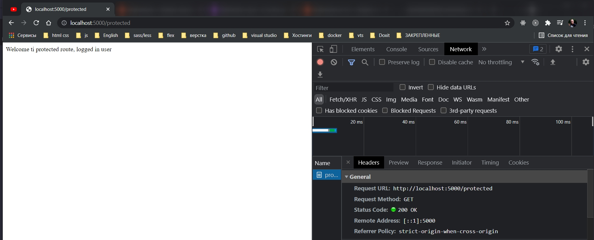

# 012_Route_Protected

Добавим новый роут /protected. Пользователь сможет увидить содержимое этой web-страницы если он залогинен в приложении.

Лучше всего создать middleware который проверяет залогиненли пользователь. До того как разрешить им переходить по
каким-то роутам.

Под interface создаю middleware requireAuth (требуется авторизация).

Как мы помним middleware принимает три параметра один из них next. Аннотацию типов ля этой функции можно посмотреть.
Кликаю на Request.


Т.е. это оннотация типа является ссылкой на следующий middleware который мы хотим вызывать.

```ts
//src routes loginRoutes.ts

import {Router, Request, Response, NextFunction} from "express";

//Расширяю стандартный interface Request дополняя его своими правилами
interface RequestWithBody extends Request {
    body: { [key: string]: string | undefined };
}

//middleware проверка залогинен ли пользователь
function requreAuth(req: Request, res: Response, next: NextFunction) {
}

const router = Router();

router.get("/login", (req: Request, res: Response) => {
    res.send(`
  <form method="POST">
   <div>
   <label>Email</label>
   <input name="email"/>
</div>
 <div>
   <label>Password</label>
   <input name="password" type="password"/>
</div>
<button>Submit</button>
   </form>
  `);
});

router.post("/login", (req: RequestWithBody, res: Response) => {
    const {email, password} = req.body; // деструктурирую из тела запроса email, password

    if (
        email &&
        password &&
        email === "375298918971@mail.ru" &&
        password === "123"
    ) {
        //Show that the user is logged in
        req.session = {loggedIn: true}; // это обозначит что пользователь залогинен
        //Redirect to the root route
        res.redirect("/");
    } else {
        res.send("Invalid email or password");
    }
});

router.get("/", (req: Request, res: Response) => {
    //req.session
    if (req.session && req.session.loggedIn) {
        res.send(`
    <div>
    <div>You are logged in</div>
    <a href="/logout">Logout</a>
</div>
    `);
    } else {
        res.send(`
    <div>
    <div>You are not logged in</div>
    <a href="/login">Login</a>
</div>
    `);
    }
});

router.get("/logout", (req: Request, res: Response) => {
    req.session = undefined; // при выходе специально присваиваю
    res.redirect("/");
});
export {router};

```

Теперь мы будем проверять залогиненли пользователь. Точнее есть ли у него session переменная и залогиненли он. Если
залогинен, то мы будем переходить к следующему middleware обработчику.

В теле middleware мне нужно установить охрану типов.

```ts
//src routes loginRoutes.ts

import {Router, Request, Response, NextFunction} from "express";

//Расширяю стандартный interface Request дополняя его своими правилами
interface RequestWithBody extends Request {
    body: { [key: string]: string | undefined };
}

//middleware проверка залогинен ли пользователь
function requreAuth(req: Request, res: Response, next: NextFunction): void {
    if (req.session && req.session.loggedIn) {
        next();
        return;
    } else {
        res.status(403);
        res.send(`Access is denied`); // доступ отклонен
    }
}

const router = Router();

router.get("/login", (req: Request, res: Response) => {
    res.send(`
  <form method="POST">
   <div>
   <label>Email</label>
   <input name="email"/>
</div>
 <div>
   <label>Password</label>
   <input name="password" type="password"/>
</div>
<button>Submit</button>
   </form>
  `);
});

router.post("/login", (req: RequestWithBody, res: Response) => {
    const {email, password} = req.body; // деструктурирую из тела запроса email, password

    if (
        email &&
        password &&
        email === "375298918971@mail.ru" &&
        password === "123"
    ) {
        //Show that the user is logged in
        req.session = {loggedIn: true}; // это обозначит что пользователь залогинен
        //Redirect to the root route
        res.redirect("/");
    } else {
        res.send("Invalid email or password");
    }
});

router.get("/", (req: Request, res: Response) => {
    //req.session
    if (req.session && req.session.loggedIn) {
        res.send(`
    <div>
    <div>You are logged in</div>
    <a href="/logout">Logout</a>
</div>
    `);
    } else {
        res.send(`
    <div>
    <div>You are not logged in</div>
    <a href="/login">Login</a>
</div>
    `);
    }
});

router.get("/logout", (req: Request, res: Response) => {
    req.session = undefined; // при выходе специально присваиваю
    res.redirect("/");
});
export {router};

```

теперь мне нужно создать request handler

```ts
//src routes loginRoutes.ts

import {Router, Request, Response, NextFunction} from "express";

//Расширяю стандартный interface Request дополняя его своими правилами
interface RequestWithBody extends Request {
    body: { [key: string]: string | undefined };
}

//middleware проверка залогинен ли пользователь
function requreAuth(req: Request, res: Response, next: NextFunction): void {
    if (req.session && req.session.loggedIn) {
        next();
        return;
    } else {
        res.status(403);
        res.send(`Access is denied`); // доступ отклонен
    }
}

const router = Router();

router.get("/login", (req: Request, res: Response) => {
    res.send(`
  <form method="POST">
   <div>
   <label>Email</label>
   <input name="email"/>
</div>
 <div>
   <label>Password</label>
   <input name="password" type="password"/>
</div>
<button>Submit</button>
   </form>
  `);
});

router.post("/login", (req: RequestWithBody, res: Response) => {
    const {email, password} = req.body; // деструктурирую из тела запроса email, password

    if (
        email &&
        password &&
        email === "375298918971@mail.ru" &&
        password === "123"
    ) {
        //Show that the user is logged in
        req.session = {loggedIn: true}; // это обозначит что пользователь залогинен
        //Redirect to the root route
        res.redirect("/");
    } else {
        res.send("Invalid email or password");
    }
});

router.get("/", (req: Request, res: Response) => {
    //req.session
    if (req.session && req.session.loggedIn) {
        res.send(`
    <div>
    <div>You are logged in</div>
    <a href="/logout">Logout</a>
</div>
    `);
    } else {
        res.send(`
    <div>
    <div>You are not logged in</div>
    <a href="/login">Login</a>
</div>
    `);
    }
});

router.get("/logout", (req: Request, res: Response) => {
    req.session = undefined; // при выходе специально присваиваю
    res.redirect("/");
});

router.get("/protected", requreAuth, (req: Request, res: Response) => {
    res.send(`Welcome ti protected route, logged in user`);
});
export {router};

```

И так я не залогинен и в ручную вбиваю url


Логинюсь и смотрю.





