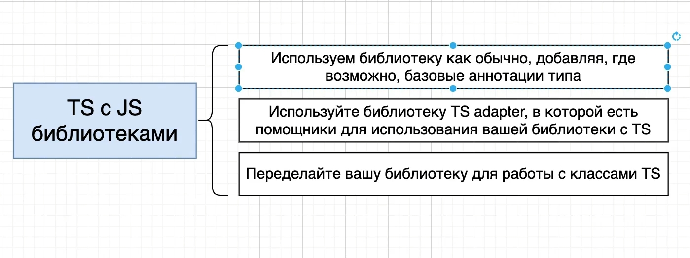
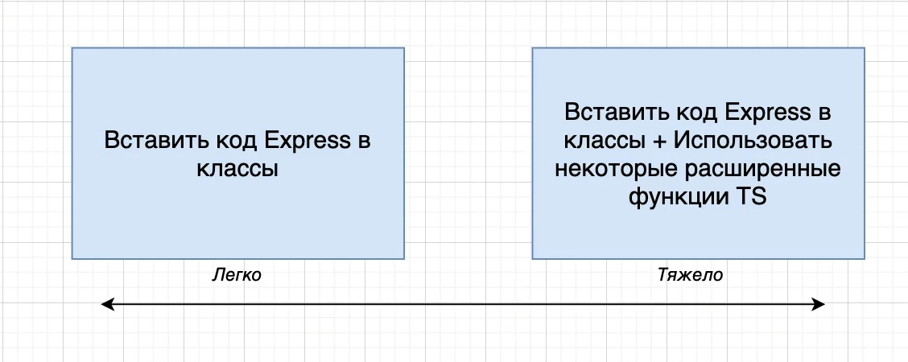
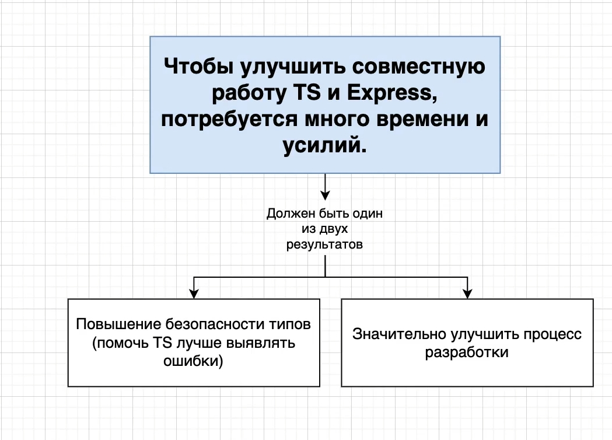
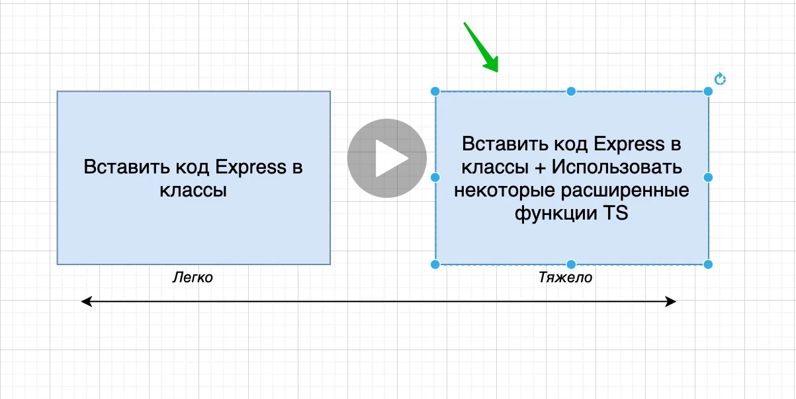

# 013_Более_тесная_интеграция_TS_&_Express

Мы закончили работу над первой версией этого приложения. Мы тут добавляем самый минимум аннотаций типов.



Мы используем TS что бы получать самые просейшие, самые базовые проверки и отлавливание ошибок.

На самом деле мы тут не делаем ни какой специальной кастомизации.

И в этом видио мы с вами начнем большой рефакторинг нашего проекта. И мы с вами попробуем понять как соеденить Express и
TS вместе, что бы они работали вместе намного теснее.

Напоминание.

Каждый раз когда мы с вами используем TS. Самые главные фитчи этого языка это классы и interface. Т.е. как только мы
говорим что бы TS начал лучше работать с какой-то JS библиотекой, то мы сразу же долны подумать о том как мы должны
заставить эту библиотеку JS работать при помощи остванного на классах и interface подходах. Т.е. все что мы с вами будем
обсуждать это как заставить работать express и весь код который мы с вами написали при помощи классов.

Теперь у нас появляется что-то ввиде спектра.



И так у нас появляется спектр на сколько тестно мы можем заставить работать TS и Express вместе.

Слева на диаграмме легко. Мы можем взять весь код для Express и поместить его в класс.

К примеру код запуска приложения я могу переписать

```ts
//src index.ts
import express from "express";
import {router} from "./routes/loginRoutes";
import cookieSession from "cookie-session";

const PORT = 5000;


class Server {
    app: express.Express = express();

    constructor() {
        this.app.use(express.urlencoded({extended: true})); // обязательно прописываю выше регистрации роутов и опциональный параметр extended: ставлю в true
        // так же располагаю выше если расположить ниже регистрации роутов то это может работать не корректно
        this.app.use(cookieSession({keys: ["asfadsfadfs"]})); // asfadsfadfs для кодировки сессии какая это будет строка не имеет значения просто это должно быть строкой
        this.app.use(router);
    }

    start(): void {
        this.app.listen(PORT, () => {
            console.log(`Сервер запущен на порту: ${PORT}`);
        });
    }
}

new Server().start();

```

Но возникает вопрос. Получаем ли мы пользу от этого? ООП подход и все такое.

Когда мы говорим что мы мпоместили весь этот код в класс это не значит что мы от этого сразу получаем какую-то пользу.
Это на самом деле то о чем вы должны подумать прежде чем начать работать с какой-нибудь JS билиотекой.

Когда вы проходите весь этот процесс рефакторинга что бы поработать с TS используя подход основанный на классах от этого
должен быть какой-то хороший результат.



Нужно что бы эти усилия и потраченное время было оправдано.

Мы должны получить повышение безопасности типов.

Значительно улучшить процесс разработки.

Тоже самое можно сказать об интеграции TS и реакта или любой другой библиотеки.

Второй подход



Именно этим мы и займемся.