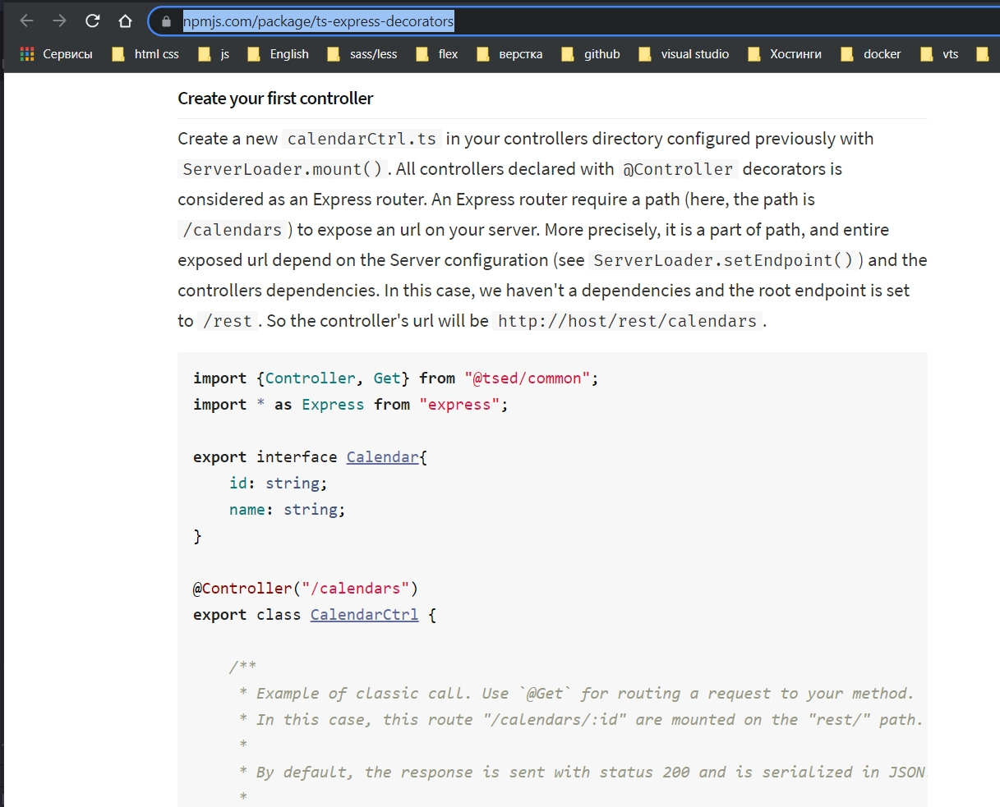
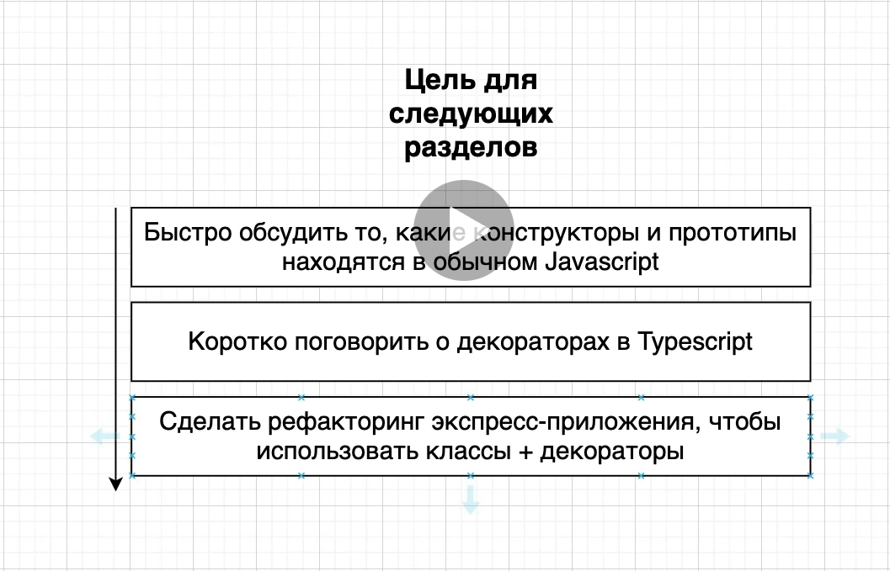

# Рефакторинг

я открываю библиотеку [ts-express-decorators](https://www.npmjs.com/package/ts-express-decorators)

z Я хочу рекомплементировать некоторые функции данной библиотеки. Т.е. я не буду ее использовать напрямую.

Когда мы начинаем исползовать эту библиотеку они вводят такое понятие как Controller



```ts
import {Controller, Get} from "@tsed/common";
import * as Express from "express";

export interface Calendar {
    id: string;
    name: string;
}

@Controller("/calendars")
export class CalendarCtrl {

    /**
     * Example of classic call. Use `@Get` for routing a request to your method.
     * In this case, this route "/calendars/:id" are mounted on the "rest/" path.
     *
     * By default, the response is sent with status 200 and is serialized in JSON.
     *
     * @param request
     * @param response
     * @returns {{id: any, name: string}}
     */
    @Get("/:id")
    async get(request: Express.Request, response: Express.Response): Promise<Calendar> {
        return {id: request.params.id, name: "test"};
    }

    @Get("/")
    @ResponseView("calendars/index") // Render "calendars/index" file using Express.Response.render internal
    async renderCalendars(request: Express.Request, response: Express.Response): Promise<Array<Calendar>> {

        return [{id: '1', name: "test"}];
    }

    @Post("/")
    @Authenticated()
    async post(
        @Required() @BodyParams("calendar") calendar: Calendar
    ): Promise<ICalendar> {

        return new Promise((resolve: Function, reject: Function) => {

            calendar.id = 1;

            resolve(calendar);

        });
    }

    @Delete("/")
    @Authenticated()
    async post(
        @BodyParams("calendar.id") @Required() id: string
    ): Promise<ICalendar> {

        return new Promise((resolve: Function, reject: Function) => {

            calendar.id = id;

            resolve(calendar);

        });
    }
}
```

И здесь вот такой вот стиль написания кода @Controller. Это то что называется Декоратор.

В этом конкретном случае этот проект [ts-express-decorators](https://www.npmjs.com/package/ts-express-decorators)
значительно улучшает продуктивность работы. Т.е. процесс разработки путем использования классов. И во-вторых это
продвинутая или расширенная функция TS декораторы. Именно при помощи декораторов работает эта библиотека.



Понимание декораторов это достаточно сложная тема. Если мы сейчас начнем использовать декораторы в нашем проекте это
будет на самом деле трудно понять