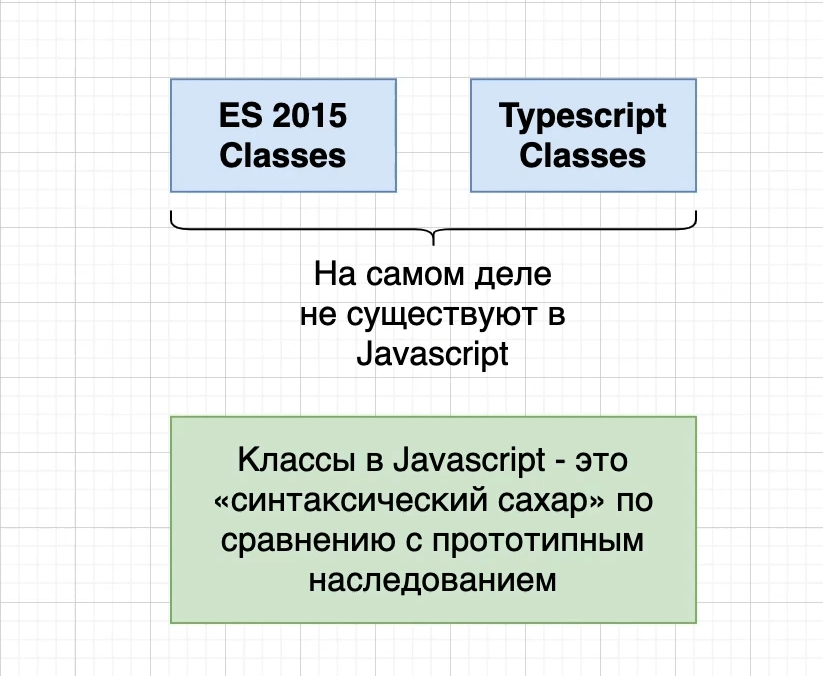
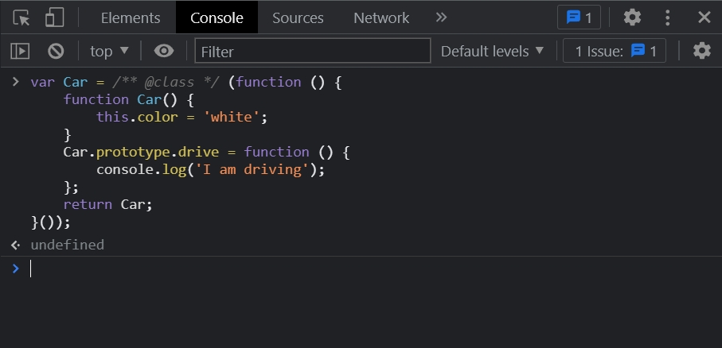
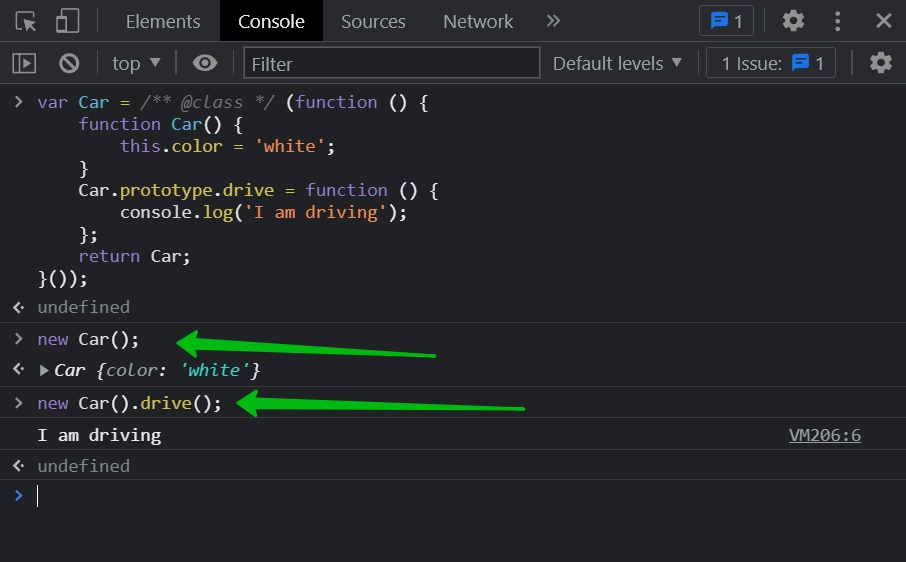
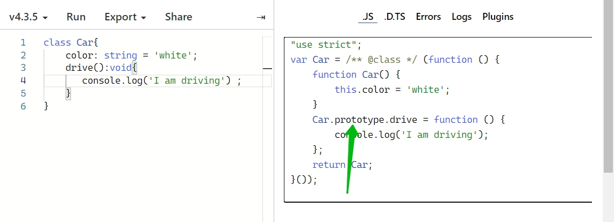
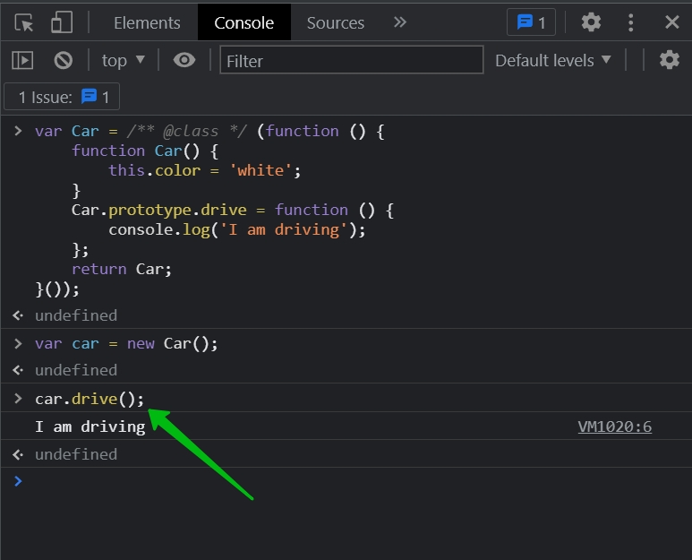
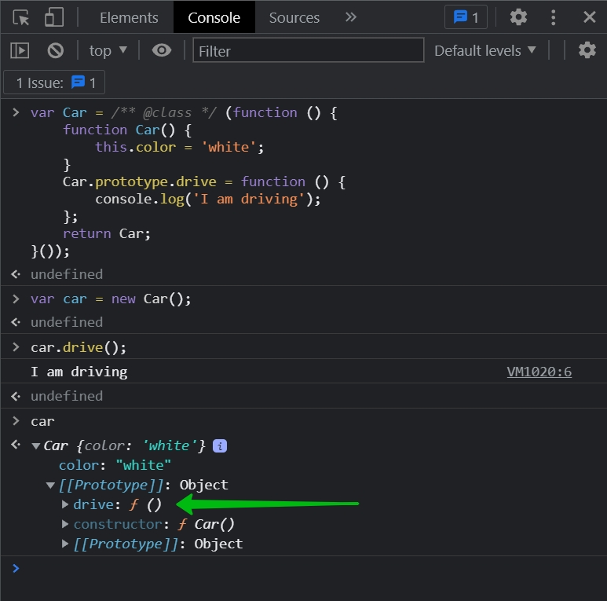
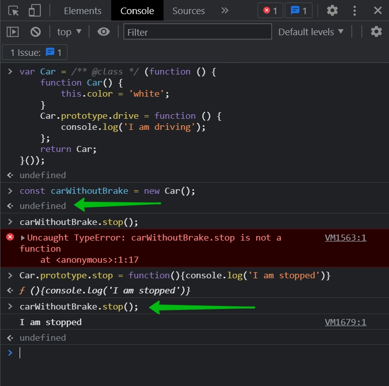

# 015_Classes_&_Prototypes

Обсудим что такое конструкторы и прототипы в обычном JS.

На самом деле class в JS это синтаксический сахар. Классы были добавлены что бы работать с наследованием и объектами
легче. Это было сделано для тех разработчиков которые например работали или работают с JAVA, C# или с любыми другими
объектно ориентированными языками.

В JS идея настоящих классов на самом деле никогда на была по настоящему имплементированна. Когда мы пишем в ES 2015 или
в TS классах, на самом деле все это происходит при помощи прототипного наследования.

Перехожу [https://www.typescriptlang.org/play?ts=4.3.5#](https://www.typescriptlang.org/play?ts=4.3.5#)

Как видите в ES5 мы не получаем ни какого класса. Настройки можно выставить в TS Config.

И менно таким образом мы можем с вами имплементироват простейший код используя систему прототипов в JS.

Я могу скопировать весь JS код ES5 и добавить его в консоль браузера.

Теперь я могу использовать объект класса Car

Проясним что здесь происходит.

Мы создаем функцию Car, определяем ее как функцию конструктор. У этой функции такая же похожая цель как у нормального
когструктора который мы с вами использовали в TS. Мы используем функцию конструкцию что бы инициализировать различные
свойства которые мы хотим что бы имел объект. Внутри этой функции конструктора мы обычно только свяываем различные
свойсва с какими-то значениями такие как string, object, array. Точнее мы связываем свойсва и их значения с ключевым
словом this.

Если же мы хотим связать различные значения с объектом Car в данном случае. Мы уже связываем не с this а с prototype
свойсвом.

Т.е. каждый раз когда мы вызываем различные методы для объекта класса Car. Создам объект класса.

Я могу вызывать методы.

Кое что интересное. Вызову car и посмотрим из чего состоит.

Как видим методы находятся в prototype.

Различные простые свойства string, boolean, object, array мы связываем с объектом класса car.

Но все методы которые мы хотим связать с этим объектом мы связываем со свойством proto т.е. prototype.

По большому счету прототип не видим в объекте класса car. proto добавлено браузером. С точки зрения JS этого свойства
proto не существует.

При вызове метода drive он его сначало ищет в объекте класс car, не находит. Видит proto ищет там и находит. Находит его
в объекте Car Prototype и вызывает его drive().

Первое прототип очень легко может быть изменен. Мы можем добавить какие-то метода даже после того как объект был создан.

Это вводит в ступор разработчиков других языков. Т.е. мы можем налету добавлять и изменять какие-то методы.

