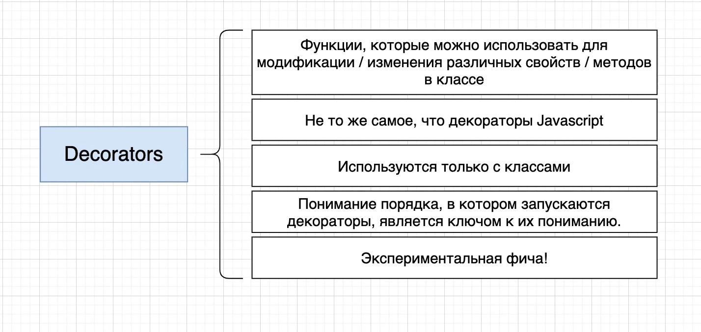

# 001_Декораторы_в_TypeScript



Функции которые можно использовать для модификации, изменения различных свойств, методов в классе.

Decorators очень сильно отличиются от декораторов в JS. Т.е. если вы когда-то использовали JS декораторы. Есть кое-что
схожее, но очень много правил отличаются в TS для декораторов.

В TS декораторы используются только с классами. Т.е. вы никогда не увидите декораторы в отдельности от класса. Он всегда
будет очень тестно связан с каким то определением класса.

Самое главное это понимание порядка, в котором запускаются декораторы, является ключом к их пониманию.

Внутри папки features я создаю decorators.ts.

```ts
class Car {
    color: string = "white";

    getFormattedColor(): string {
        return `This car color is ${this.color}`;
    }

    drive(): void {
        console.log(`I am driving`);
    }
}

```

Внутри класса у нас есть свойство color. У нас есть метод accessor в данном случае getter, и так же у нас есть простой
метод drive. Ну и конечно же есть общее определение класса на самом верху.

Мы разберем как использовать декораторы для всех этих частей класса.

После класса определяю функцию декоратор.

```ts
class Car {
    color: string = "white";

    getFormattedColor(): string {
        return `This car color is ${this.color}`;
    }

    drive(): void {
        console.log(`I am driving`);
    }
}

function testDecorator() {
}

```

Параметры этой функции очень важны. Первый параметр это то что мы всегда будем называть target. Пока что оставлю его тип
как any. Следующий параметр называется key: этот параметр будет типа string. На данный момент эта функция не будет
ничего возвращать

```ts
class Car {
    color: string = "white";

    getFormattedColor(): string {
        return `This car color is ${this.color}`;
    }

    drive(): void {
        console.log(`I am driving`);
    }
}

function testDecorator(target: any, key: string): void {
    console.log(`Target: ${target}`);
    console.log(`Key: ${key}`);
}

```

Для того что бы добавить декоратор для метода drive я должен записать над названием метода символ собачки @ и затем
название функции декоратора.


```shell
tsc --init
```

Далее перехожу в созданный tsconfig.json. Нахожу experimentalDecorators и разкоментирую. И так же снимаю комментарий "
emitDecoratorMetadata": true. И так же переименовываю класс так как у меня в проекте такой класс уже есть.

```ts
class DecoratorCar {
    color: string = "white";

    getFormattedColor(): string {
        return `This car color is ${this.color}`;
    }

    @testDecorator
    drive(): void {
        console.log(`I am driving`);
    }
}

function testDecorator(target: any, key: string): void {
    console.log("Target:", target);
    console.log("Key:", key);
}

```

```shell
ts-node decorators.ts
```


При использовании Template literals вывело Target как Object:object.