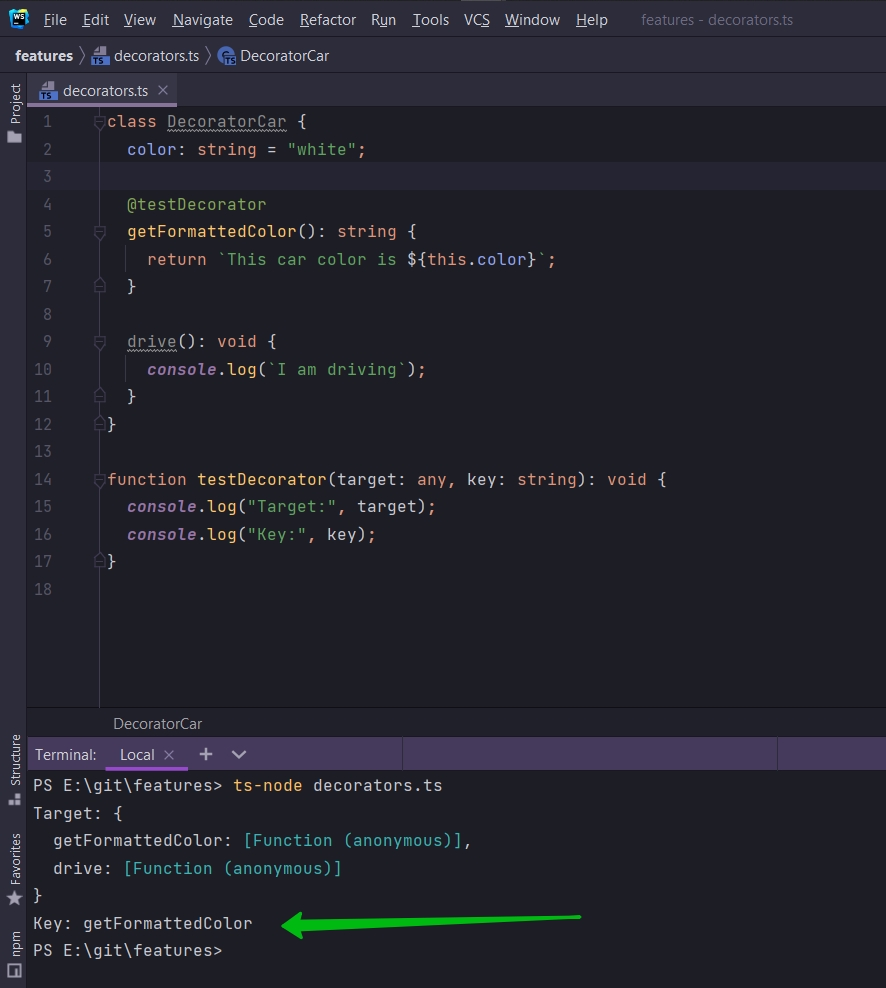
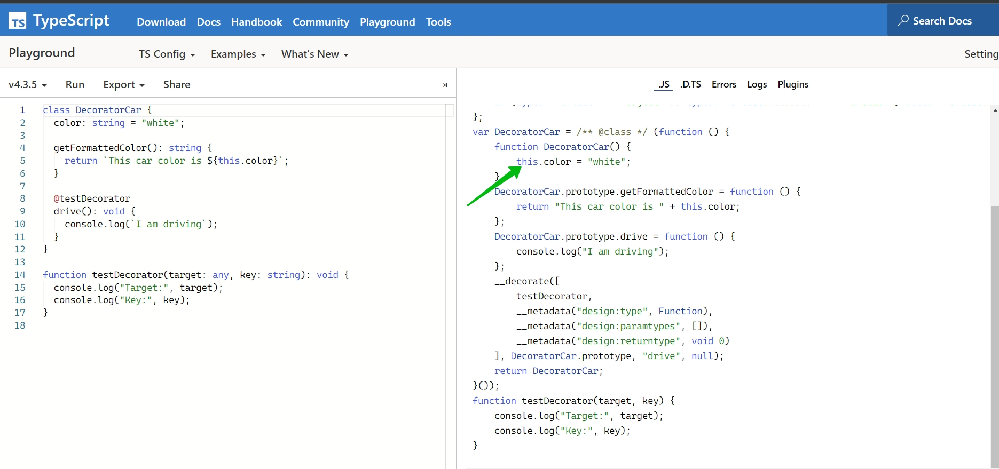

# 002_Подробнее_о_декораторах


В нашем классе это все есть

```ts
class DecoratorCar {
    color: string = "white";

    getFormattedColor(): string {
        return `This car color is ${this.color}`;
    }

    @testDecorator
    drive(): void {
        console.log(`I am driving`);
    }
}

function testDecorator(target: any, key: string): void {
    console.log("Target:", target);
    console.log("Key:", key);
}

```

- color - свойство
- get - так же есть accessor get
- И матод drive

т.е. мы можем использовать @testDecorator для трех этих разных сущностей.

Наша функция testDecorator как и любой декоратор может принимать несколько аргументов.

Первый аргумент это прототип объекта. Т.е. в нашем случае мы говорим о прототипе класса DecoratorCar. Буквально не давно
мы рассматривать Prototype в JS. Каждый раз когда создается класс создается функция конструктор и так же прототип для
этой функции конструктора.

Первый аргумент в функции testDecorator это target - это prototype класса DecoratedCar. Это хначит что это объект с
самыми различными функциями которые мы определили внутри класса. Когда мы выводим в консоль Target мы получаем метод
drive.

```shell
ts-node decorators.ts
```


И можно заметить что свойство здесь не отображается в Target. Здесь есть только его значение. Странно у него не
показывается, а у меня есть getFormattedColor. Свойство привязывается к constructor функции. Через слово this мы можем
обращаться к свойству.

Второй аргумент это ключ свойства, метода, аксессора к объекту. Т.е. при помощи key, когда декорируем при помощи
@testDecorator какую-то функцию, в данном случае drive(), то key будет связан с названием метода drive.


Если я перемещу @testDecorator на уровень выше getFormattedColor, то key будет в даннм случае getFormattedColor.

```ts
class DecoratorCar {
    color: string = "white";

    @testDecorator
    getFormattedColor(): string {
        return `This car color is ${this.color}`;
    }

    drive(): void {
        console.log(`I am driving`);
    }
}

function testDecorator(target: any, key: string): void {
    console.log("Target:", target);
    console.log("Key:", key);
}

```



Технически существует третий аргумент в функции декораторе - это дескриптор свойства. По файкту мы не получаем этот
третий аргумент внутри функции. Мы не можем к нему обратиться внутри функции декоратора. Но если мы добавим, определим
этот третий аргумент, то это будет дескриптор свойства или property descriptor.

Мы поговорим об этом чуть позже.

И самая важная четвертая часть это самая важная часть о декораторах. Это то что декораторы используются только при
запуске кода этого класса т.е. декораторы запускаются всего лишь один раз в тот момент когда мы определяем класс.
Другими словами когда TS смотрит на наш код, а точнее JS потому что TS компилируется в JS, мы в какой-то момент
определяем класс. И именно когда мы определяем класс DecoratorCar этот @testDecorator запускается. Декоратор не
запускается когда мы создаем экземпляр этого класса. Т.е. при создании объекта этого класса.

В нашем коде мы не создаем объект класса, но тем не менее декоратор запускается.

Если я сейчас скопирую наш код и использую площадку TS Playground


Заметьте когда мы используем @testDecorator в JS появляется переменная var __decorate = (this && this.__decorate) ||
function (decorators, target, key, desc) которая содержит определение функции. Данная функция называется underscore
decorate. Т.е. два символа нижнего подчеркивания и decorate.

Эта функция добавляется автоматически в наш код что бы имплементировать все возможности декоратора. Если я уберу
@testDecorator


То как видим эта функция var __decorate изчезает. Т.е. эта функция существует только для того что бы имплементировать
действия, функциональность нашего декоратора.

И давайте пропробуем понять где эта функция используется.

Верну декоратор к методу drive и взляну еще раз

```ts
class DecoratorCar {
    color: string = "white";

    getFormattedColor(): string {
        return `This car color is ${this.color}`;
    }

    @testDecorator
    drive(): void {
        console.log(`I am driving`);
    }
}

function testDecorator(target: any, key: string): void {
    console.log("Target:", target);
    console.log("Key:", key);
}

```

Так же выставляю настройки на ES5


Так же прокручиваю немного вниз и смотрю определение декоратора


Как видите этот метод добавлен к prototype. В то время как обращение к свойству color идет через this



После определения декоратора у нас идет вызов underscore decorate.


Первый аргумент это массив из разных декораторов которые мы применяем к этому методу. Так же здесь находится  __
metadata, о ней мы поговорим немного позже.

Далее вторым параметром идет DecoratorCar.prototype,


И третий параметр это key, т.е. название того к чему мы добавили декоратор.


И последний параметр это null. Этот параметр property descriptor котором мы поговорим чуть позже.

Что на самом деле декоратор делает для нас?

Если взять функцию

```js
var __decorate = (this && this.__decorate) || function (decorators, target, key, desc) {
    var c = arguments.length,
        r = c < 3 ? target : desc === null ? desc = Object.getOwnPropertyDescriptor(target, key) : desc, d;
    if (typeof Reflect === "object" && typeof Reflect.decorate === "function") r = Reflect.decorate(decorators, target, key, desc);
    else for (var i = decorators.length - 1; i >= 0; i--) if (d = decorators[i]) r = (c < 3 ? d(r) : c > 3 ? d(target, key, r) : d(target, key)) || r;
    return c > 3 && r && Object.defineProperty(target, key, r), r;
};
```

И удалить все лишнии проверки у нас останется логика декоратора.

```js
var __decorate = function (decorators, target, key, desc) {
    var desc = Object.getOwnPropertyDescriptor(target, key);
    for (var decorator of decorators) {
        decorator(target, key, desc)
    }
}
```

На самом деле эта функция итерирует в цикле for через все декораторы и вызывает каждый из этих декораторов со следующими
параметрами target, key, desc.

Вот этот весь код

```ts
class DecoratorCar {
    color: string = "white";

    getFormattedColor(): string {
        return `This car color is ${this.color}`;
    }

    @testDecorator
    drive(): void {
        console.log(`I am driving`);
    }
}

function testDecorator(target: any, key: string): void {
    console.log("Target:", target);
    console.log("Key:", key);
}

```

это синтаксический сахар

Если я удалю прототип и сделаю вот так

```ts
class DecoratorCar {
    color: string = "white";

    getFormattedColor(): string {
        return `This car color is ${this.color}`;
    }

    drive(): void {
        console.log(`I am driving`);
    }
}

function testDecorator(target: any, key: string): void {
    console.log("Target:", target);
    console.log("Key:", key);
}

testDecorator(DecoratorCar.prototype, "drive");

```


то этот код работает так же.

Мы разобрали механику декораторов, но на самом деле суть и важность не в этом. А в том для чего мы можем их
использовать.


