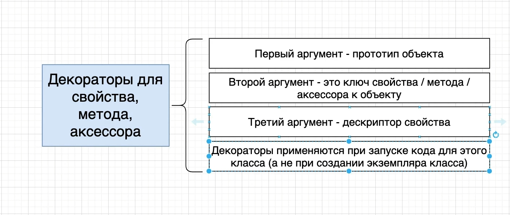
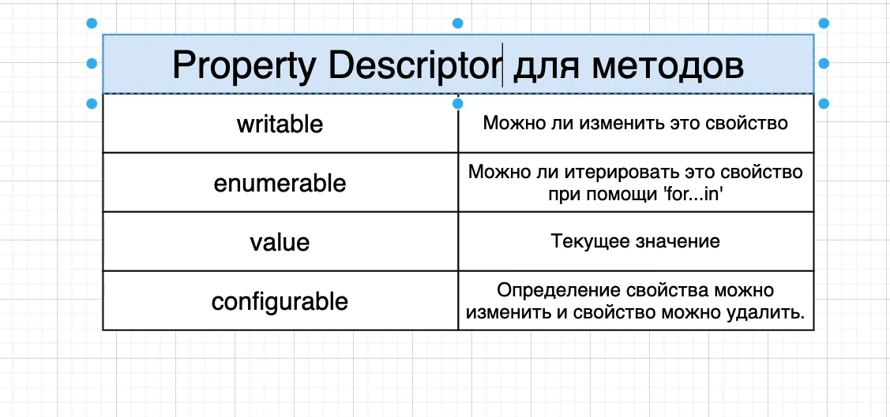
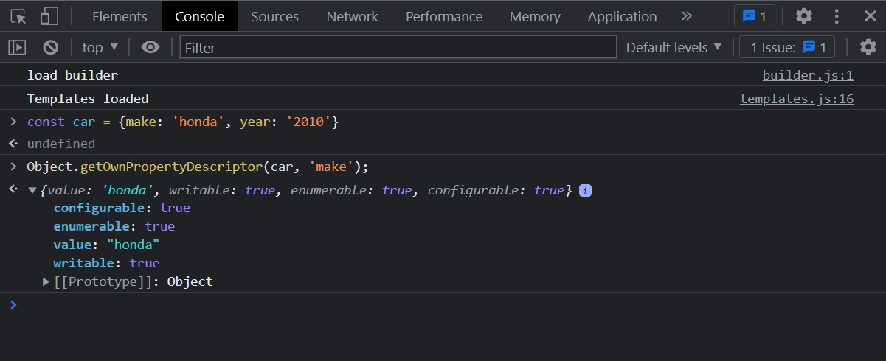
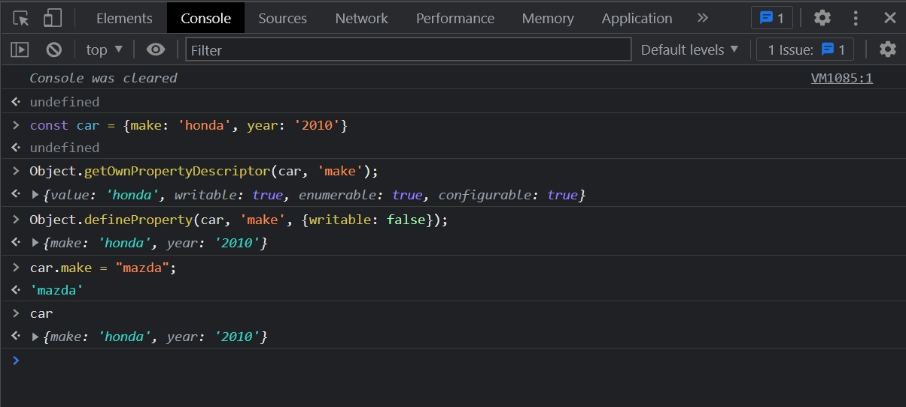

# 003_Property_Descriptor

В этом видео рассмотрим случаи когда декораторы могут быть очень полезны. Создам такой код.

```ts
class DecoratorCar {
    color: string = "white";

    getFormattedColor(): string {
        return `This car color is ${this.color}`;
    }

    @logError
    drive(): void {
        throw new Error();
        console.log(`I am driving`);
    }
}

function logError(target: any, key: string): void {
    console.log("Target:", target);
    console.log("Key:", key);
}

```

Я хочу убедиться каким-то образом в том что когда мы вызываем метод drive, который не избежно выбрасывает ошибку.
Декоратор logError отлавливал этоу ошибку и потом выводил в консоль эту ошибку в каком-то удобочитаемом виде.

Для имплементации этой функциональности мы будем использовать третий параметр в функции декораторе.

Прежде чем мы продолжим обсудим что же этот третий параметр значит.

Третий аргумент это property descriptor



Я укажу третий параметр как desc т.е. descriptor. И Этот параметр будет типа PropertyDescriptor.

```ts
class DecoratorCar {
    color: string = "white";

    getFormattedColor(): string {
        return `This car color is ${this.color}`;
    }

    @logError
    drive(): void {
        throw new Error();
        console.log(`I am driving`);
    }
}

function logError(target: any, key: string, desc: PropertyDescriptor): void {
    console.log("Target:", target);
    console.log("Key:", key);
}

```

Этот тип PropertyDescriptor глобально доступен у нас в TS.

И так что же это все таки такое PropertyDescriptor? Можно описать его как объект который имеет какие-то конфигурационные
опции о свойстве определенном для объекта. Это по сути не чать TS. Это часто ES5 JS.

PropertyDescriptor мы можем использовать внутри Node, Внутри браузера без использования ES2015 или TS.



- Property Descriptor - это по сути объект которорый предназначен для конфигурации совойства для другого объекта. Каждый
  раз когда мы работаем с Property Descriptor а именно с property descriptor для метода, то он будет иметь следующие
  опции представленные на скрине.

- Флаг writable - это будет boolean значение true или false которое будет говорить можноли изменить это свойство.
- enumerable - так же boolean можно ли это свойство итерировать при помощи for ...in
- value - текущее значение.
    - configurable - отображает можем ли мы менять конфигурацию этого свойства и можно ли его удалить.

Для наглядности в консоли браузера определяю объект

```js
const car = {make: 'honda', year: '2010'}
```

Далее вызываю

```js
Object.getOwnPropertyDescriptor()
```

Первым параметром я указываю объект car. Вторым аргументом мы передадим key для которого мы хотим получить property
descriptor т.е. описание свойства. Т.е. в данном случае у нас в объекте car есть два свойства make и year. Если мы хотим
получить property descriptor для свойства year, то мы должы вторым аргументом передать называние ключа в формате строки.

```js
Object.getOwnPropertyDescriptor(car, 'make');
```



И вот мы молучаем property descriptor т.е. объект property descriptor для свойства make которое существует у объекта
car.

- writable: true означает что мы сейчас можем обновить свойства этого объекта. Т.е. вместо make:"honda" указать другое
  значение.

Давайте попробуем изменить property descriptor этого объекта. После чего мы увидим как меняется поведение этого объекта.

Для того что бы изменить

```js
Object.defineProperty(car, 'make', {});
```

третьим параметром я указываю новое определение свойства make.

```js
Object.defineProperty(car, 'make', {writable: false});
```

Теперь свойство make мы не можем перезаписать.



Как видим при присвоении нового значения оно вроде как бы присвоилось, но на самом деле нет. Теперь свойство make мы не
можем перезаписывать.