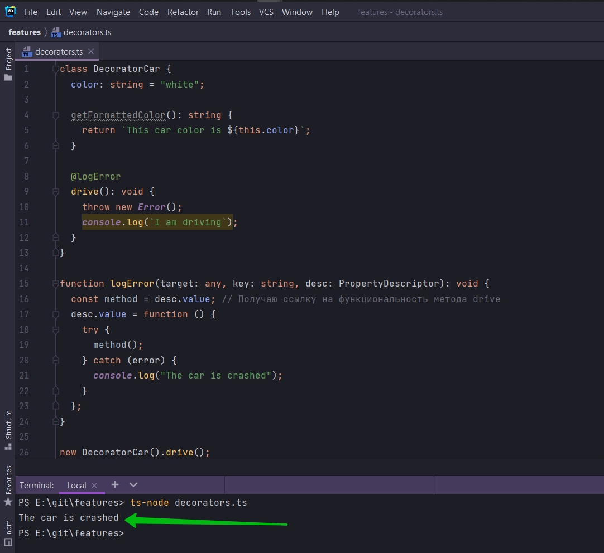

# 004_Обертывание_методов

Мы обернем нашу функцию drive для того что бы отлавливать ошибки.

```ts
class DecoratorCar {
    color: string = "white";

    getFormattedColor(): string {
        return `This car color is ${this.color}`;
    }

    @logError
    drive(): void {
        throw new Error();
        console.log(`I am driving`);
    }
}

function logError(target: any, key: string, desc: PropertyDescriptor): void {

}

```

Прежде всего я получаю ссылку на существующий метод drive. const method = desc.value; // Получаю ссылку на
функциональность метода drive

```ts
class DecoratorCar {
    color: string = "white";

    getFormattedColor(): string {
        return `This car color is ${this.color}`;
    }

    @logError
    drive(): void {
        throw new Error();
        console.log(`I am driving`);
    }
}

function logError(target: any, key: string, desc: PropertyDescriptor): void {
    const method = desc.value; // Получаю ссылку на функциональность метода drive
}

```

Теперь я возвращаюсь к property descriptor и при помощи него попытаюсь обновить это значение.

```ts
class DecoratorCar {
    color: string = "white";

    getFormattedColor(): string {
        return `This car color is ${this.color}`;
    }

    @logError
    drive(): void {
        throw new Error();
        console.log(`I am driving`);
    }
}

function logError(target: any, key: string, desc: PropertyDescriptor): void {
    const method = desc.value; // Получаю ссылку на функциональность метода drive
    desc.value = function () {
        try {
            method();
        } catch (error) {
            console.log("The car is crashed");
        }
    };
}

```

Но данный код не запуститься так как нужно создать объект класса DecoratedCar. new DecoratorCar().drive(); и так же
вызываю метод drive.



Мы перехватили вызов метода drive. И обернули его в свою кастомную функцию. Т.е. теоретически если мы ожидаем ошибку
внутри какого-то метода класса мы можем просто внутри пометить этот метод декоратором @logError и мы автоматически будем
отлавливать ошибки.