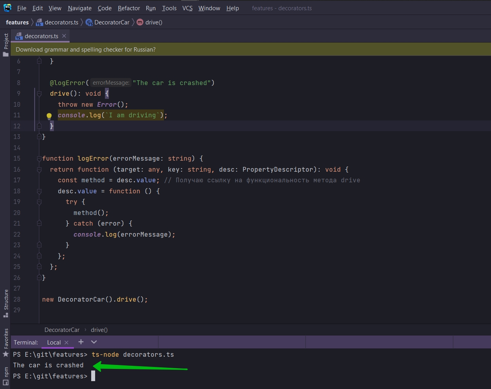

# 005_Decorator_Factory_Фабрика_декораторов

И так наш декоратор работает.

```ts
class DecoratorCar {
    color: string = "white";

    getFormattedColor(): string {
        return `This car color is ${this.color}`;
    }

    @logError
    drive(): void {
        throw new Error();
        console.log(`I am driving`);
    }
}

function logError(target: any, key: string, desc: PropertyDescriptor): void {
    const method = desc.value; // Получаю ссылку на функциональность метода drive
    desc.value = function () {
        try {
            method();
        } catch (error) {
            console.log("The car is crashed");
        }
    };
}

new DecoratorCar().drive();

```

Я хочу внести не большое изменение.

Сейчас каждый раз когда мы используем этот decorator. Каждый раз он будет выводить в консоль. console.log("The car is
crashed");

Мы на самом деле можем использовать этот декоратор только с классом DecoratedCar. И об этом четко коворится в выводе в
консоли.

Было бы не плохо кастомизировать это сообщение обошибке каждый раз когда мы используем декоратор. Т.е. было бы не плохо
в качестве параметра в декоратор передавать строку.

Для этого мы можем использовать фабрику декораторов. Это декоратор который возвращает функцию. Синтаксис может быть
немного сложноватый.

Перехожу в функции logError, т.е. декоратор который мы создали. Уберу название logError. После чего я оберну эту функцию
при помощи другой функции которую назову logError.

```ts
class DecoratorCar {
    color: string = "white";

    getFormattedColor(): string {
        return `This car color is ${this.color}`;
    }

    @logError
    drive(): void {
        throw new Error();
        console.log(`I am driving`);
    }
}

function logError() {
    return function (target: any, key: string, desc: PropertyDescriptor): void {
        const method = desc.value; // Получаю ссылку на функциональность метода drive
        desc.value = function () {
            try {
                method();
            } catch (error) {
                console.log("The car is crashed");
            }
        };
    };
}

new DecoratorCar().drive();

```

Далее я могу передавать это сообщение о возможной ошибке как параметр в функцию.


```ts
class DecoratorCar {
    color: string = "white";

    getFormattedColor(): string {
        return `This car color is ${this.color}`;
    }

    @logError("The car is crashed")
    drive(): void {
        throw new Error();
        console.log(`I am driving`);
    }
}

function logError(errorMessage: string) {
    return function (target: any, key: string, desc: PropertyDescriptor): void {
        const method = desc.value; // Получаю ссылку на функциональность метода drive
        desc.value = function () {
            try {
                method();
            } catch (error) {
                console.log(errorMessage);
            }
        };
    };
}

new DecoratorCar().drive();

```

Теперь мы можем кастомизированно передавать сообщение об ошибке.

Когда мы вызываем @logError мы изначально передаем какой-то параметр


При помощи @logError я запускаю функцию logError и уже данная функция будет примена как декоратор.




