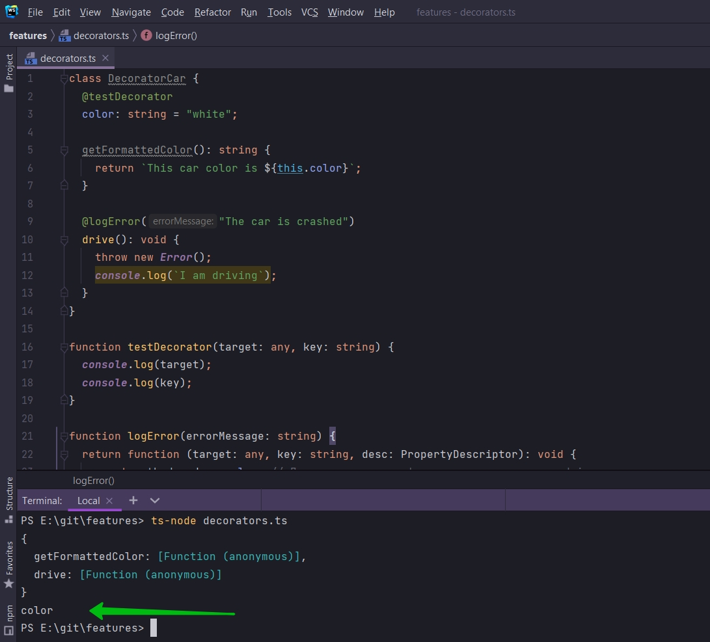
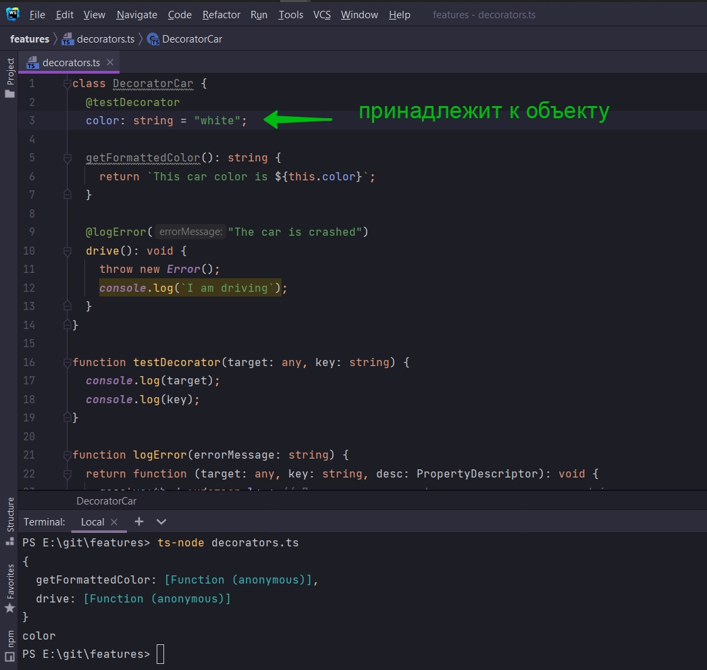

# 006_Декораторы_и_свойства

Разберем декораторы применяемые для свойств. В данном случае для свойства color.

Создам еще один декоратор testDecorator.

```ts
class DecoratorCar {
    @testDecorator
    color: string = "white";

    getFormattedColor(): string {
        return `This car color is ${this.color}`;
    }

    @logError("The car is crashed")
    drive(): void {
        throw new Error();
        console.log(`I am driving`);
    }
}

function testDecorator(target: any, key: string) {
    console.log(target);
    console.log(key);
}

function logError(errorMessage: string) {
    return function (target: any, key: string, desc: PropertyDescriptor): void {
        const method = desc.value; // Получаю ссылку на функциональность метода drive
        desc.value = function () {
            try {
                method();
            } catch (error) {
                console.log(errorMessage);
            }
        };
    };
}


```



Т.е. Я вижу информациб о прототипе drive а так же прототип свойства color.

теперь давайте попробуем распечатать значение свойства color.

На самом деле это очень не просто. Если на данном уровне знаний декораторов мы попробуем как-то обратиться к значению
этого свойства, то мы просто не сможем это сделать. Это происходит из-за того что свойства пренадлежит к объекту



а не к prototype.

И еще мы с вами выяснили что код декоратора запускается только при создании класса, но не при создании объекта.

Т.е. на данном этапе, пока мы не станем очень-очень умными с декораторами, не научимся обращаться очень изощренно, мы не
можем получить доступ к этому значению.

На самом деле для свойств этот декоратор может использоваться только для получения того же key


Значение этого свойства мы получить не можем. Т.е. мы не можем модифицировать эти свойства, каким-то образом изменять их
или оборачивать в какие-то функции.

Все что я хотел сказать это то что мы не можем получить прямого доступа для свойств декоратора потому что он запускается
до того как мы создаем какой-то объект т.е. при объявлении класса. Потому что свойство на прямую связано с объектом
через ключевое слово this.