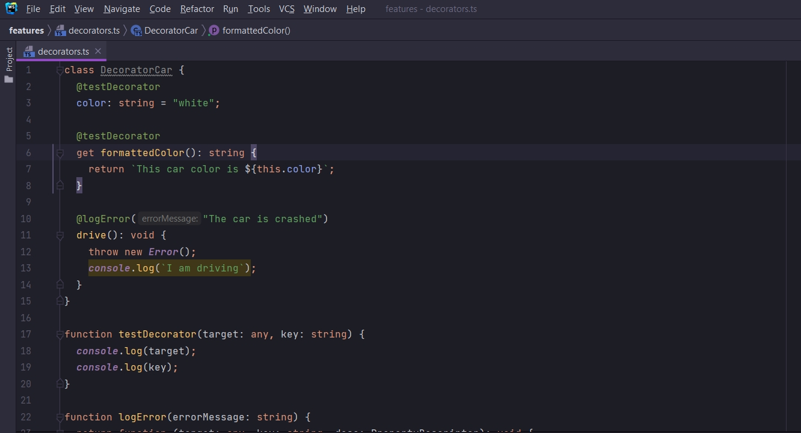
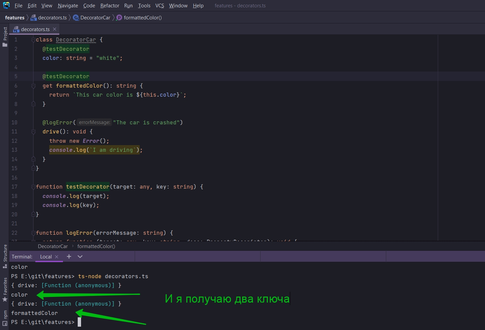
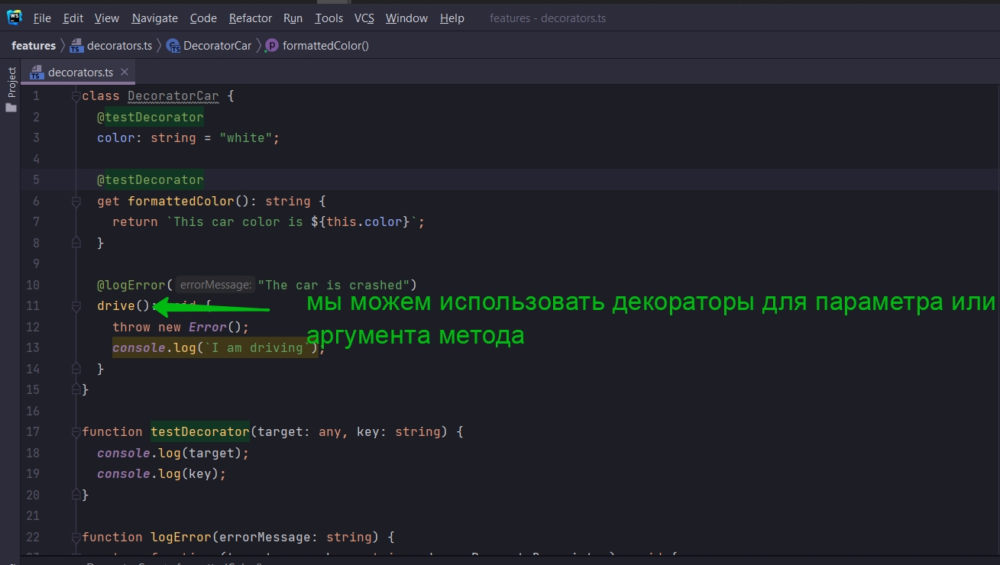
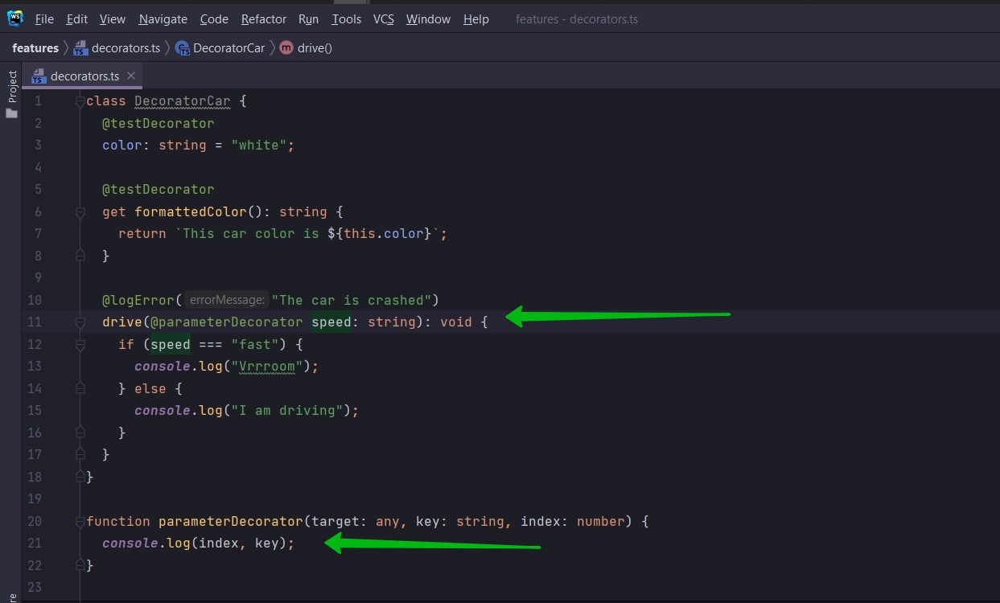
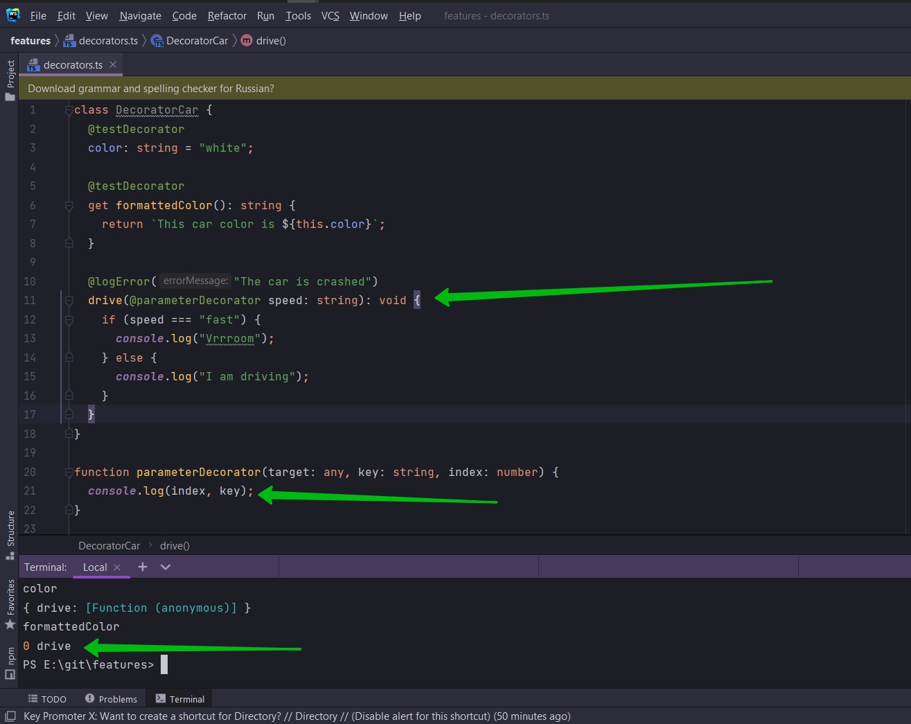
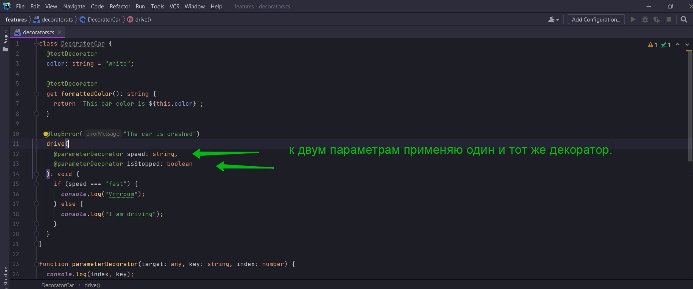
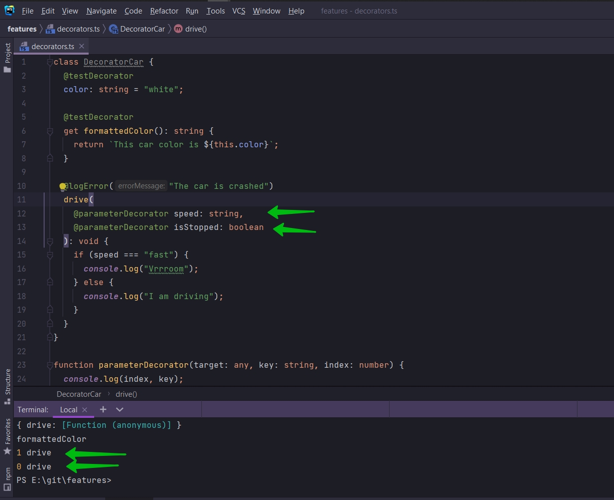
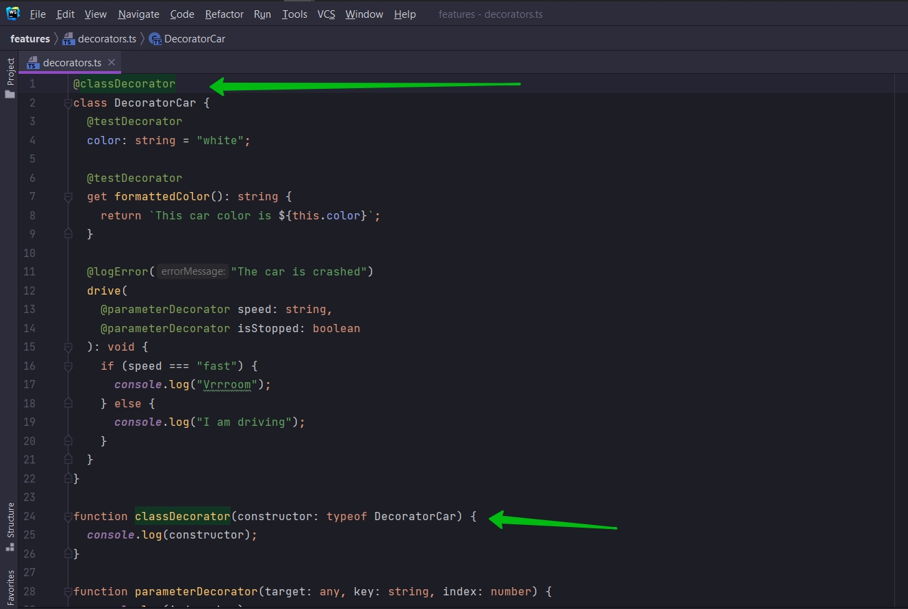
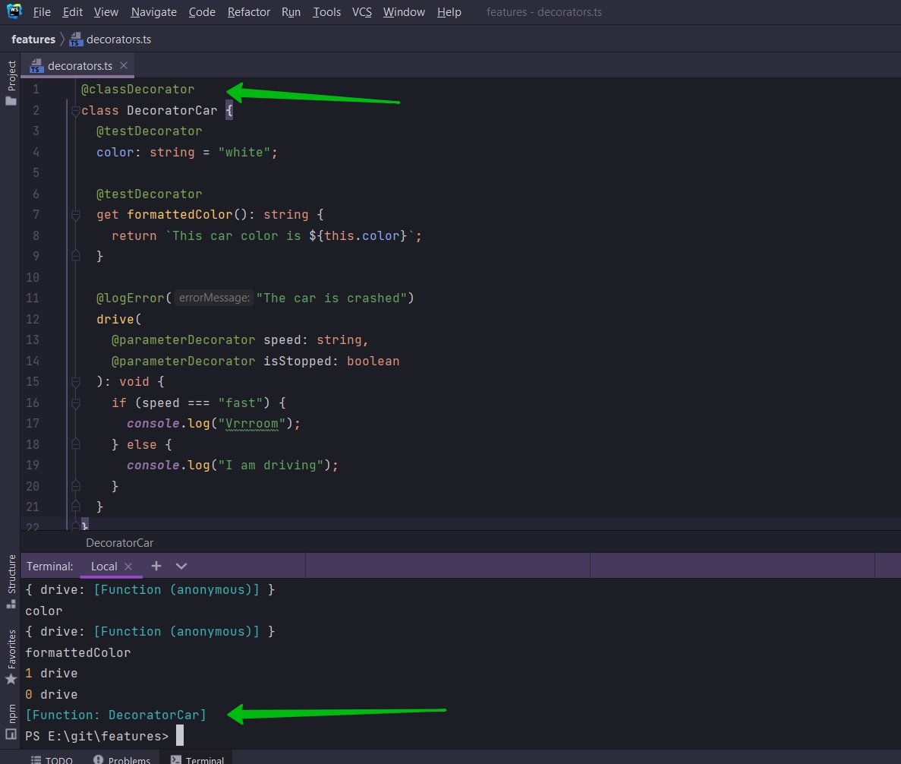

# 007_Больше_о_декораторах

В этом видео мы с вами рассмотрим еще прару мест где могли бы использоваться декораторы.

1. Это конечно accessor get. Мы можем например использовать тот же testDecorator для этого accessor.



```ts
class DecoratorCar {
    @testDecorator
    color: string = "white";

    @testDecorator
    get formattedColor(): string {
        return `This car color is ${this.color}`;
    }

    @logError("The car is crashed")
    drive(): void {
        throw new Error();
        console.log(`I am driving`);
    }
}

function testDecorator(target: any, key: string) {
    console.log(target);
    console.log(key);
}

function logError(errorMessage: string) {
    return function (target: any, key: string, desc: PropertyDescriptor): void {
        const method = desc.value; // Получаю ссылку на функциональность метода drive
        desc.value = function () {
            try {
                method();
            } catch (error) {
                console.log(errorMessage);
            }
        };
    };
}

```



Есть еще пару мест где мы можем использовать декораторы. Очень ясно все равно не покажу для чего вы можете использовать
декораторы в этих местах. На данный момент я вам хочу показать что такие места существуют.

Одно из мест где мы можем использовать декоратор это для параметра или аргумента метода.



Давайте предположим что наш метод drive имеет параметр speed и это string параметр.

```ts
class DecoratorCar {
    @testDecorator
    color: string = "white";

    @testDecorator
    get formattedColor(): string {
        return `This car color is ${this.color}`;
    }

    @logError("The car is crashed")
    drive(speed: string): void {
        if (speed === "fast") {
            console.log("Vrrroom");
        } else {
            console.log("I am driving");
        }
    }
}

function testDecorator(target: any, key: string) {
    console.log(target);
    console.log(key);
}

function logError(errorMessage: string) {
    return function (target: any, key: string, desc: PropertyDescriptor): void {
        const method = desc.value; // Получаю ссылку на функциональность метода drive
        desc.value = function () {
            try {
                method();
            } catch (error) {
                console.log(errorMessage);
            }
        };
    };
}

```

Мы можем применить декоратор именно для аргумена speed. Сначало запишем определение самого декоратора а затем рассмотрим
как мы можем его применить к параметру или к аргументу. Напишу function parameterDecorator(target: any, key: string,
index: number) {}

```ts
class DecoratorCar {
    @testDecorator
    color: string = "white";

    @testDecorator
    get formattedColor(): string {
        return `This car color is ${this.color}`;
    }

    @logError("The car is crashed")
    drive(speed: string): void {
        if (speed === "fast") {
            console.log("Vrrroom");
        } else {
            console.log("I am driving");
        }
    }
}

function parameterDecorator(target: any, key: string, index: number) {
}

function testDecorator(target: any, key: string) {
    console.log(target);
    console.log(key);
}

function logError(errorMessage: string) {
    return function (target: any, key: string, desc: PropertyDescriptor): void {
        const method = desc.value; // Получаю ссылку на функциональность метода drive
        desc.value = function () {
            try {
                method();
            } catch (error) {
                console.log(errorMessage);
            }
        };
    };
}

```

index это index параметра т.е. speed, т.е. его порядковый номер начиная с ноля, в списке параметров метода drive. Выведу
в консоль index и key. И для того что бы использовать декоратор в параметрах, я должен указать декоратор прямо перед
названием параметра.



```ts
class DecoratorCar {
    @testDecorator
    color: string = "white";

    @testDecorator
    get formattedColor(): string {
        return `This car color is ${this.color}`;
    }

    @logError("The car is crashed")
    drive(@parameterDecorator speed: string): void {
        if (speed === "fast") {
            console.log("Vrrroom");
        } else {
            console.log("I am driving");
        }
    }
}

function parameterDecorator(target: any, key: string, index: number) {
    console.log(index, key);
}

function testDecorator(target: any, key: string) {
    console.log(target);
    console.log(key);
}

function logError(errorMessage: string) {
    return function (target: any, key: string, desc: PropertyDescriptor): void {
        const method = desc.value; // Получаю ссылку на функциональность метода drive
        desc.value = function () {
            try {
                method();
            } catch (error) {
                console.log(errorMessage);
            }
        };
    };
}

```



И как я уже сказал идексация начинается с ноля.

Если у нас будет еще параметр, то мы можем применить тот же декоратор





А где на самом деле в реальности применяются декораторы.

Это на самом деле очень сложные такие сценарии когда вы захотите применить декоратьр для параметра.

И еще я хочу показать декоратор который применяется к определению класса т.е. мы применим декоратор ко всему классу а не
кчему-то внутри класса. Создам function classDecorator() {}. И в нем будет единственный аргумент или параметр класса это
функция constructor класса. Указываю тип Function. Или как алтернатива можем указать typeof DecoratedCar т.е. название
класса.

```ts
function classDecorator(constructor: typeof DecoratorCar) {
    console.log(constructor);
}
```

И теперь что бы написать определение класса, над классо указываю декоратор.



```ts
@classDecorator
class DecoratorCar {
    @testDecorator
    color: string = "white";

    @testDecorator
    get formattedColor(): string {
        return `This car color is ${this.color}`;
    }

    @logError("The car is crashed")
    drive(
        @parameterDecorator speed: string,
        @parameterDecorator isStopped: boolean
    ): void {
        if (speed === "fast") {
            console.log("Vrrroom");
        } else {
            console.log("I am driving");
        }
    }
}

function classDecorator(constructor: typeof DecoratorCar) {
    console.log(constructor);
}

function parameterDecorator(target: any, key: string, index: number) {
    console.log(index, key);
}

function testDecorator(target: any, key: string) {
    console.log(target);
    console.log(key);
}

function logError(errorMessage: string) {
    return function (target: any, key: string, desc: PropertyDescriptor): void {
        const method = desc.value; // Получаю ссылку на функциональность метода drive
        desc.value = function () {
            try {
                method();
            } catch (error) {
                console.log(errorMessage);
            }
        };
    };
}

```



т.е. это функция constructor класса DecoratorCar.

И опять тот же ответ на когда нам это использовать. Это такие продвинутые могут быть случаи когда вы можете использовать
декораторы для классов. Это используется для взаимодейтсвия с конструктором класса. Но есть еще один сценарий и мы будем
использовать конструктор класса именно для того что бы координировать как-то. Мы будем использовать декораторы класса
для координации декораторов которые находяться внутри класса.


