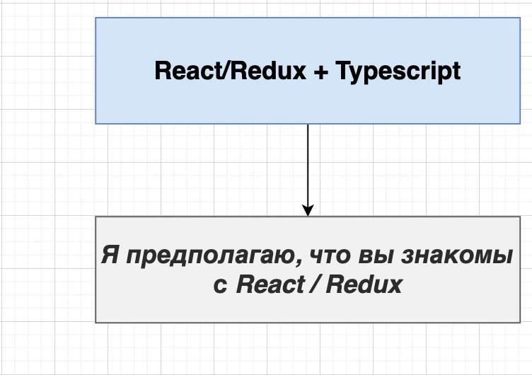
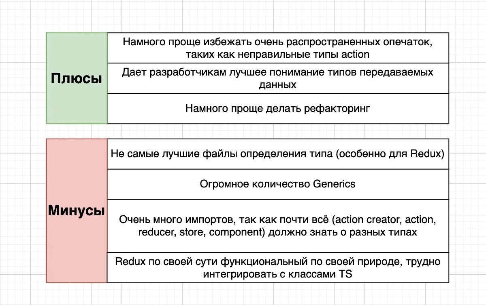

# 001_Обзор_React_и_Redux

**И так важная ифа. До 013_Валидация_структуры_Redux_Store структура файлов и папок может отличаться. Так перепутан код
с index.ts в папках actions и reducers. В reducers.index.ts должен быть код combineReducers**.

Он дает как разработчикам лучшее понимание типов которые у нас существуют в приложении. Когда вы работаете при помощи JS
c React и Redux, то Redux существует везде в важем приложении и вы не всегда знаете какой тип данных приходит к вам из
Redux store. И когда мы начинаем использовать TS то его компилятор и так аннотации типов и вся система типов дает вам
очень хорошее представление о том какие типы присутствуют, в каких местах в вашем приложении. И у вас никогда не
возникнет вопросов какие props получаются в этом компоненте.

Так же намного проще рефакторить код.

Когда в TS вы начнете делать рефакторинг вы сразу же начнете получать огромное количество предупреждений. В отличие от
JS в котором предупреждений нет и лепишь на угад. Благодаря TS у вас будут подсказки того что вам нужно изменить в коде.

 
 
 

Перейдем к минусам.

Не самые лучшие файлы определения типа особенно для Redux.

Существует огромное количество Generics. Много Generic в основном в Redux. В React меньше. Хотя технически каждый
компонент который мы будем делать при помощи React это Generic. Но с ними очень легко работать.

Очень много импортов, так как почти все(action creator, action ,reducer, store, component) должно знать о различных
типах. Получается так что все внутри redux должно знать обо всем. Например action creator должен знать payload:type.
Action должен знать payload, потому что на самом деле именно action интересуется в payload о его типе. Reducer должен
знать о типе payload. Store тоже должен знать о типе payload. Component должен знать о данных которые приходять из
Redux. Как только к вам приходят данные с json эта информация должна быть практически везде, в каждом файле. Это может
быть большой проблемой.

Redux по своей сути функциональный. Трудно интегрировать с классами TS.

