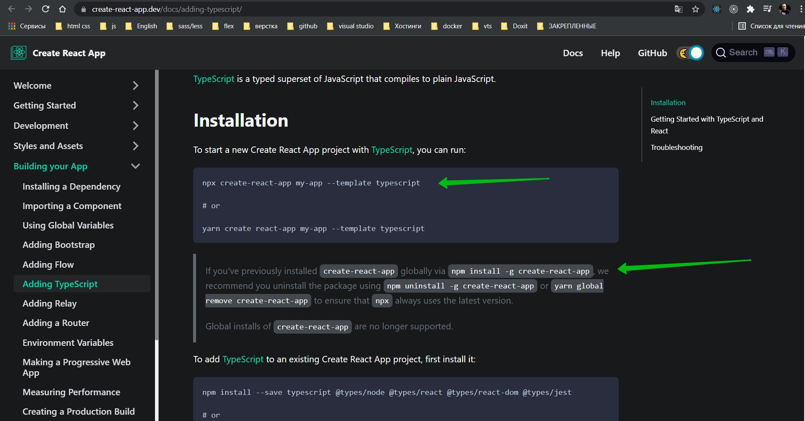

# 002_Создаем_приложение



На скрине показано как установить проект с ts. Так же есть предупреждение что если react установлен глобально, то его
лучше удалить.

На всякий случае удаляю.

```shell
npm uninstall -g create-react-app
```

И делее устанавливаю проект

```shell
npx create-react-app my-app --template typescript
```

- my-app название проекта.

```shell
npx create-react-app my-typescript-app --template typescript
```