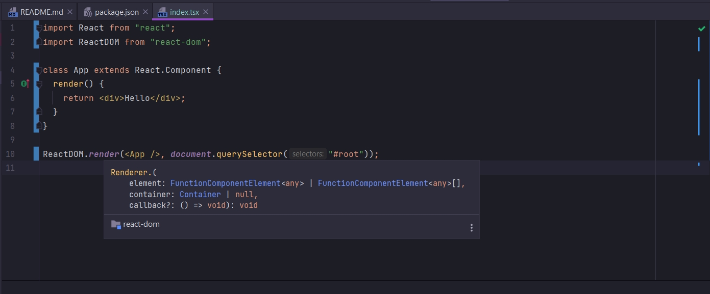
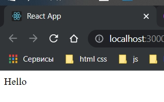

# 003_Простой_компонент

Удаляю всю дирректорию src и создаю заново с файлом index.tsx.

```tsx
import React from "react";
import ReactDOM from "react-dom";

class App extends React.Component {
    render() {
        return <div>Hello < /div>;
    }
}

ReactDOM.render(<App / >, document.querySelector("#root"));

```

Вреде TS нет но он есть.






