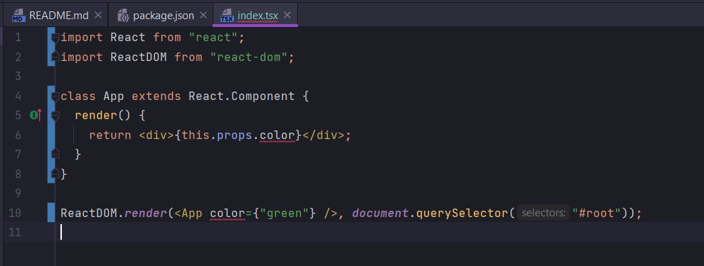
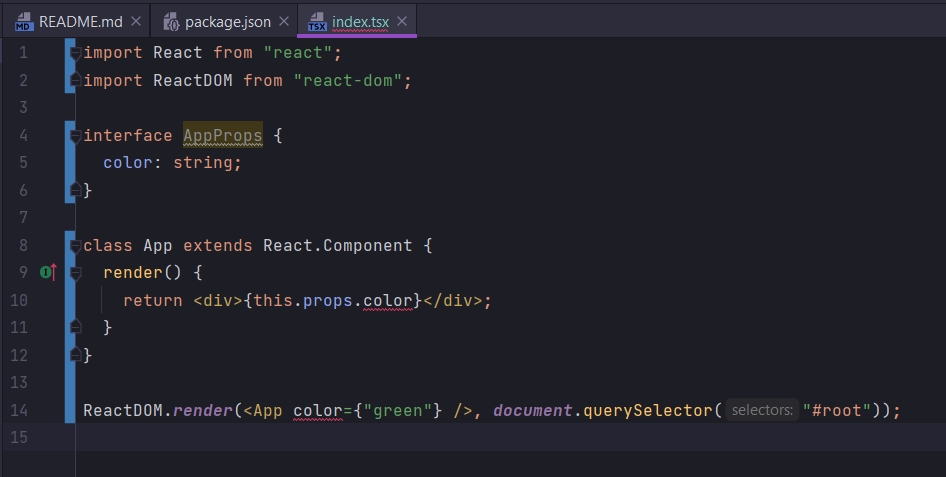
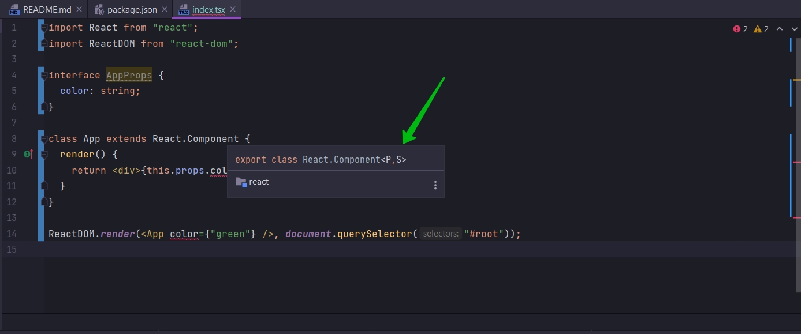
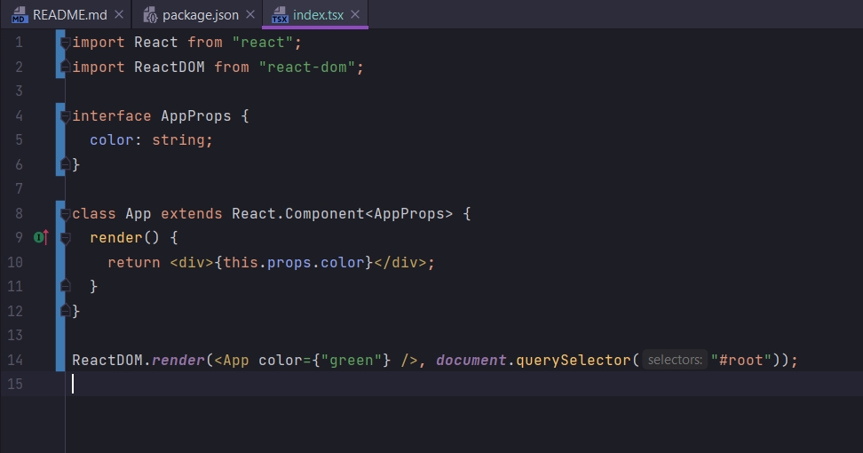
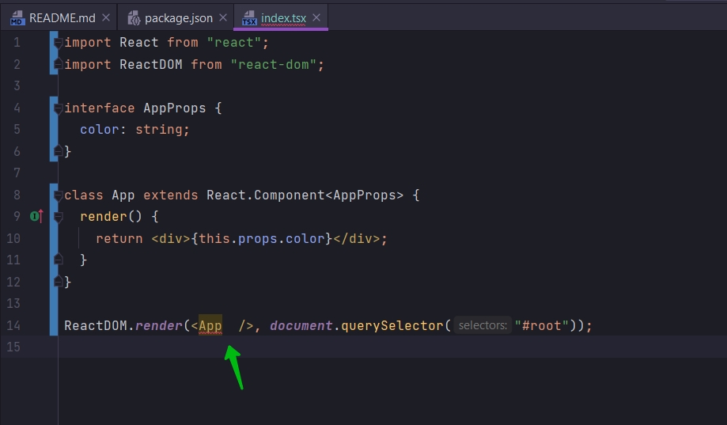
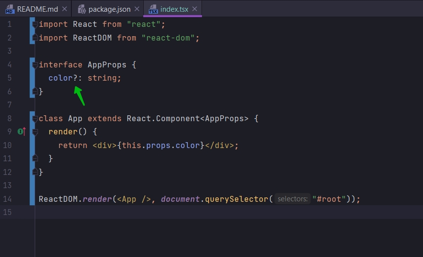

# 004_Interfaces_&_Props

Сделаем самую базовую вещь которую мы делаем в React. Передадим props.



Проблема. Один из самых простых спсобов при помощи которого мы работаем с компонентами в TS. Мы создаем interface
который описывает различные свойства которые мы собираемся передавать в компонет. И в этот interface мы должны поместить
все различные свойства которые мы собираемся передавать в компонент.

```tsx
import React from "react";
import ReactDOM from "react-dom";

interface AppProps {
    color: string;
}

class App extends React.Component {
    render() {
        return <div>{this.props.color} < /div>;
    }
}

ReactDOM.render(<App color={"green"}
/>, document.querySelector("#root"));

```



И теперь я добавлю анотацию к компоненту. Компонент это Generic класс



Здесь указывается что каждый раз когда мы используем React.Component мы можем указать свойсва которое будем передавать в
этот компонент как Generic. Как первый параметр на скрине параметр P={}. Т.е. я могу указать наш interface.

```tsx
import React from "react";
import ReactDOM from "react-dom";

interface AppProps {
    color: string;
}

class App extends React.Component<AppProps> {
    render() {
        return <div>{this.props.color} < /div>;
    }
}

ReactDOM.render(<App color={"green"}
/>, document.querySelector("#root"));

```



Этот паттерн который мы применили применяется к каждому компоненту в react. Т.е. мы должны определить наш компонент.
Далее над ним определить interface который описывает структуру свойств которые мы собираемся передавать в компонент. И
далее мы можем ссылаться на этот interface. Далее мы можем ссылаться на этот interface с помощью Generic.

В реакт компонентах мы очень чато можем иметь свойства которые опциональны. Например я хочу отобразить компонент App и
так же передать в него свойство color. Но например в другом случае я не захочу передавать в этот компонент ни какого
цвета. Например если я сейчас захочу отобразить компонент без свойства color.



Причина этому наш interface. На данный момент свойство color обязательно не опционально.

Если мы хотим для какого-то свойства указать что оно опционально. Как для любого interface рядом с названием свойства мы
можем указать знак вопроса.



```tsx
import React from "react";
import ReactDOM from "react-dom";

interface AppProps {
    color?: string;
}

class App extends React.Component<AppProps> {
    render() {
        return <div>{this.props.color}</div>;
    }
}

ReactDOM.render(<App/>, document.querySelector("#root"));

```

