# 006_Непонятное_состояние_компонента

```tsx
import React from "react";
import ReactDOM from "react-dom";

interface AppProps {
    color?: string;
}

class App extends React.Component<AppProps> {
    state = {counter: 0};

    onIncrement = (): void => {
        this.setState({counter: this.state.counter + 1});
    };

    onDecrement = (): void => {
        this.setState({counter: this.state.counter - 1});
    };

    render() {
        return (
            <div>
                <button onClick={this.onIncrement}>+</button>
                <button onClick={this.onDecrement}>-</button>
                {this.state.counter}
            </div>
        );
    }
}

ReactDOM.render(<App/>, document.querySelector("#root"));

```

Код простой но есть сложность.

Я хочу окцентировать ваше внимание на том что когда мы работаем при помощи TS в React то у на получается довольно не
обычное поведение. До тех пор пока вы не отточите ваши TS навыки вы можете получать какие-то сообщения об ошибках
которые будут для вас загадочными.

Сделаю не большой рефакторинг и посмотрим на странное сообщение.

Обратим внимание на определение state

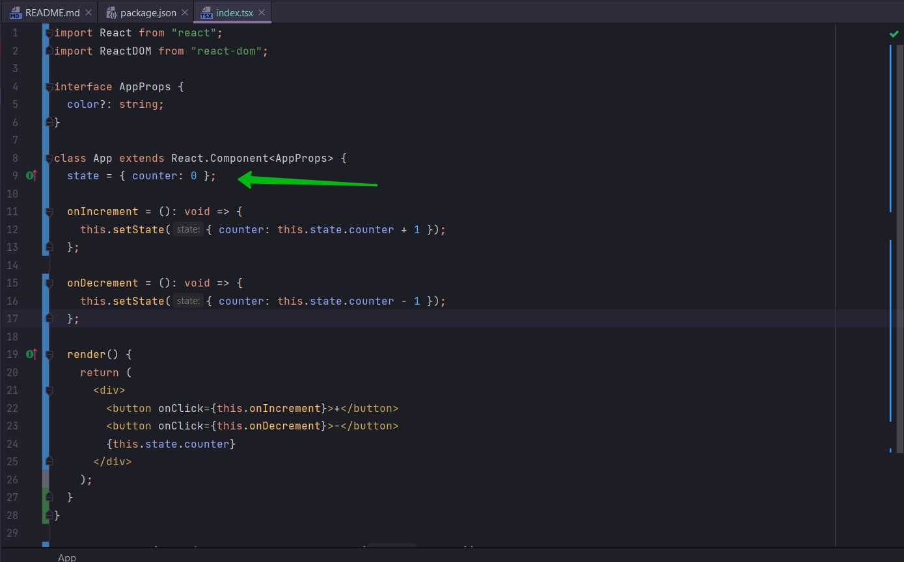

Это нормально определение свойства в классе в TS. Это нормальный способ инициализации state в JS React или TS React
приложении.

Другой способ это инициализация при помощи функции constructor.

```tsx
import React from "react";
import ReactDOM from "react-dom";

interface AppProps {
    color?: string;
}

class App extends React.Component<AppProps> {
    constructor(props: AppProps) {
        super(props);
        this.state = {counter: 0};
    }

    onIncrement = (): void => {
        this.setState({counter: this.state.counter + 1});
    };

    onDecrement = (): void => {
        this.setState({counter: this.state.counter - 1});
    };

    render() {
        return (
            <div>
                <button onClick={this.onIncrement}>+</button>
                <button onClick={this.onDecrement}>-</button>
                {this.state.counter}
            </div>
        );
    }
}

ReactDOM.render(<App/>, document.querySelector("#root"));

```

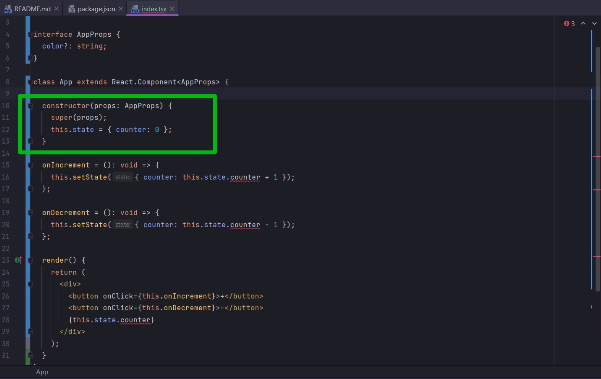

В JS мире этот код на 100% эквивалентен тому коду который был записан до этого в одной строчке.

Но как видите с этим кодом у нас ошибка.

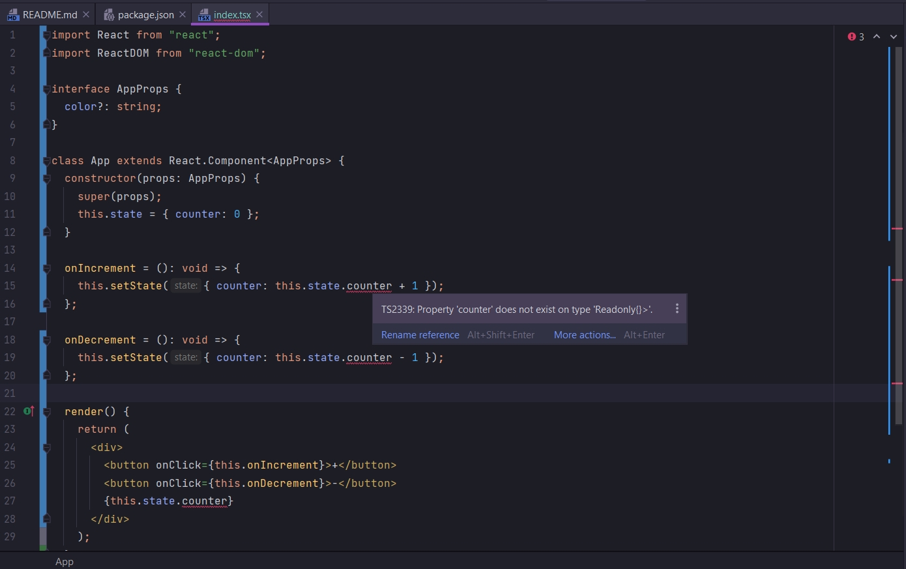

Т.е. свойство counter не существует в типе Readonly и объект {}. Это и есть это странное не ожиданное поведение которому
вы будедете не приятно удивлены если вы попытаетесь применять ваши знания JS и использовать его точно так же и в TS.

Для начало я сделаю Ctrl + клик на React.Component на Component. Перехожу в соответствующий Type definition File.

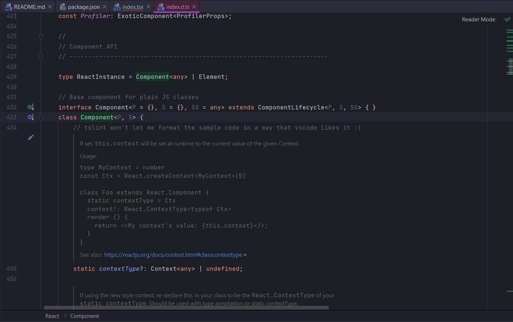

Как видим interface Component наследуется от class Component. Посмотрим на определение класса. Прежде всего я хочу
обратить внимание что class Component это Generic класс.

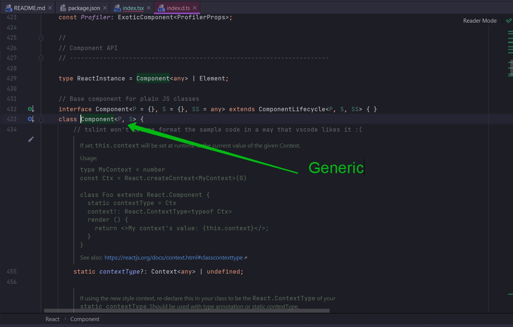

Т.е. это тот же Component от которого мы наследуемся вот здесь

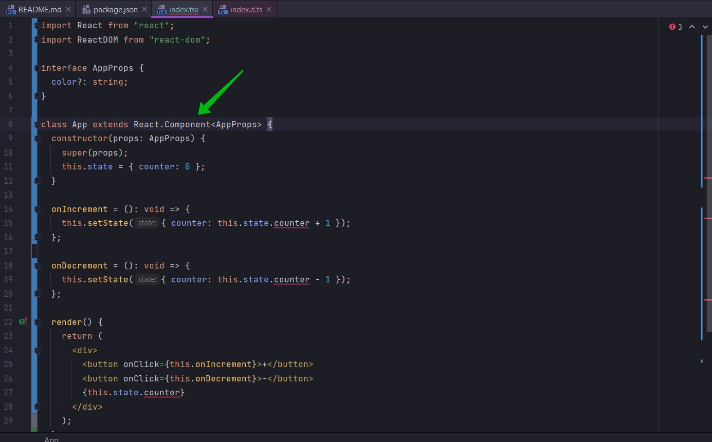

Мы можем увидить что в Generic есть два аргумента R и S.

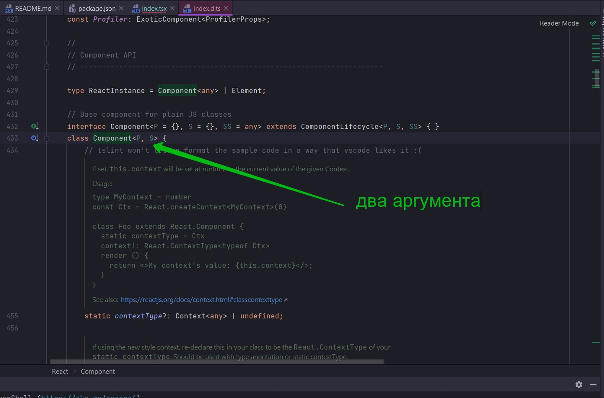

- P - означает props. Это те свойства которые получает наш компонент. Мы с вами определили interface AppProps и передали
  его в качестве первого Generic параметра.

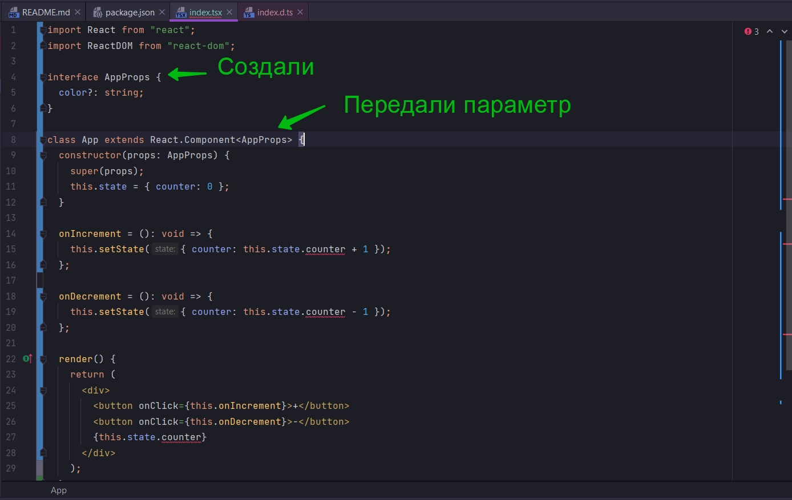

- S - это state. Т.е. мы можем опционально передавать еще interface как второй Generic аргумент или параметр каждый раз
  когда мы создаем React.Component как класс с Generic. И этот interface будет описывать state который мы хотим иметь
  внутри нашего компонента.

И как же это относится к инициализации начального состояния this.state = { counter: 0 };

Если мы в файле определения типов прокрутим вниз и найдем state

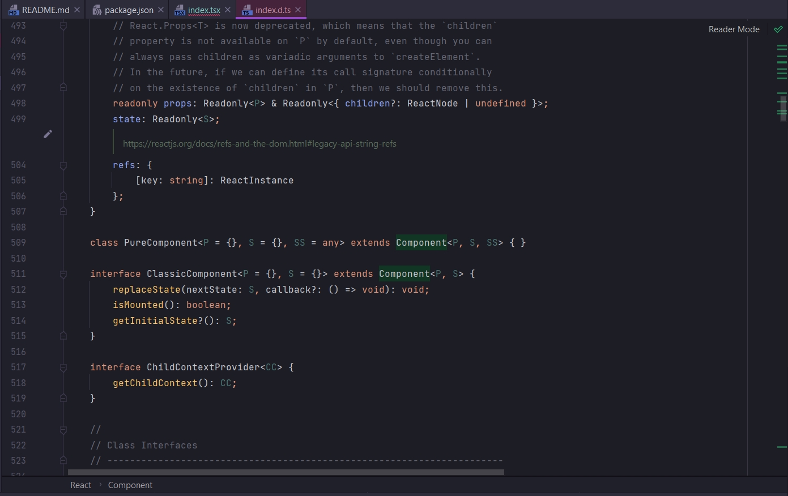

Мы видим что state у него Readonly с Generic S параметром. Это значит что это будет только считываемый объект т.е.
Readonly типа S.

На данный момент мы ничего не передали для Generic S т.е. для состояния. Сейчас это пустой объект не имеющий ни каких
свойств. Это частично объясняет наше сообщение об ошибке.

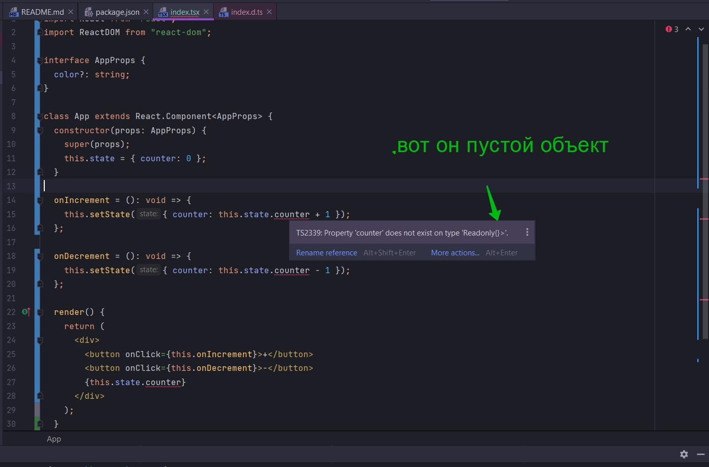

У него соответственно не существует props counter. Именно по этому т.к. в этом объекте ничего нет, а мы пытаемся
получить свойство counter, мы и получаем ошибку.

Почему же код который мы написали ранее работал? А этот не работает.

Давайте вспомним как работает наследование от класса работает в TS.

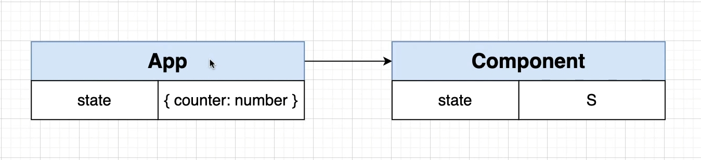

Смотря на диаграмму. Когда Component становится родителем для App он переопределяет state. Т.е. когда мы определяем
свойство не в конструкторе state = {counter:0} а вот так. Мы переопределяем свойство state которое есть в классе
Component.

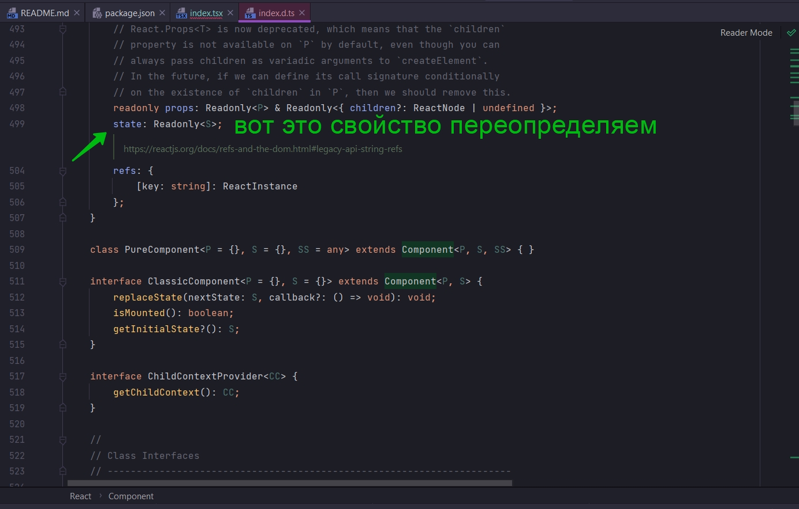

Т.е. когда мы используем вот такую запись state = {counter:0}, мы полностью переопределяем и создаем новое свойство
state.

А в случае с constructor this.state определяется как пустой объект. Мы не пытаемся переопределить это свойство


Мы пытаемся здесь присвоить ему новое значение

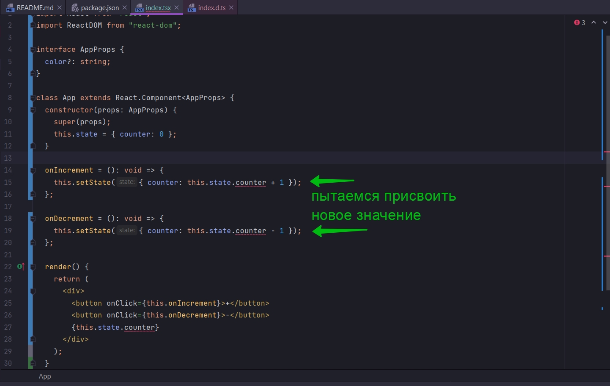

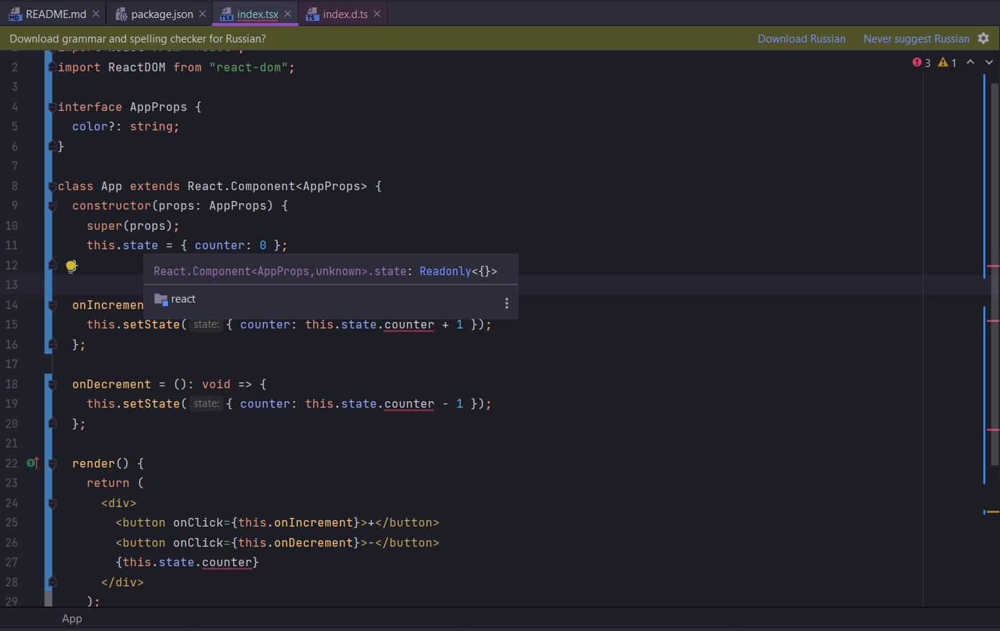

Т.е. мы не можем не считывать ни каких свойств, не присваивать какие-то значения свойствам т.к. объект пустой.

Однако если мы определим state выше конструктора то смотрите что происходить. State переопределяется и конструктор
становится работоспособным.

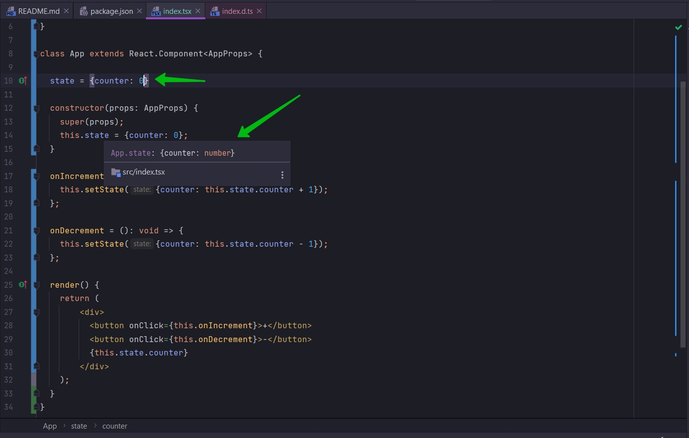

counter в конструкторе сразу становится типа number. Это уде не путой объект, а переопределенное свойство state.

Это довольно странное и не ожиданное поведение. Конечно же здесь есть вполне здравый смысл если это все очень подробно
рассмотреть.

Но если вы изучали react и применяли его с JS вы могли слышать что определение state как в одну строку так и через
constructor идентичны на 100%. Но во вселенной TS это не работает. Это два совершенно разных statement. И этот код будет
совершенно по разному работать. Т.е. вы как разработчик должны решить использовать ли вам метод constructor для
инициализации state или использовать какой-нибудь другой способ инициализации state.

Теперь рассмотрим как заставить работать constructor. Передам второй аргумент в Generic. Т.е. я создам новый interface
для описания объекта state.

```tsx
import React from "react";
import ReactDOM from "react-dom";

interface AppProps {
    color?: string;
}

interface AppState {
    counter: number;
}

class App extends React.Component<AppProps, AppState> {
    state = {counter: 0};

    constructor(props: AppProps) {
        super(props);
        this.state = {counter: 0};
    }

    onIncrement = (): void => {
        this.setState({counter: this.state.counter + 1});
    };

    onDecrement = (): void => {
        this.setState({counter: this.state.counter - 1});
    };

    render() {
        return (
            <div>
                <button onClick={this.onIncrement}>+</button>
                <button onClick={this.onDecrement}>-</button>
                {this.state.counter}
            </div>
        );
    }
}

ReactDOM.render(<App/>, document.querySelector("#root"));

```

вывод мы должны сделать выбор сами.


