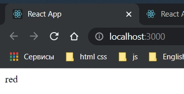

# 007_Функциональные_компоненты

Они похожи на функции JS едиственное что мы добавляем типовые аннотации.

```tsx
import React from "react";
import ReactDOM from "react-dom";

interface AppProps {
    color?: string;
}


const App = (props: AppProps) => {
    return <div></div>;
};

ReactDOM.render(<App / >, document.querySelector("#root"));
```

С функциональным компонентом мы конечно не должны надеятся на вывод типов. Я настоятельно рекомендую указывать тип
возвращаемого значения.

К примеру я хочу вернуть какой-то JSX элемент.

```tsx
import React from "react";
import ReactDOM from "react-dom";

interface AppProps {
    color?: string;
}


const App = (props: AppProps): JSX.Element => {
    return <div>{props.color}</div>;
};

ReactDOM.render(<App color={"red"}/>, document.querySelector("#root"));

```



Далее мы еще будет работать с функциональными компонентами.


