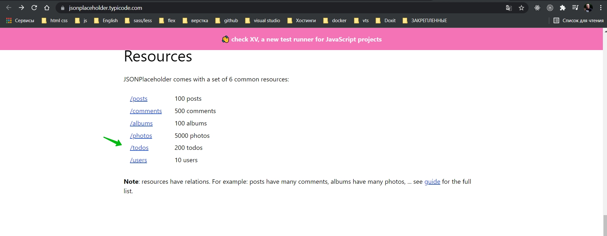
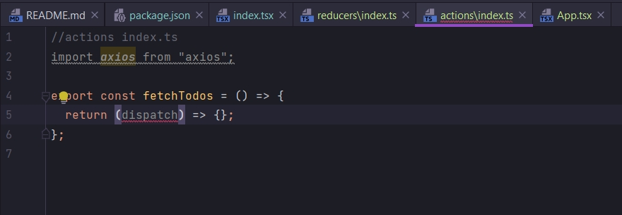
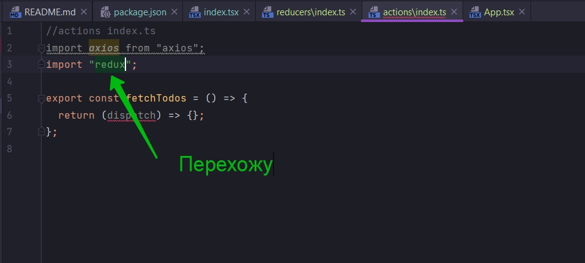
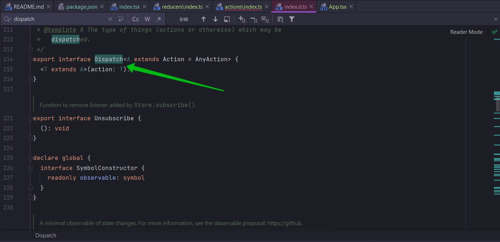
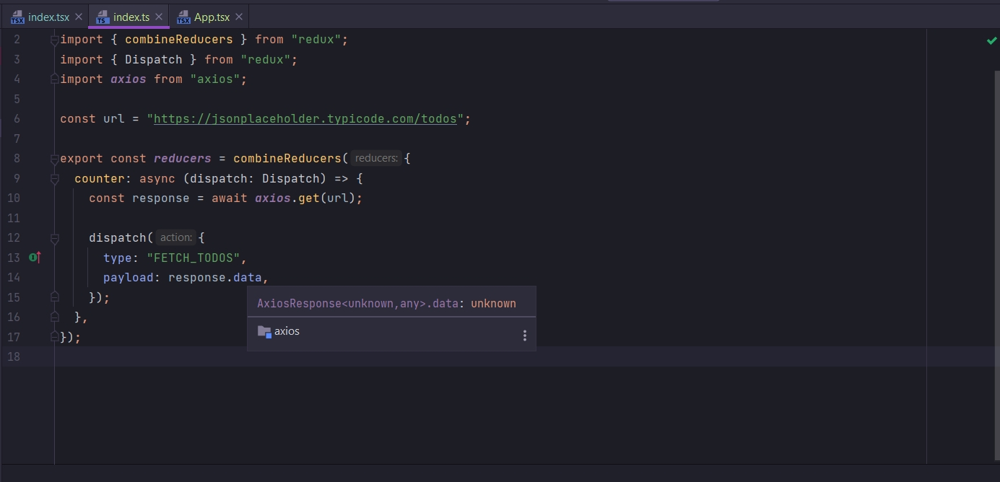
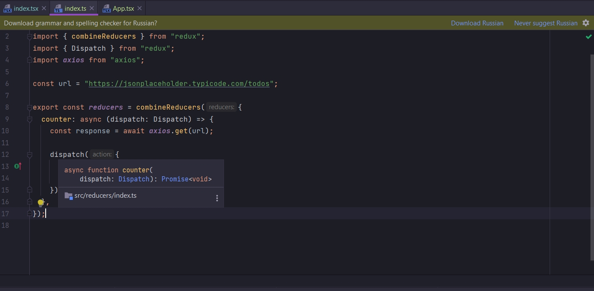

# 009_Action_Creators_&_TypeScript

Теперь когда у меня есть базовая структура приложения то лучше всего начать с action creator.

```tsx
//index.tsx
import React from "react";
import ReactDOM from "react-dom";
import {createStore, applyMiddleware} from "redux";
import {Provider} from "react-redux";
import thunk from "redux-thunk";
import {App} from "./components/App";
import {reducers} from "./reducers";

const store = createStore(reducers, applyMiddleware(thunk));

ReactDOM.render(
    <Provider store={store}>
        <App/>
    </Provider>,
    document.querySelector("#root")
);

```

```tsx
//components App.tsx
import React from "react";

export class App extends React.Component {
    render() {
        return <div>Hello</div>;
    }
}

```

```ts
//reducers index.tsx
import {combineReducers} from "redux";

export const reducers = combineReducers({
    counter: () => {
        return 0;
    },
});

```

C помощью action creator мы будем получать доступ к JSONPlaceholder API и пытаться извлечь список.



В src создаю новую директорию actions.

```ts
//actions index.ts
import axios from "axios";

export const fetchTodos = () => {
};

```

Я здесь использую асинхронный action creator. По этому мы здесь должны использовать redux-thunk. Т.е вместо того что бы
возвращать action из этой функции. Вместо этого мы будем возвращать функцию. И каждый раз когда мы используем
redux-thunk мы используем параметр dispatch. Эта функция из redux которая нам позволяет отправлять actions.



Мы здесь сразу получаем ошибку потому что не используем аннотацию типов. Это начинается самая сложная часть для того что
бы совместить работу React и Redux. Это действительно большая проблема потому что мне нужно изучить некоторые Type
Definition File. Файл определения типов и понять некоторые типы которые они предоставляют нам для различных библиотек.

dispatch это функция и я не могу из головы вытащить какую-то информацию о парамтрах этой функции типов точнее ее
параметров.





Есть описание что же из себя представляет функция Dispatch. Т.е. нам не нужно пытаться писать типовые аннотации

```ts
//reducers index.tsx
import {combineReducers} from "redux";
import {Dispatch} from "redux";
import axios from "axios";

const url = "https://jsonplaceholder.typicode.com/todos";

export const reducers = combineReducers({
    counter: async (dispatch: Dispatch) => {
        const response = await axios.get(url);

        dispatch({
            type: "FETCH_TODOS",
            payload: response.data,
        });
    },
});

```

Если не брать во внимание аннотацию типов, то все выглядит как обычный JS. Вроде бы это не плохо, но тут есть один такой
подводный камень. На самом деле у нас сейчас в этом файле нет ни какой безопасности типов.

Прежде всего когда мы получаем ответ response мы не имеем ни какого понятия о структуре этого ответа. Если я сейчас
наведу курсор на response.data то я увижу тип any.



Т.е. мы понятия не имеем с какими данными мы работаем.

Далее рассмотрим тип который мы здесь присваиваем. Мы устанавливаем тип type: "FETCH_TODOS" как hard coded string. Нужно
избегать жестко закодированных строк потому что очень лего допустить ошибку. Для этого нам нужно создать Enum или что-то
вроде этого для сохранения различных action и типов.

Теперь давайте обратим внимание на вызов функции dispatch.



По сути это Generic функция. Т.е. по сути когда мы ее вызываем, мы можем передавать в нее какие-нибуть аргументы или
какой-то Generic тип который будет описывать объект action который мы передаем в нутрь функции dispatch.


