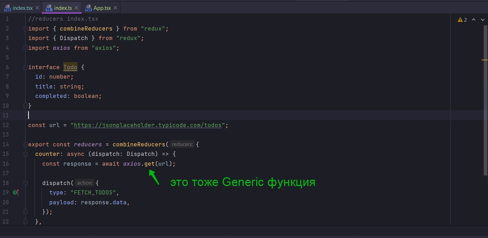
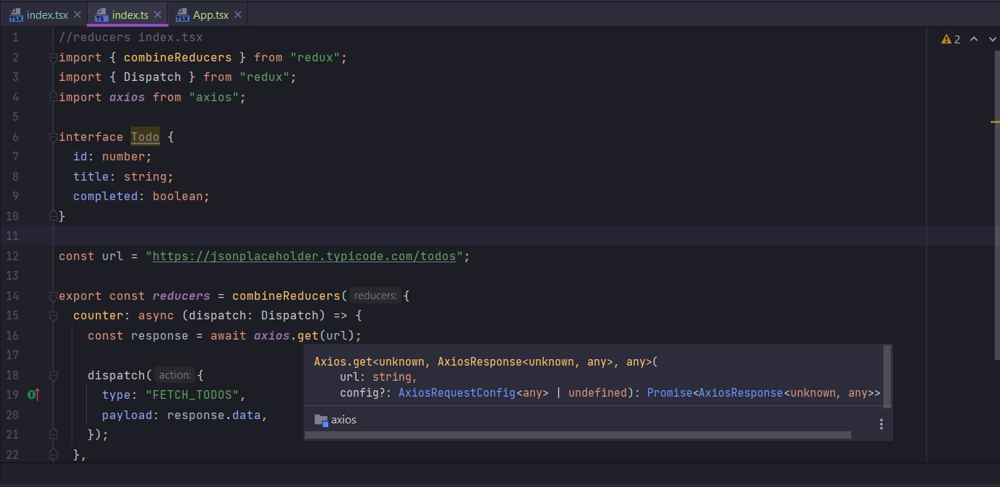
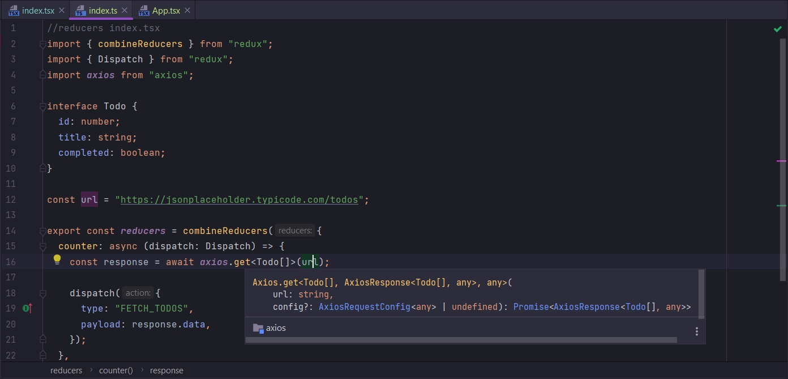
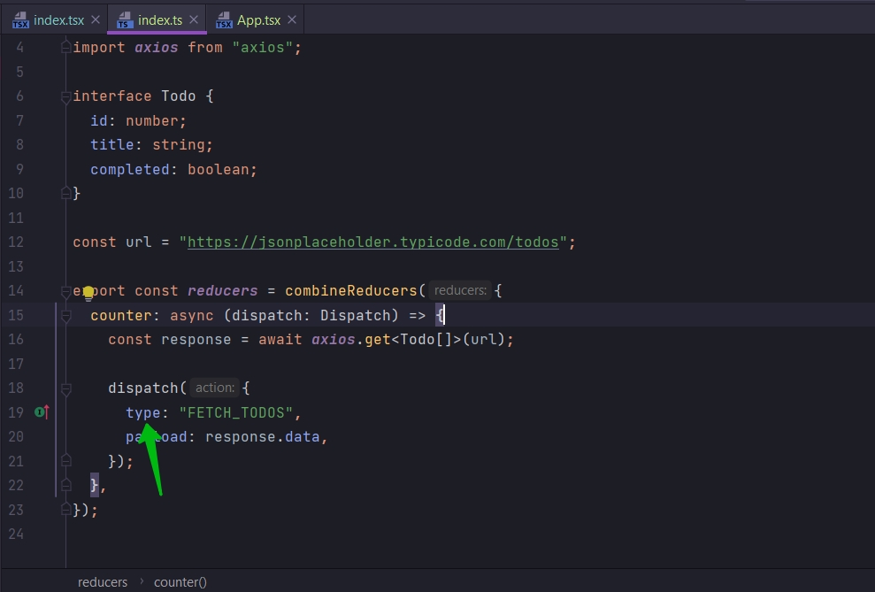
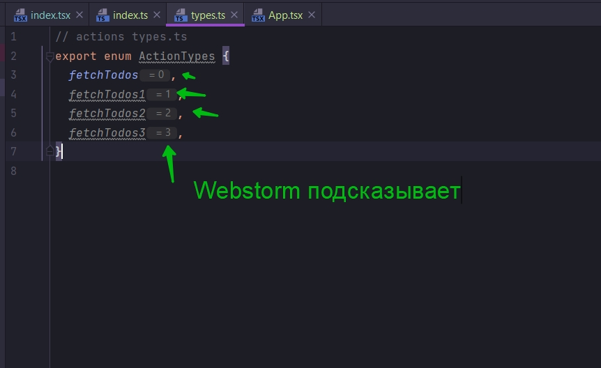

# 010_ActionTypes_Enum

Мы немного улучшим Action creator

```ts
//reducers index.tsx
import {combineReducers} from "redux";
import {Dispatch} from "redux";
import axios from "axios";

const url = "https://jsonplaceholder.typicode.com/todos";

export const reducers = combineReducers({
    counter: async (dispatch: Dispatch) => {
        const response = await axios.get(url);

        dispatch({
            type: "FETCH_TODOS",
            payload: response.data,
        });
    },
});

```

Прежде всего я хочу применить тип к response.data которую мы получаем из API.

И для этого я создам внутри этого файла interface который описывает структуру todo которую мы получаем из API.

```ts
//reducers index.tsx
import {combineReducers} from "redux";
import {Dispatch} from "redux";
import axios from "axios";

interface Todo {
    id: number;
    title: string;
    completed: boolean;
}

const url = "https://jsonplaceholder.typicode.com/todos";

export const reducers = combineReducers({
    counter: async (dispatch: Dispatch) => {
        const response = await axios.get(url);

        dispatch({
            type: "FETCH_TODOS",
            payload: response.data,
        });
    },
});

```

И теперь что бы помочь TS понять какой тип информации будет в Response data.

Если вы помните вот эта функция get это тоже Generic функция





Сейчас TS предполагает что мы получаем тип any. как видите на скрине это отображено. И сейчас Generic функции get мы
немного поможем указав Generic Todo. А именно массив Todo.



```ts
//reducers index.tsx
import {combineReducers} from "redux";
import {Dispatch} from "redux";
import axios from "axios";

interface Todo {
    id: number;
    title: string;
    completed: boolean;
}

const url = "https://jsonplaceholder.typicode.com/todos";

export const reducers = combineReducers({
    counter: async (dispatch: Dispatch) => {
        const response = await axios.get<Todo[]>(url);

        dispatch({
            type: "FETCH_TODOS",
            payload: response.data,
        });
    },
});


```

Это говорит TS что именно внутри response.data мы будем иметь массив объектов типа Todo. Т.е. объектов которые
удовлетворяют interface Todo.

Второе я хочу создать Enum который будет отображать различные типы в приложении.

И не большая заметка. Мы тут активно используем слово type.



И если вы помните в TS type обозначает тип объекта, тип свойства, тип функции и т.д.

Когда же мы говорим о типе в Redux, то мы имеем ввиду о типе который имеет объект dispatch.

И так я собираюсь создать Enum который будет репрезентовать все типы которые я собираюсь иметь в своем приложении, типы
redux.

Для этого в директории actions я создам новый файл types.ts.

```ts
// actions types.ts
export enum ActionTypes {
    fetchTodos,
}

```

Хочу обратить внимание ранее когда мы создавали enum мы всегда присваивали какую-то строку

```ts
// actions types.ts
export enum ActionTypes {
    fetchTodos = "fetch_todos",
}

```

Но на самом деле если оставим вот в таком вот виде, то TS по умолчанию первому типу присвоит 0, второму 1 т.д. И
WebStorm мне об этом подсказывает



```ts
// actions types.ts
export enum ActionTypes {
    fetchTodos,
    fetchTodos1,
    fetchTodos2,
    fetchTodos3,
}

```

Едиственное требование в redux action это то что этот тип должен быть уникальным. Теоретически это может быть уникальной
строкой. На самом деле все равно строкой или нет. Мы можем расчитывать на эти default состояния которые предоставляет
нам TS.

оставляю так

```ts
// actions types.ts
export enum ActionTypes {
    fetchTodos,
}

```

```ts
//reducers index.tsx
import {combineReducers} from "redux";
import {Dispatch} from "redux";
import axios from "axios";
import {ActionTypes} from "../actions/types";

interface Todo {
    id: number;
    title: string;
    completed: boolean;
}

const url = "https://jsonplaceholder.typicode.com/todos";

export const reducers = combineReducers({
    counter: async (dispatch: Dispatch) => {
        const response = await axios.get<Todo[]>(url);

        dispatch({
            type: ActionTypes.fetchTodos,
            payload: response.data,
        });
    },
});

```


