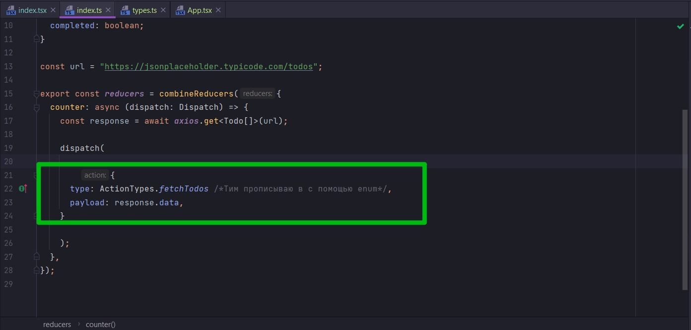
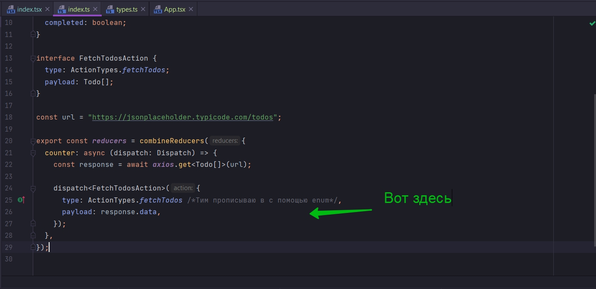
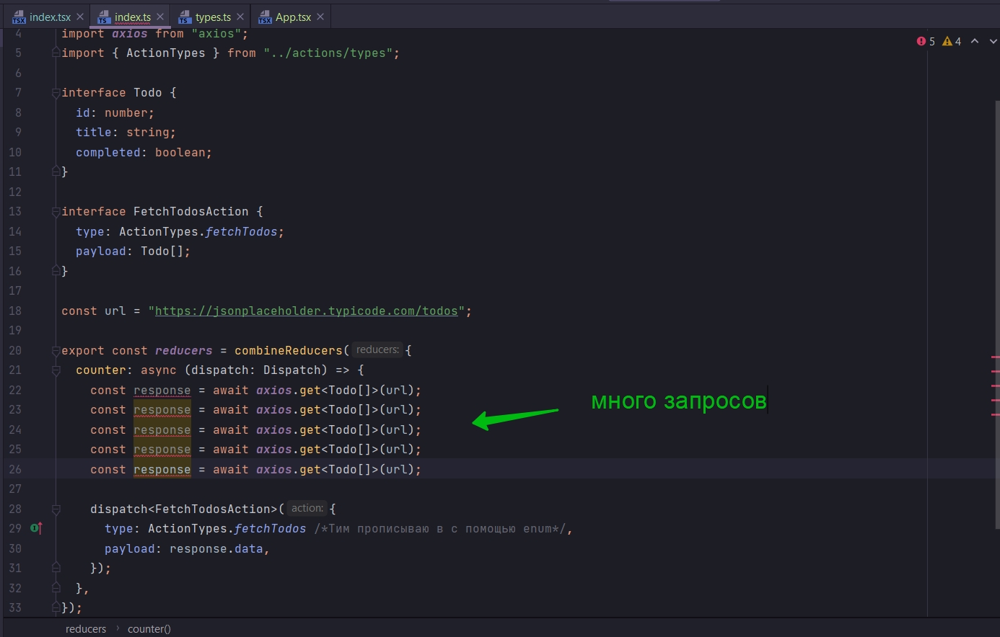
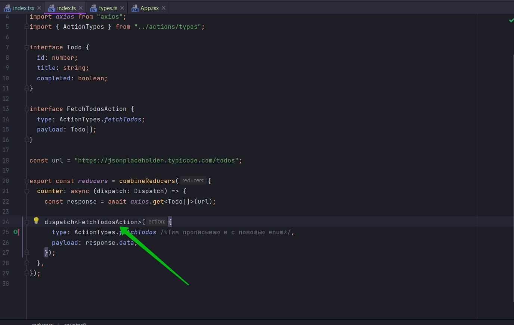
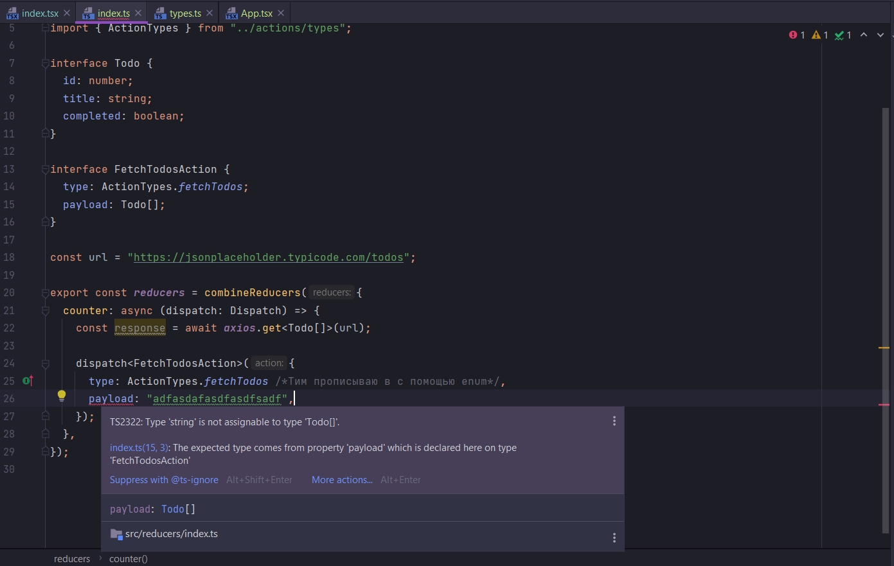

# 011_Generic_функция_dispatch

```ts
//reducers index.tsx
import {combineReducers} from "redux";
import {Dispatch} from "redux";
import axios from "axios";
import {ActionTypes} from "../actions/types";

interface Todo {
    id: number;
    title: string;
    completed: boolean;
}

const url = "https://jsonplaceholder.typicode.com/todos";

export const reducers = combineReducers({
    counter: async (dispatch: Dispatch) => {
        const response = await axios.get<Todo[]>(url);

        dispatch({
            type: ActionTypes.fetchTodos /*Тим прописываю в c помощью enum*/,
            payload: response.data,
        });
    },
});

```

Рассмотрим не обязательное опциональное свойство. Этот дополнительный шаг даст вам немного большее улучшение проверки
ошибок внутри action creator.

Мы добвим новый interface внутри этого файла. Целью этого interface будет описать этот объект action



```ts
//reducers index.tsx
import {combineReducers} from "redux";
import {Dispatch} from "redux";
import axios from "axios";
import {ActionTypes} from "../actions/types";

interface Todo {
    id: number;
    title: string;
    completed: boolean;
}

interface FetchTodosAction {
    type: ActionTypes.fetchTodos;
    payload: Todo[];
}

const url = "https://jsonplaceholder.typicode.com/todos";

export const reducers = combineReducers({
    counter: async (dispatch: Dispatch) => {
        const response = await axios.get<Todo[]>(url);

        dispatch({
            type: ActionTypes.fetchTodos /*Тим прописываю в c помощью enum*/,
            payload: response.data,
        });
    },
});

```

И вот в чем суть. Мы создали с вами interface FetchTodosAction что бы описать action функцию dispatch. Поэтому теперь я
могу в качестве Generic типа передать interface FetchTodosAction. Теперь параметр который мы будем передавать в функции
dispatch должен соответствовать interface FetchTodosAction

```ts

//reducers index.tsx
import {combineReducers} from "redux";
import {Dispatch} from "redux";
import axios from "axios";
import {ActionTypes} from "../actions/types";

interface Todo {
    id: number;
    title: string;
    completed: boolean;
}

interface FetchTodosAction {
    type: ActionTypes.fetchTodos;
    payload: Todo[];
}

const url = "https://jsonplaceholder.typicode.com/todos";

export const reducers = combineReducers({
    counter: async (dispatch: Dispatch) => {
        const response = await axios.get<Todo[]>(url);

        dispatch<FetchTodosAction>({
            type: ActionTypes.fetchTodos /*Тим прописываю в c помощью enum*/,
            payload: response.data,
        });
    },
});

```

И зачем же я это все сделал. На самом деле ответ очено прост.

Иногда когда вы работаете над action creator а именно при помощи redux thunk, у вас может быть огромное количество кода.
Вот здесь вот



И вы можете легко запутаться что же здесь на самом деле происходит. Т.е. у вас может быть хоть миллион запросов



Вконце концов вы можете получить довольно запутанный action creator.

Что делает этот Generic, interface FetchTodosAction который мы в него передаем?



Он позволяет нам быть всегда уверенными что мы всегда передаем объект именно с теми типами который нужен в качестве
параметра для этой функции dispatch.

И вот смтрите.



И вот он пишет что я предоставляю строку, а ему нужен массив Todo.

То же самое если я передаю не тот action. Вместо fetchTodos еще что-то, он мне тоже об этом подскажет.