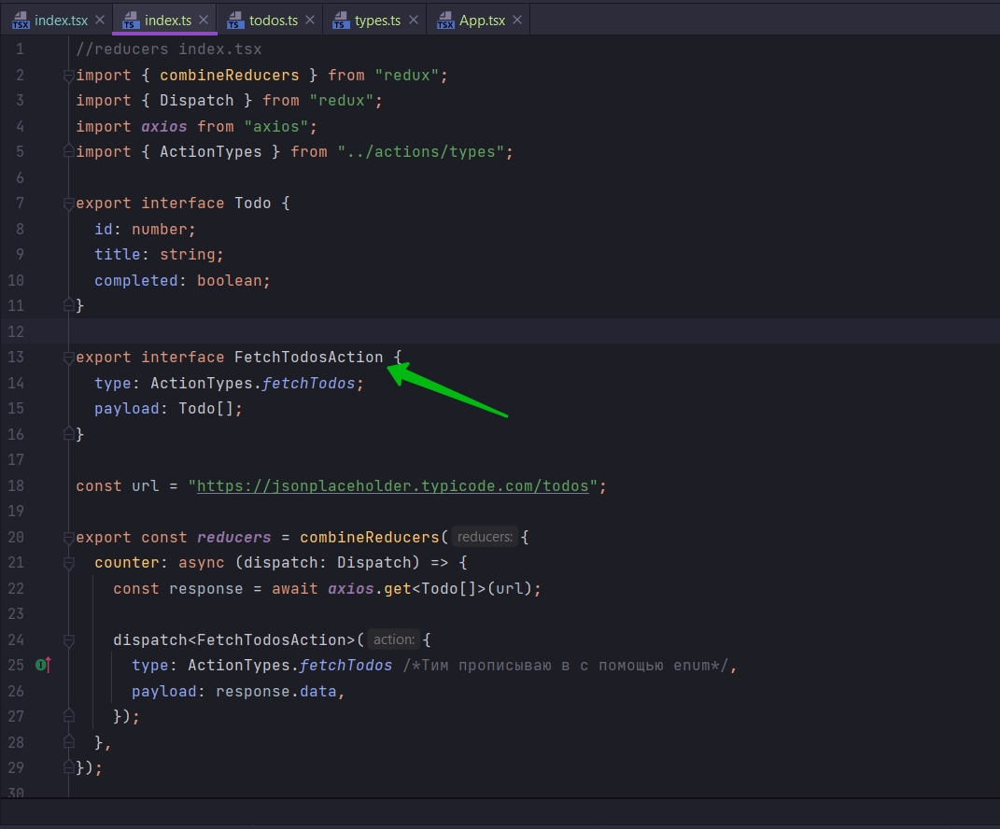
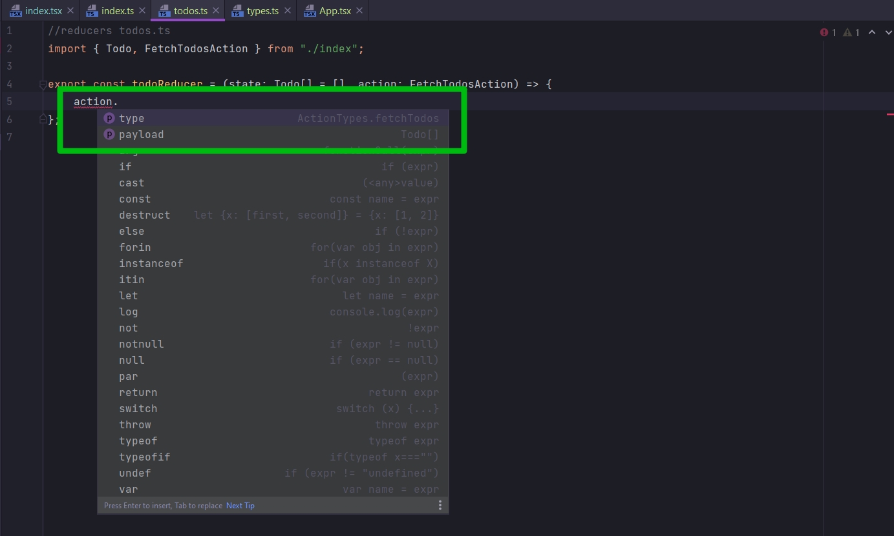
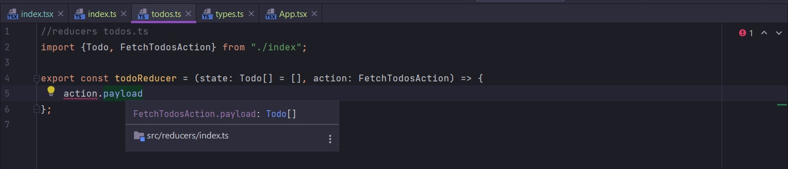

# 012_Reducer_&_Enums

Теперь когда мы с вами создали action creator

```ts
//reducers index.tsx
import {combineReducers} from "redux";
import {Dispatch} from "redux";
import axios from "axios";
import {ActionTypes} from "../actions/types";

interface Todo {
    id: number;
    title: string;
    completed: boolean;
}

interface FetchTodosAction {
    type: ActionTypes.fetchTodos;
    payload: Todo[];
}

const url = "https://jsonplaceholder.typicode.com/todos";

export const reducers = combineReducers({
    counter: async (dispatch: Dispatch) => {
        const response = await axios.get<Todo[]>(url);

        dispatch<FetchTodosAction>({
            type: ActionTypes.fetchTodos /*Тим прописываю в c помощью enum*/,
            payload: response.data,
        });
    },
});

```

нам нужен reducer который будет управлять action типа FetchTodosAction. А именно сохранять ссылку на todo которую мы
получаем.

В директории reducers создаю новый файл todos.ts

```ts
//reducers todos.ts
export const todoReducer = () => {
};

```

Первый аргумент будет это default state объект. И скорее всего я буду из этого reducer возвращать массив из объектов
todo.

И что бы это как-то выразить должен импортировать interface Todo. Прописываю export для interface Todo

```ts
//reducers index.tsx
import {combineReducers} from "redux";
import {Dispatch} from "redux";
import axios from "axios";
import {ActionTypes} from "../actions/types";

export interface Todo {
    id: number;
    title: string;
    completed: boolean;
}

export interface FetchTodosAction {
    type: ActionTypes.fetchTodos;
    payload: Todo[];
}

const url = "https://jsonplaceholder.typicode.com/todos";

export const reducers = combineReducers({
    counter: async (dispatch: Dispatch) => {
        const response = await axios.get<Todo[]>(url);

        dispatch<FetchTodosAction>({
            type: ActionTypes.fetchTodos /*Тим прописываю в c помощью enum*/,
            payload: response.data,
        });
    },
});

```

Указываю тип параметра state

```ts
//reducers todos.ts
import {Todo} from "./index";

export const todoReducer = (state: Todo[]) => {
};

```

Теперь нам нужно для параметра state нужно указать какое-то значение по умолчанию. После указания аннотации типа я могу
инициализировать начальное состояние. Присваиваю начальному состоянию пустой массив.

```ts
//reducers todos.ts
import {Todo} from "./index";

export const todoReducer = (state: Todo[] = []) => {
};

```

Тем самым мы говорим что state будет массивом из объектов Todo, но если мы не предоставим параметр в качестве аргумента,
не передадим массив Todo, то этот параметр инициализируется пустым массивом.

Второй параметр это action. И здесь есть кое-что интересное.

Если вы помните внутри index.ts мы создавали interface FetchTodosAction



И он описывает структуру action т.е. какая должна быть эта структура. type типа ActionTypes.fetchTodos и payload типа
Todo[].

импортирую interface FetchTodosAction и использую его для аннотации типа параметра action.

```ts
//reducers todos.ts
import {Todo, FetchTodosAction} from "./index";

export const todoReducer = (state: Todo[] = [], action: FetchTodosAction) => {
};

```

Теперь мы уверены в том что наш объект action всегда будет иметь свойство payload и свойство type



Они появляются в автокомплите. И свойство payload будет массивом Todo



Но здесь есть небольшая проблема. Если у нас вконце концов будет много различных actions т.е. не только action:
FetchTodosAction, а еще какие-нибудь типы action. То как мы видим мы очень себя ограничиваем в использовании только
action типа FetchTodosAction и больше ни какой другой. Позже это мы исправим.

```ts
//reducers todos.ts
import {FetchTodosAction, Todo} from "./index";
import {ActionTypes} from "../actions/types";

export const todoReducer = (state: Todo[] = [], action: FetchTodosAction) => {
    switch (action.type) {
        case ActionTypes.fetchTodos:
            return action.payload;
        default:
            return state;
    }
};

```

Один момент на который я бы хотел обратить внимание. TS нам как бы лжет.

Первый раз когда Redux загружается, то происходят кое-какие действия. Скажем так разминка reducer. отправляется пара
различных объектов action c рандомизированными types в них что бы проверить что ни один reducer не отвечает не
корректно. Т.е. Redux как бы отправляет свой тип action в reducer. В насстоящий момент мы как бы для него добавили не
корректную аннотацию типа аргумента action. Мы говорим что action всегда будет типа FetchTodosAction. И как я уже сказал
это не совсем точно.