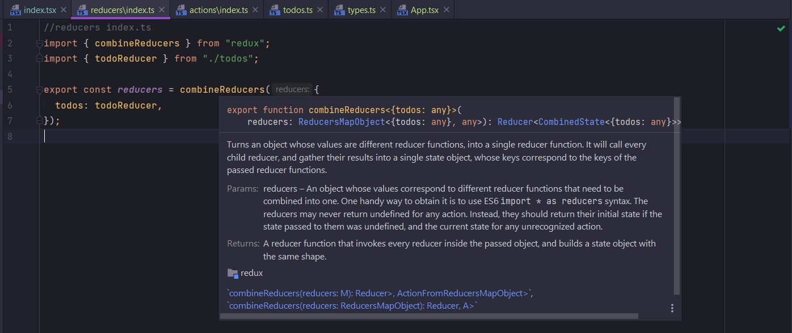
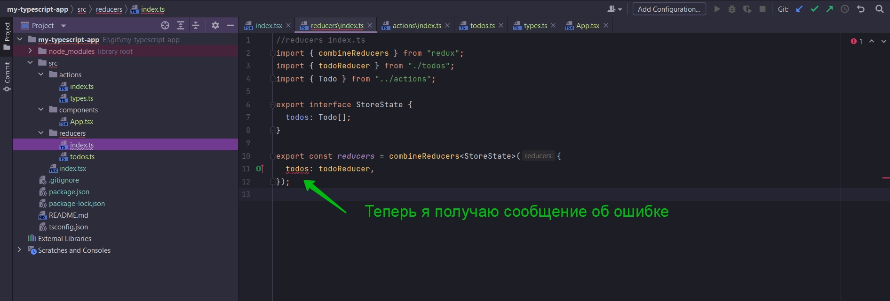
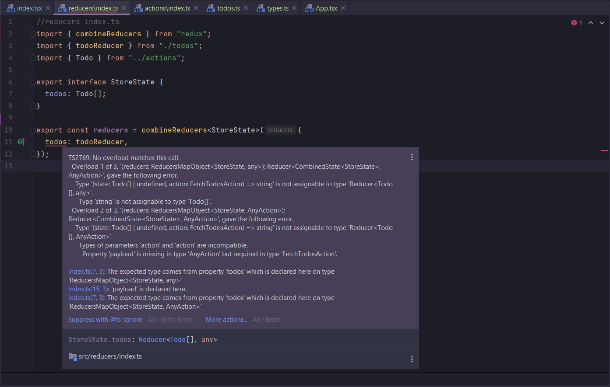

# 013_Валидация_структуры_Redux_Store

Мы создали наш Todo reducer

```ts
//reducers todos.ts
import {FetchTodosAction, Todo} from "./index";
import {ActionTypes} from "../actions/types";

export const todoReducer = (state: Todo[] = [], action: FetchTodosAction) => {
    switch (action.type) {
        case ActionTypes.fetchTodos:
            return action.payload;
        default:
            return state;
    }
};

```

И теперь нам надо его связать с нашим CombineReducers в index.ts файле в папке reducers.

Когда открыты одни index.ts легко перепутать в каком файле писать. В это проекте исправлю.

```ts
//reducers index.ts
import {combineReducers} from "redux";
import {todoReducer} from "./todos";

export const reducers = combineReducers({
    todos: todoReducer,
});

```

Я хочу показать еще один опциональный параметр который мы можем добавить к combineReducers.



как видим combineReducers это тоже Generic функция. Мы може в Generic передать какой-то interface для валидации объекта
передаваемого в качестве параметра при вызове функции combineReducers.

```ts
//reducers index.ts
import {combineReducers} from "redux";
import {todoReducer} from "./todos";
import {Todo} from "../actions";

export interface StoreState {
    todos: Todo[];
}

export const reducers = combineReducers<StoreState>({
    todos: todoReducer,
});

```

Вродебы ничего не изменилось но за кулисами происходит очень важная вещь. TS теперь проверяет объект который мы передаем
в качестве аргумента в combineReducers. TS будет рассматривать все различные свойства этого объекта и так же различные
reducers.

Теперь если мы вернем не подходящее значение из reducers мы сразу обнаружим это благодаря проверки возвращаемого
значения.

Проверяю. Перехожу в todos.ts. Комментурую switch и возвращаю строку.

```ts
//reducers todos.ts
import {Todo, FetchTodosAction} from "../actions";
import {ActionTypes} from "../actions/types";

export const todoReducer = (state: Todo[] = [], action: FetchTodosAction) => {
    // switch (action.type) {
    //   case ActionTypes.fetchTodos:
    //     return action.payload;
    //   default:
    //     return state;
    // }
    return "Cdfwafwfwfewfwef";
};

```





Эта самая полезная фитча интеграции TS в Redux приложение.

