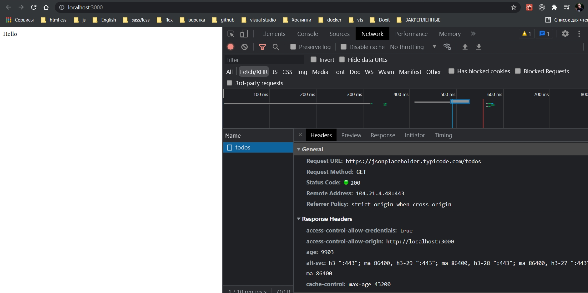

# 017_Отображение_списка

создам componentDidMount.

```ts
//components App.tsx
import React from "react";
import {connect} from "react-redux";
import {Todo, fetchTodos} from "../actions";
import {StoreState} from "../reducers";

interface AppProps {
    todos: Todo[];

    fetchTodos(): any;
}

class _App extends React.Component<AppProps> {
    componentDidMount() {
        this.props.fetchTodos();
    }

    render() {
        return <div>Hello < /div>;
    }
}

const mapStateToProps = ({todos}: StoreState): { todos: Todo[] } => {
    return {todos};
};

export const App = connect(mapStateToProps, {fetchTodos})(_App);

```




Как видим произошел запрос на сервер.

Теперь я убеждаюсь получаю ли я этот список со store.

```tsx
//components App.tsx
import React from "react";
import {connect} from "react-redux";
import {Todo, fetchTodos} from "../actions";
import {StoreState} from "../reducers";

interface AppProps {
    todos: Todo[];

    fetchTodos(): any;
}

class _App extends React.Component<AppProps> {
    componentDidMount() {
        console.log(this.props.todos);
        this.props.fetchTodos();
    }

    render() {
        return <div>Hello</div>;
    }
}

const mapStateToProps = ({todos}: StoreState): { todos: Todo[] } => {
    return {todos};
};

export const App = connect(mapStateToProps, {fetchTodos})(_App);
```


```tsx
//components App.tsx
import React from "react";
import {connect} from "react-redux";
import {Todo, fetchTodos} from "../actions";
import {StoreState} from "../reducers";

interface AppProps {
    todos: Todo[];

    fetchTodos(): any;
}

class _App extends React.Component<AppProps> {
    onButtonClick = (): void => {
        this.props.fetchTodos();
    };

    renderTodos(): JSX.Element[] {
        return this.props.todos.map((todo: Todo) => {
            return <div key={todo.id}>{todo.title}</div>;
        });
    }

    render() {
        return (
            <div>
                <button onClick={this.onButtonClick}>Fetch</button>
                {this.renderTodos()}
            </div>
        );
    }
}

const mapStateToProps = ({todos}: StoreState): { todos: Todo[] } => {
    return {todos};
};

export const App = connect(mapStateToProps, {fetchTodos})(_App);

```


